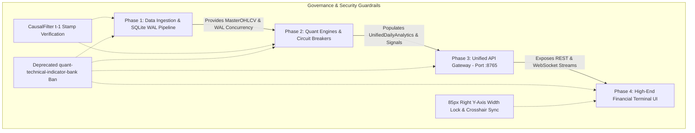

# MASTER ROADMAP: Unified Quantitative & Statistical Bitcoin Intelligence Platform (`quant.maftia.tech`)

**Repository:** `quant.maftia.tech`  
**Domain:** 4-System Multi-Layered Quantitative Defense & High-End Financial Terminal  
**Status:** Canonical Multi-Phase Engineering Trajectory  

---

## 1. Executive Summary & Purpose

This document (`MASTER_ROADMAP.md`) serves as the single source of truth for the multi-phase engineering trajectory that unifies four interlocked quantitative Bitcoin trading and analysis systems into an enterprise-grade financial terminal:
1. **`quant-btc-valuation-system`**: 17-indicator piecewise linear interpolated valuation score `[-2.0, +2.0]` & macro `CircuitBreakerFilter` (`>= +1.50` bubble risk / `<= -1.00` deep discount).
2. **`quant-btc-lttd-system`**: 3-State Gaussian HMM (`BULL`, `BEAR`, `SIDEWAYS`) regime classifier using log returns and 20-day volatility (`SIDEWAYS` probability $> 0.60$ forces `0.0` mid-term trend exposure).
3. **`quant-btc-mttd-system`**: Multi-principle consensus oscillator `[-1.0, +1.0]` across 10 statistical families with strict multi-layer gates (`EfficiencyRatioGate` $\ge 0.20$, `ShannonEntropyGate` $\le 2.30$, and `ChikouMomentumExit` $< -0.30$).
4. **`quant-lttd-ichimoku`**: Stationary bounded $\tanh$ oscillator `[-1.0, +1.0]` transforming non-stationary Ichimoku cloud components (`S_TK`, `S_Cloud`, `S_Future`, `S_Chikou`) filtered via Ehlers 2-pole `SuperSmoother` IIR transfer function.

### Strict Governance Rules
- **Atomic OpenSpec Decomposition:** Every phase in this roadmap MUST be executed via its own atomic OpenSpec proposal (`/opsx:propose <phase-name>`) and implementation (`/opsx:apply`). Simultaneous multi-phase mutations inside a single change are strictly prohibited to prevent context window overflows and circular dependencies.
- **Deprecated Component Exclusivity:** The legacy `quant-technical-indicator-bank` (`05. Indicator Bank`) system and documentation have been explicitly removed and deprecated. Under no circumstances should any phase reference, import, or re-introduce indicator models from `quant-technical-indicator-bank`.
- **Zero Lookahead Bias (`CausalFilter`):** All mathematical transformations, rolling normalizations (`[-2.0, +2.0]` or `[-1.0, +1.0]`), and regime classifications (`BULL`, `BEAR`, `SIDEWAYS`) MUST strictly enforce causal verification at timestamp $t-1$. No right-aligned or future-peeking data windows may leak into historical backtests.

---

## 2. Phase Breakdown Matrix

The unification is partitioned into 4 distinct, sequential phases with strict dependency gates:

| Phase | Target Domain | Key Capabilities & Deliverables | Prerequisite Dependencies | Verification Gate |
| :--- | :--- | :--- | :--- | :--- |
| **Phase 1: Data & Storage Layer** | Canonical Ingestion & Concurrency | • Ingest exchange feeds & `bitview.space` BRK metrics into `MasterOHLCV` (`master_ohlcv`)<br>• Enforce SQLite Write-Ahead Logging (`WAL`) (`PRAGMA journal_mode=WAL;`) across all `.db` files<br>• Migrate connectors to parameterized queries (`?-style`) to eliminate `database is locked` | None (Foundation Layer) | `python3 run_report_pipeline.py` passes cleanly without lock contention |
| **Phase 2: Quant Engines & Circuit Breakers** | Core Math & Interlocking Gates | • Unify calculation pipelines for `ValuationComposite`, `LTTDRegime`, `MTTDIntegratedOscillator`, and `IchimokuDenoisedOscillator`<br>• Enforce macro override hooks (`SIDEWAYS` HMM $\to 0.0$ MTTD exposure)<br>• Write outputs to `UnifiedDailyAnalytics` and `UnifiedComponentSignals` | **Phase 1** (`MasterOHLCV` & WAL mode operational) | Strict $t-1$ `CausalFilter` audit & unit tests passing across all 4 quant systems |
| **Phase 3: Unified API Gateway Layer** | High-Performance Hono v4 + Bun Backend | • Single API Gateway running strictly on port `:8765` (`api.quant.maftia.tech`)<br>• Standardized REST & WebSocket endpoints querying `UnifiedDailyAnalytics` (`/api/v1/analytics/daily`) & circuit breakers (`/api/v1/system/circuit-breakers`)<br>• Ban all temporary ad-hoc servers (`:3000`, `:8766`, etc.) | **Phase 2** (`UnifiedDailyAnalytics` schema-locked & populated) | API load test (`bun test`) confirming sub-50ms query response on port `:8765` |
| **Phase 4: Financial Terminal UI** | React 19 + Vite + Lightweight Charts v5.2 | • Master Executive Dashboard & 4 specialized studios (`Valuation Studio`, `LTTD Lab`, `MTTD Console`, `Ichimoku Terminal`)<br>• **85px Y-Axis Lock:** Mandate `rightPriceScale: { minimumWidth: 85 }` across all subplots<br>• Bidirectional real-time Vertical Crosshair Synchronization across subplots | **Phase 3** (`api.quant.maftia.tech:8765` operational) | Playwright / visual verification of `85px` Y-axis alignment and crosshair sync across all 4 studios |

---

## 3. Prerequisite & Dependency Architecture



---

## 4. Immediate Execution Trajectory

With this Master Roadmap established, engineering execution immediately proceeds to **Phase 1** via atomic OpenSpec proposal:
```bash
# Initiate Phase 1 proposal
openspec new change phase-1-data-and-wal-pipeline
```

Every subsequent step will strictly follow this roadmap to ensure continuous architectural integrity, zero lookahead bias, and high-performance financial terminal delivery.
