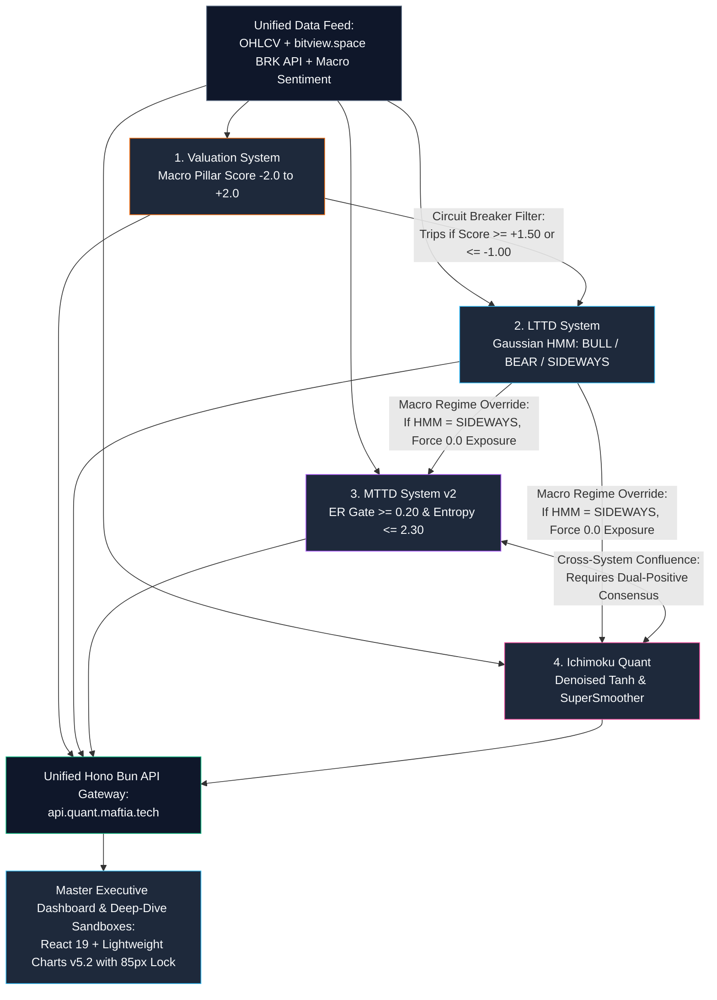

# Maftia Quant Bitcoin Intelligence Platform (`quant.maftia.tech`)

> **Unified Quantitative & Statistical Bitcoin Trading System**  
> **Master Workspace & Architecture Repository:** `/home/ubuntu/projects/quant.maftia.tech`

  
  
  
  
  
  

---

## 📖 Selamat Datang di Maftia Quant Unified Platform

Repositori dan folder ini (`/home/ubuntu/projects/quant.maftia.tech`) adalah pusat arsitektur terpadu (*Unified Architecture & System Documentation*) yang menggabungkan seluruh ekosistem proyek kuantitatif Bitcoin yang dipicu oleh skrip orkestrator `run_report_pipeline.py`.

Pusat dokumentasi ini memetakan secara mendalam **arsitektur kode, alur pemrosesan data, validasi statistik (10 Statistical Families), gerbang eksekusi logika, serta rancangan antarmuka visual (UI/UX & Frontend)** untuk menyatukan 5 proyek terpisah menjadi satu platform bertaraf institusional.

---

## 📚 Indeks Dokumentasi Arsitektur & Fitur Proyek

Seluruh dokumentasi telah disusun dengan rapi dalam format Markdown yang interaktif, dilengkapi diagram **Mermaid**, tabel parameter sistem, dan spesifikasi API:

| Dokumen | Proyek Sumber | Peran & Deskripsi Singkat | Tautan Langsung |
|---|---|---|---|
| **00. Master Unified Architecture** | `quant.maftia.tech` | **[DOKUMEN MASTER]** Rancangan arsitektur terpadu, integrasi data, proposal fitur frontend, rancangan UI/UX, tokens warna HSL (*Obsidian Dark-Tech*), dan *roadmap* migrasi 4 fase. | [UNIFIED_SYSTEM_ARCHITECTURE.md](file:///home/ubuntu/projects/quant.maftia.tech/UNIFIED_SYSTEM_ARCHITECTURE.md) |
| **01. Valuation System** | `quant-btc-valuation-system` | Arsitektur *Macroeconomic Cycle Valuation Engine* berdasarkan 17 indikator (*Fundamental, Teknikal, Sentimen*) dengan interpolasi linear piecewise `[-2.0, +2.0]`. | [docs/01_quant_btc_valuation_system.md](file:///home/ubuntu/projects/quant.maftia.tech/docs/01_quant_btc_valuation_system.md) |
| **02. LTTD System** | `quant-btc-lttd-system` | Arsitektur *Orthogonal Regime-Switching Ensemble Engine* (6-Layer Architecture, 3-State Gaussian HMM, PCA, VIF Pruning, dan L1-Lasso/XGBoost WFO). | [docs/02_quant_btc_lttd_system.md](file:///home/ubuntu/projects/quant.maftia.tech/docs/02_quant_btc_lttd_system.md) |
| **03. MTTD System v2** | `quant-btc-mttd-system` | Arsitektur *Multi-Principle Consensus Strategy* berjangka menengah (6+ Statistical Families, Kaufman Efficiency Ratio Gate, Shannon Entropy Noise Gate). | [docs/03_quant_btc_mttd_system.md](file:///home/ubuntu/projects/quant.maftia.tech/docs/03_quant_btc_mttd_system.md) |
| **04. Ichimoku Quant** | `quant-lttd-ichimoku` | Arsitektur *Multi-Principle Denoised Framework* yang mengubah pola Ichimoku visual menjadi osilator stasioner bebas noise (*SuperSmoother $\tanh$* + 5-Gate Logic). | [docs/04_quant_lttd_ichimoku.md](file:///home/ubuntu/projects/quant.maftia.tech/docs/04_quant_lttd_ichimoku.md) |
| **05. Indicator Bank** | `quant-technical-indicator-bank` | Pustaka dasar kuantitatif, mesin *scraper* Pine Script otomatis (`agent-browser`), terjemahan vektor *bar-by-bar* Python (`indicators_helper.py`), dan konsensus 15-indikator. | [docs/05_quant_technical_indicator_bank.md](file:///home/ubuntu/projects/quant.maftia.tech/docs/05_quant_technical_indicator_bank.md) |

---

## 🎯 Ringkasan Saling Mengunci (Interlocking Ecosystem Matrix)

Dalam ekosistem terpadu `quant.maftia.tech`, kelima proyek tidak lagi bekerja secara terisolasi, melainkan membentuk **Konsensus Berlapis (*Multi-Layered Quantitative Defense*)**:

---

## 🚀 Fitur Utama & Keunggulan Frontend Proposal

1. **Rich Aesthetics & Dark-Tech UI:** Menggabungkan keanggunan *Bloomberg Terminal*, kepraktisan *TradingView*, dan desain *Glassmorphism/Obsidian Dark Theme*.
2. **Vertical Crosshair Synchronization:** Pergerakan kursor mouse pada satu grafik harga akan mensinkronisasikan garis vertikal waktu secara tepat pada seluruh grafik indikator di bawahnya (`Valuation`, `LTTD`, `MTTD`, dan `Ichimoku`).
3. **85px Y-Axis Width Lock:** Sumbu kanan harga dikunci pada ukuran minimum `85px`, menjamin seluruh *grid horizontal & vertical ticks* tersusun tegak lurus sempurna lintas *subplot*.
4. **5 Deep-Dive Analytical Studios:** Eksplorasi interaktif khusus untuk *Valuation Pillars*, *LTTD Regime & PCA Lab*, *MTTD Console*, *Ichimoku Terminal*, dan *Indicator Bank Sandbox & Backtester*.

---

## 🛠️ Status Eksekusi Terkini (Pipeline Output)

Eksekusi terakhir `python3 run_report_pipeline.py` telah berhasil dijalankan dan memverifikasi integritas seluruh komponen kuantitatif di `/home/ubuntu/projects/latest_week_scores_report.md`:
- **Valuation Composite:** `~1.5402` (Menandakan area valuasi tinggi / historis *overvalued risk zone*).
- **LTTD / MTTD / Ichimoku:** Ketiga sistem *trend-following* menunjukkan konvergensi kesepakatan pada status **BEARISH / NEUTRAL** dengan **0.0 position exposure (100% Cash/Neutral Mode)**, membuktikan bahwa mekanisme *Circuit Breaker* dan *HMM Sideways/Bearish Filter* bekerja dengan sempurna melindungi modal dari kerugian.
