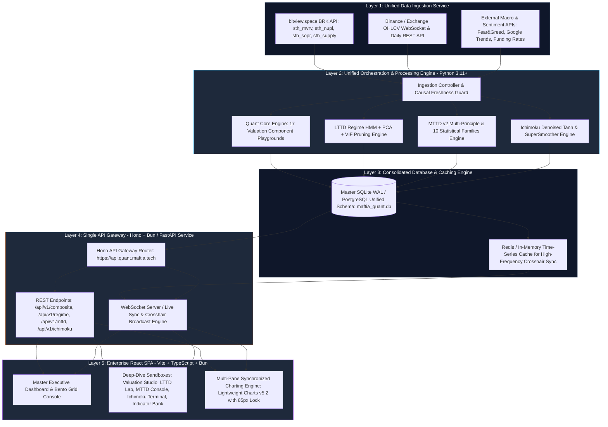
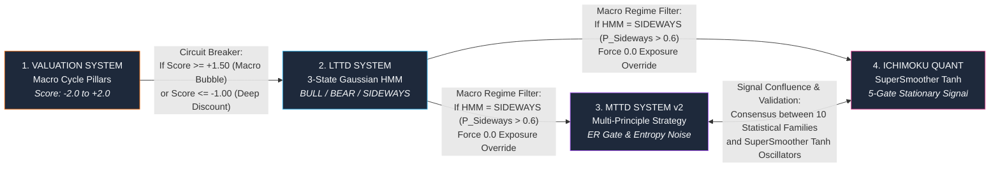

# Master Unified System Architecture: Maftia Quant Bitcoin Intelligence Platform (`quant.maftia.tech`)

> **Dokumen Arsitektur Unified System, Integrasi Ekosistem, Proyeksi Fitur, dan Desain UI/UX**  
> **Lokasi Proyek:** `/home/ubuntu/projects/quant.maftia.tech`  
> **Tujuan:** Menyatukan 5 proyek kuantitatif terpisah menjadi satu platform *Quantitative Bitcoin Intelligence System* bertingkat *enterprise*.

---

## 1. Visi & Strategi Penggabungan (The Unified Vision)

Saat ini, ekosistem kuantitatif di bawah `/home/ubuntu/projects` terdiri dari 5 proyek yang independen namun memiliki ketergantungan sirkular secara fungsional:
1. `quant-btc-valuation-system`: Mengukur siklus valuasi makroekonomi berdasarkan 17 indikator (*Fundamental, Teknikal, Sentimen*).
2. `quant-btc-lttd-system`: Mengklasifikasikan arah tren jangka panjang (*Bull, Bear, Sideways*) menggunakan *Gaussian HMM*, *PCA*, dan *Ensemble L1-Lasso/XGBoost*.
3. `quant-btc-mttd-system`: Mengambil keputusa posisi tren jangka menengah menggunakan konsensus multi-prinsip (*Efficiency Ratio, Shannon Entropy, Chikou Momentum*).
4. `quant-lttd-ichimoku`: Mendekomposisi pola Ichimoku visual menjadi osilator stasioner bebas noise (*SuperSmoother $\tanh$*).
5. `quant-technical-indicator-bank`: Menyediakan mesin translasi Pine Script, 10 keluarga statistik dasar, dan dashboard konsensus 15-indikator (*MTTD v1*).

Eksekusi integrasi saat ini masih bersifat *ad-hoc sequential pipeline* yang dikendalikan oleh skrip tunggal `run_report_pipeline.py`—di mana proses memulai *backend* sementara di *port* 3000, menyalin data secara manual antar file SQLite/JSON (`lttd.db` $\rightarrow$ `btc_daily.json`), menjalankan kalkulasi berurutan, dan mencetak file teks tunggal (`latest_week_scores_report.md`).

**Maftia Quant Unified Platform (`quant.maftia.tech`)** dirancang untuk mentransformasi arsitektur terfragmentasi tersebut menjadi **satu platform kuantitatif terintegrasi berarsitektur event-driven** yang menyatukan seluruh *pipeline* data, penyimpanan relasional, layanan API, dan antarmuka visualisasi interaktif.

---

## 2. Arsitektur Sistem Terpadu (Unified Enterprise Architecture)



### 2.1 Layer 1: Unified Data Ingestion Service
Menggantikan pengambilan data yang berulang di setiap folder proyek dengan satu layanan penarikan data terpusat (`Ingestion Controller`):
- **OHLCV Master Feed:** Mengambil harga OHLCV harian Bitcoin secara *real-time* dan menyimpannya di satu titik kebenaran (*Single Source of Truth*).
- **BRK API Bulk Service:** Mengambil 4 seri *on-chain* (`sth_mvrv`, `sth_nupl`, `sth_sopr_24h`, `sth_supply_in_profit`) dari `bitview.space` dalam satu panggilan HTTP *bulk request*.
- **Causal Freshness Guard:** Memastikan *stamp* data on-chain terverifikasi ≥ $t-1$ sebelum mengizinkan mesin kuantitatif melakukan kalkulasi.

### 2.2 Layer 2: Core Orchestration & Processing Engine
Menyatukan kelima modul kalkulasi secara modular dan terorkestrasi:
1. **Valuation Engine:** Menghitung 17 komponen dari 3 pilar dan melakukan interpolasi linear piecewise ke rentang `[-2.0, +2.0]`.
2. **LTTD Engine:** Menerima data OHLCV master, melatih 3-State Gaussian HMM (Log Returns + 20d Vol), melakukan filter VIF & PCA, serta mengevaluasi model ensemble (*XGBoost / L1-Lasso*).
3. **MTTD v2 Engine:** Menerima *output* dari 10 Keluarga Statistik dan mengevaluasi gerbang komposit `IMO`, `Efficiency Ratio (ER)`, dan `Shannon Entropy`.
4. **Ichimoku Engine:** Melakukan dekomposisi $\tanh$ stasioner dan penyaringan spektral *Ehlers SuperSmoother* pada 5 gerbang konfirmasi.

### 2.3 Layer 3: Consolidated Database Schema (`maftia_quant.db`)
Menggabungkan 4 database terpisah (`metrics.db`, `lttd.db`, `btc_daily.json`, dan `mttd_data.json`) ke dalam skema relasional bersatu berpresisi tinggi:

```sql
-- 1. Master OHLCV Price Table (Single Source of Truth)
CREATE TABLE master_ohlcv (
  date                   TEXT PRIMARY KEY,
  open                   REAL NOT NULL,
  high                   REAL NOT NULL,
  low                    REAL NOT NULL,
  close                  REAL NOT NULL,
  volume                 REAL NOT NULL
);

-- 2. Master Composite Metrics & Regimes (Unified Output Table)
CREATE TABLE unified_daily_analytics (
  date                   TEXT PRIMARY KEY,
  -- A. Valuation System Output
  valuation_composite    REAL,          -- Score in [-2.0, +2.0]
  valuation_btc_price    REAL,
  
  -- B. LTTD System Output
  lttd_final_score       REAL,          -- Score in [-1.0, +1.0]
  lttd_regime            TEXT,          -- 'BULL' | 'BEAR' | 'SIDEWAYS'
  lttd_p_bull            REAL,
  lttd_p_bear            REAL,
  lttd_p_sideways        REAL,
  lttd_target_exposure   REAL,          -- 0.0 or 1.0
  lttd_circuit_breaker   INTEGER,       -- 1 if triggered by valuation score
  
  -- C. MTTD System v2 Output
  mttd_imo               REAL,          -- Integrated Market Oscillator [-1.0, +1.0]
  mttd_efficiency_ratio  REAL,          -- Kaufman ER gate
  mttd_entropy           REAL,          -- Shannon Entropy gate
  mttd_position          REAL,          -- Position exposure [0.0, 1.0]
  mttd_immunity_active   INTEGER,       -- 1 if hold immunity is active
  
  -- D. Ichimoku Quant System Output
  ichimoku_imo           REAL,          -- Denoised Tanh Oscillator [-1.0, +1.0]
  ichimoku_regime        TEXT,          -- 'BULLISH' | 'BEARISH' | 'NEUTRAL'
  ichimoku_position      REAL,          -- Position exposure [0.0, 1.0]
  
  FOREIGN KEY (date) REFERENCES master_ohlcv(date)
);

-- 3. Detailed Component Scores (17 Valuation Metrics + 12 LTTD Indicators + 15 Indicator Bank Signals)
CREATE TABLE unified_component_signals (
  date                   TEXT,
  system_source          TEXT,          -- 'VALUATION' | 'LTTD' | 'MTTD_BANK' | 'ICHIMOKU'
  component_name         TEXT,
  raw_value              REAL,
  normalized_score       REAL,          -- Score normalized to system bounds
  signal_direction       INTEGER,       -- -1 (Bearish) | 0 (Neutral) | +1 (Bullish)
  PRIMARY KEY (date, system_source, component_name)
);
```

### 2.4 Layer 4: Single API Gateway (`https://api.quant.maftia.tech`)
Menggantikan kebingungan manajemen port lokal (`:3000`, `:8765`, `:8766`, `:5173`) dengan **satu API Gateway berkinerja tinggi berbasis Hono v4 (Bun Runtime)**:
- **`GET /api/v1/executive-summary`**: Mengembalikan ringkasan eksekutif harian terbaru (konsensus 4 sistem) dalam satu payload JSON super cepat.
- **`GET /api/v1/timeseries/master`**: Mengembalikan histori waktu lengkap yang sudah diselaraskan (*outer join*) untuk grafik penjelajah utama.
- **`GET /api/v1/system/:system_name/details`**: Mengambil detail spesifik dari `valuation`, `lttd`, `mttd`, atau `ichimoku`.
- **`WebSocket /api/v1/ws/crosshair`**: Saluran WebSocket waktu nyata yang menyiarkan koordinat *cursor/crosshair* pengguna agar beberapa monitor atau sesi browser dapat tersinkronisasi secara langsung (*multi-screen trading terminal capability*).

---

## 3. Matriks Interaksi & Konsensus Lintas-Sistem (Cross-System Matrix)

Kekuatan utama dari arsitektur terpadu ini adalah terciptanya **Sistem Saling Mengunci (*Interlocking Quantitative Safeguards*)** di antara keempat sistem pemodelan:



1. **Valuation $\rightarrow$ LTTD (*Macro Circuit Breaker*):**
   Ketika `Valuation Composite Score` melampaui `+1.50` (ekstrem overvalued / zona bahaya puncak siklus), LTTD memodulasi batas toleransi *ensemble*-nya. Jika model LTTD memberi sinyal beli saat valuasi sudah di atas `+1.50`, eksekusi dibatasi maksimal 50% atau diblokir seutuhnya untuk mencegah membeli di puncak siklus 4 tahunan.
2. **LTTD HMM $\rightarrow$ MTTD & Ichimoku (*Regime Override*):**
   Jika Gaussian HMM pada LTTD mendeteksi bahwa pasar berada dalam status **SIDEWAYS** ($P(\text{Sideways}) > 0.60$), maka sistem memberikan *override command* kepada MTTD dan Ichimoku untuk **menonaktifkan seluruh sinyal entry baru**. Ini menghemat biaya *whipsaw* yang menjadi kelemahan utama sistem *trend-following* jangka menengah.
3. **MTTD $\leftrightarrow$ Ichimoku (*Statistical Confluence*):**
   Kedua sistem jangka menengah ini saling memvalidasi. Posisi *Super-Size / Full Leverage Exposure* hanya diizinkan apabila **keduanya menghasilkan konsensus positif** (`MTTD IMO > 0.25` **DAN** `Ichimoku IMO > 0.40`).

---

## 4. Proposal Fitur Frontend Terpadu (`quant.maftia.tech`)

Antarmuka pengguna terpadu dibangun menggunakan **React 19, TypeScript, Vite, dan TradingView Lightweight Charts v5.2.0**. Platform ini dikemas ke dalam 6 modul utama:

### 4.1 Master Executive Dashboard (`/`)
Tampilan utama yang menyuguhkan status eksekutif sekilas (*at-a-glance*) bagi para manajer investasi dan periset kuantitatif:
- **Macro Bento Grid Header:** 4 Kartu status beresolusi tinggi yang menampilkan status langsung dari `Valuation Score`, `LTTD Regime & Probability`, `MTTD IMO Position`, dan `Ichimoku Denoised Signal`.
- **Cross-System Confluence Gauge:** Meteran komposit melingkar (*Radial Arc Gauge*) yang menyimpulkan persentase keyakinan pasar terpadu (`0%` Sangat Bearish s.d `100%` Sangat Bullish).
- **Consensus Action Banner:** Spanduk rekomendasi tindakan otomatis (*e.g., "STRONG BEARISH REGIME — 0.0% EXPOSURE RECOMMENDED — ALL SYSTEMS IN CASH OR HEDGE MODE"*).
- **Unified Summary Table (Pengganti Laporan Markdown):** Tabel interaktif harian yang menggantikan keluaran statis `latest_week_scores_report.md` dengan fitur pengurutan (*sorting*), pemfilteran tanggal, dan unduhan langsung berformat CSV/PDF/Markdown.

### 4.2 Deep-Dive Analytical Sandboxes (5 Studio Khusus)
1. **Valuation Pillar Studio (`/valuation`):**
   - Eksplorasi mendalam 17 metrik fundamental, teknikal, dan sentimen.
   - *Custom Threshold Builder:* Memungkinkan periset menggeser batas atas/bawah secara interaktif pada grafik mentah dan melihat dampak perubahannya terhadap *Master Composite Score* secara *real-time*.
2. **LTTD Orthogonal Regime Lab (`/lttd`):**
   - *HMM Posterior Area Chart:* Visualisasi probabilitas tumpang tindih antara *Bull*, *Bear*, dan *Sideways* dari tahun 2016 hingga sekarang.
   - *PCA Loadings & VIF Matrix:* Bar chart korelasi yang memperlihatkan bobot *Pratt's Relative Importance* dan daftar indikator teknikal/on-chain yang dipangkas karena multikolinearitas.
   - *Walk-Forward Optimization Console:* Tabel interaktif yang menampilkan akurasi (*out-of-sample accuracy*) dan *Sharpe Ratio* dari setiap lipatan (*fold*) pengujian beruntun.
3. **MTTD Multi-Principle Console (`/mttd`):**
   - Tampilan pemantauan 10 Keluarga Statistik.
   - *Gate Visualizer:* Lampu indikator status (*Traffic Light UI*) untuk **Efficiency Ratio Gate (`ER >= 0.20`)**, **Shannon Entropy Gate (`Entropy <= 2.30`)**, dan **Chikou Momentum Exit (`< -0.30`)**.
4. **Ichimoku Denoised Terminal (`/ichimoku`):**
   - Tampilan perbandingan langsung antara *Raw Non-Stationary Ichimoku Cloud* dengan *Stationary Bounded $\tanh$ Oscillators (`S_TK, S_Cloud, S_Future, S_Chikou`)*.
   - Visualisasi dinamika *SuperSmoother IIR transfer function* pada harga.
5. **Indicator Bank Sandbox & Backtester (`/indicator-bank`):**
   - *Interactive Pine-to-Python Playground:* Tempat menguji dan memvisualisasikan 15 indikator konsensus *perpetual* dan *oscillator* atas data harga BTC.
   - *On-the-fly Backtest Runner:* Pengguna dapat memilih kombinasi N indikator, memvariasikan parameter ambang batas, dan menjalankan simulasi *equity curve* langsung di peramban.

---

## 5. Proposal Layout, Desain UI/UX & Rich Aesthetics System

### 5.1 Filosofi Visual: *High-End Quantitative Financial Terminal*
Desain antarmuka `quant.maftia.tech` harus menakjubkan sejak pandangan pertama (*wow at first glance*), memadukan estetika terminal keuangan kelas dunia (*Bloomberg Terminal / TradingView*) dengan kebersihan desain modern (*Glassmorphism, Minimalist Industrial Brutalist, Dark-Tech UI*).

### 5.2 Curated Color Palette & Design Tokens (HSL Tailored)
Sistem menghindari warna dasar yang membosankan (*plain red/green*) dan menerapkan palet warna HSL yang terukur dan harmonis untuk menjaga kenyamanan mata pada pemantauan berjam-jam:
```css
:root {
  /* Surface & Background Tokens */
  --bg-obsidian-master: hsl(220, 24%, 7%);       /* #0B0E14 - Deep Obsidian Root */
  --bg-surface-card: hsl(218, 22%, 11%);        /* #121721 - Sub-surface card container */
  --bg-surface-elevated: hsl(217, 20%, 16%);    /* #202634 - Hovered / active card state */
  --border-glass: rgba(255, 255, 255, 0.08);    /* Subtly illuminated glassmorphism border */
  
  /* Quantitative Signal Color Tokens */
  --signal-bull-emerald: hsl(142, 71%, 45%);    /* #22C55E - Bullish / Undervalued / Active Long */
  --signal-neutral-amber: hsl(45, 93%, 47%);    /* #EAB308 - Sideways / Fair Value / Cash Mode */
  --signal-bear-crimson: hsl(0, 84%, 60%);      /* #EF4444 - Bearish / Overvalued / Exit Trigger */
  --signal-quant-cyan: hsl(192, 91%, 50%);      /* #06B6D4 - Data highlights / Spectral lines */
  --signal-pca-purple: hsl(262, 83%, 68%);      /* #A855F7 - Statistical / PCA / HMM overlays */
  
  /* Typography Tokens */
  --text-primary: hsl(210, 40%, 98%);           /* Pure crisp white for primary headers */
  --text-secondary: hsl(215, 20%, 65%);         /* Muted slate for axis labels and descriptions */
  --text-mono-accent: hsl(180, 70%, 75%);       /* Cyan mono for formula variables and numbers */
}
```

### 5.3 Typography System
- **Display & Headings:** Google Font **Outfit** atau **Inter** (ketebalan `600`/`700`), memberikan kesan modern, geometris, dan sangat tepercaya.
- **Data Grids, Numbers & Formulas:** Google Font **JetBrains Mono** atau **Roboto Mono**, memastikan keselarasan vertikal tabular pada seluruh angka desimal dan metrik kuantitatif.

### 5.4 Rancangan Layout UI (Wireframe Struktur Terpadu)

```
┌──────────────────────────────────────────────────────────────────────────────────────────────────────┐
│  Maftia Quant Intelligence Platform   [ Master Overview ]  [ Valuation ]  [ LTTD ]  [ MTTD ]  [ Bank ]│
├─────────┬────────────────────────────────────────────────────────────────────────────────────────────┤
│ SIDEBAR │  EXECUTIVE SUMMARY HEADER (Bento Grid Layout)                                              │
│         │  ┌────────────────────────┐ ┌────────────────────────┐ ┌─────────────────────────────────┐ │
│         │  │ VALUATION COMPOSITE    │ │ LTTD REGIME (HMM)      │ │ CROSS-SYSTEM CONSENSUS          │ │
│ • Home  │  │  1.5402                │ │  BEARISH (P: 0.89)     │ │  STRONG BEAR / NEUTRAL          │ │
│ • Val   │  │  Status: Overvalued    │ │  Exposure: 0.0% Cash   │ │  Target Allocation: 0.0%        │ │
│ • LTTD  │  └────────────────────────┘ └────────────────────────┘ └─────────────────────────────────┘ │
│ • MTTD  ├────────────────────────────────────────────────────────────────────────────────────────────┤
│ • Ich   │  SYNCHRONIZED MULTI-PANE CHARTING ENGINE (Lightweight Charts v5.2.0 - 85px Y-Axis Lock)   │
│ • Bank  │  ┌──────────────────────────────────────────────────────────────────────────────┬────────┐ │
│         │  │ [Subplot 1: Log-Scale BTC/USD OHLC Price + Ichimoku Cloud + Buy/Sell Markers] │ $62.6K │ │
│ • Alert │  ├──────────────────────────────────────────────────────────────────────────────┼────────┤ │
│ • Export│  │ [Subplot 2: Master Valuation Composite Oscillator (-2.0 to +2.0 Scale)]      │ +1.54  │ │
│ • Settings ├──────────────────────────────────────────────────────────────────────────────┼────────┤ │
│         │  │ [Subplot 3: LTTD Final Score + HMM Probability Background Fills]             │ -0.44  │ │
│         │  ├──────────────────────────────────────────────────────────────────────────────┼────────┤ │
│         │  │ [Subplot 4: MTTD v2 IMO & Kaufman Efficiency Ratio (ER Gate >= 0.20 Overlay)]│ -0.99  │ │
│         │  └──────────────────────────────────────────────────────────────────────────────┴────────┘ │
└─────────┴────────────────────────────────────────────────────────────────────────────────────────────┘
```

### 5.5 Inovasi UX Charting Kritis: *Vertical Cursor Sync & 85px Y-Axis Lock*
Mengadopsi dan menyempurnakan fitur terbaik dari *Indicator Bank* dan *Valuation System*:
1. **Vertical Crosshair Synchronization:** Ketika periset mengarahkan kursor pada tanggal *21 Juni 2026* di grafik harga utama (Subplot 1), garis vertikal penunjuk waktu secara otomatis muncul di posisi yang sama persis pada Subplot 2 (`Valuation`), Subplot 3 (`LTTD`), dan Subplot 4 (`MTTD/Ichimoku`).
2. **Y-Axis Width Lock (`85px`):** Sumbu harga/nilai di sisi kanan seluruh *subplot* dikunci secara ketat pada lebar minimum `85px`. Tanpa penguncian ini, angka harga BTC yang panjang (`$63,508.84`) dan angka osilator yang pendek (`-0.45`) akan menyebabkan pergeseran horizontal pada area grafik. Penguncian `85px` menjamin bahwa sumbu waktu horizontal ($X$-axis) tepat bergaris lurus dari atas ke bawah layar.

---

## 6. Peta Jalan Implementasi & Migrasi (*Phased Roadmap*)

Untuk mewujudkan ekosistem terpadu ini secara mulus tanpa mengganggu validitas model historis, implementasi dibagi ke dalam 4 fase bertahap:

| Fase | Nama Milestone | Target Utama & Output Kritis | Estimasi Waktu |
|---|---|---|---|
| **Phase 1** | **Unified Storage & Data Orchestration** | • Pembangunan skema SQLite WAL / PostgreSQL master (`maftia_quant.db`).<br/>• Pembuatan skrip `UnifiedIngestionService` untuk menarik data OHLCV & BRK API secara otomatis.<br/>• Migrasi data historis dari `metrics.db` dan `lttd.db` ke database master. | **Minggu 1 – 2** |
| **Phase 2** | **Single Backend API Gateway (`Hono + Bun`)** | • Pembangunan API Gateway di Port tunggal (`:8765` / `api.quant.maftia.tech`).<br/>• Pembuatan *endpoint* terpadu `/api/v1/executive-summary` dan `/api/v1/timeseries/master`.<br/>• Integrasi WebSocket Server untuk penyiaran *sync crosshair* & pembaruan kalkulasi harian. | **Minggu 3 – 4** |
| **Phase 3** | **Frontend Core & Master Executive Dashboard** | • *Scaffold* aplikasi React 19 + Vite + TypeScript di bawah folder `/home/ubuntu/projects/quant.maftia.tech/web`.<br/>• Implementasi *Design System Tokens (Obsidian HSL)* dan *Sidebar Layout*.<br/>• Integrasi *TradingView Lightweight Charts v5.2* dengan *Vertical Sync & 85px Y-Axis Lock*. | **Minggu 5 – 6** |
| **Phase 4** | **Deep-Dive Sandboxes & Advanced Backtester** | • Pembangunan 5 Studio Khusus (`Valuation Pillar Studio`, `LTTD Lab`, `MTTD Console`, `Ichimoku Terminal`, `Indicator Bank`).<br/>• Implementasi *Interactive Pine-to-Python Backtest Simulator* di peramban.<br/>• Pengaktifan sistem notifikasi *webhook/alert* otomatis untuk laporan harian/mingguan. | **Minggu 7 – 8** |

---

## 7. Kesimpulan Arsitektur

Dengan menyatukan kelima proyek di bawah `/home/ubuntu/projects` ke dalam **Maftia Quant Bitcoin Intelligence Platform (`quant.maftia.tech`)**, kita tidak hanya mengeliminasi kerepotan manual dan redundansi komputasi skrip `run_report_pipeline.py`, tetapi juga menciptakan **satu terminal riset dan perdagangan kuantitatif bertaraf institusional** yang elegan, stasioner secara matematis, dan didukung oleh konsensus 10 Keluarga Statistik berpresisi tinggi.
