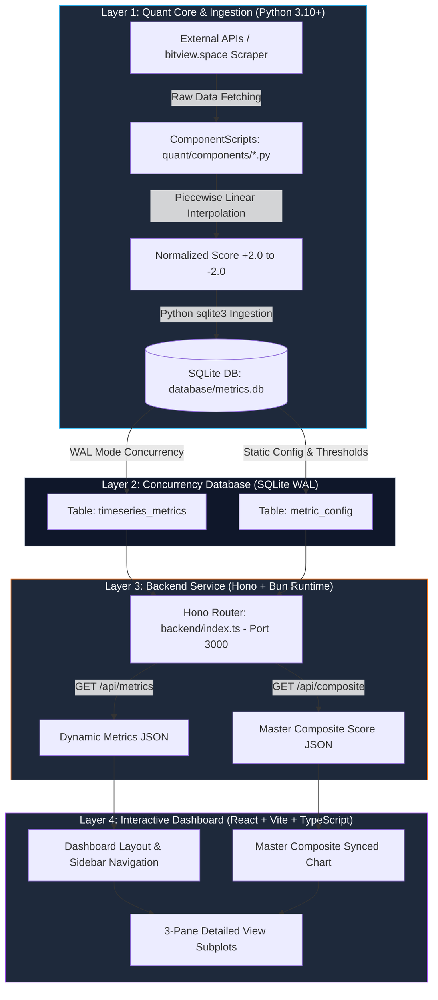

# Arsitektur & Fitur: Quant BTC Cycle Valuation System (`quant-btc-valuation-system`)

> **Dokumen Arsitektur & Analisis Fitur Sistem Kuantitatif**  
> **Lokasi Proyek:** `/home/ubuntu/projects/quant-btc-valuation-system`  
> **Peran dalam Ekosistem:** *Macroeconomic Cycle Valuation Engine* (Sistem Valuasi Siklus Makroekonomi Bitcoin)

---

## 1. Ringkasan Eksekutif & Tujuan Proyek

**Quant BTC Cycle Valuation System** adalah mesin valuasi kuantitatif dan statistikal yang dirancang untuk mengagregasi indikator *on-chain*, teknikal, dan sentimen guna mengidentifikasi titik puncak (*peak*), dasar (*trough*), dan fase transisi siklus makroekonomi Bitcoin.

Sistem ini memecahkan masalah perbedaan skala indikator mentah (rasio, persentase, z-score, dan metrik absolut) dengan melakukan **interpolasi linear piecewise** berdasarkan ambang batas standar deviasi (SD) historis. Seluruh 17 indikator dikonversi ke dalam satu skala osilator standar yang terikat secara ketat pada interval **`+2.0` (Sangat Undervalued / Cycle Bottom)** hingga **`-2.0` (Sangat Overvalued / Cycle Peak)**, menghasilkan indikator komposit utama yang disebut **Master Valuation Oscillator**.

---

## 2. Arsitektur Kode & Alur Data (Data Flow)

Sistem ini menerapkan arsitektur modular yang memisahkan secara tegas antara *pipeline* riset/kuantitatif (Python), penyimpanan konkuren berkinerja tinggi (SQLite WAL), layanan API (*Hono + Bun*), dan antarmuka visual interaktif (*React + Vite*).

### 2.1 Desain Modul (*Domain-Driven Design Principles*)

1. **Isolated Component Playgrounds (`quant/components/*.py`)**:
   Setiap indikator diimplementasikan sebagai skrip Python independen yang mewarisi kelas dasar `BaseComponent`. Modul ini bertanggung jawab atas dua metode utama: `fetch_data()` (pengambilan atau kalkulasi data mentah) dan `normalize()` (pemetaan ke skala `-2` s.d `+2`).
2. **Orkestrator Pipeline (`quant/run_all.py`)**:
   Berfungsi sebagai *command-line interface* (CLI) yang menjalankan pembaruan data secara inkremental (*delta fetch*) atau membangun ulang seluruh histori data dari tahun 2016 jika dipanggil dengan parameter `--rebuild`.
3. **Konkurensi Database SQLite WAL Mode (`database/metrics.db`)**:
   Dengan mengaktifkan **Write-Ahead Logging (WAL)**, database mengizinkan operasi *read* dari *backend* Bun (Port 3000) dan operasi *write/insert* dari *pipeline* Python berjalan secara bersamaan tanpa *lock contention*.

---

## 3. Rincian 17 Indikator & 3 Pilar Valuasi

Sistem mengkategorikan 17 komponen kuantitatif ke dalam tiga pilar utama:

### A. Pilar Cointime-Adjusted Valuation (*DR-Immune Indicators*)

Mengukur valuasi intrinsik jaringan menggunakan cointime-adjustment (pembagian dengan Cointime Value Stored Cumulative/CVSC) untuk menghasilkan osilator stasioner yang kebal terhadap *diminishing returns* antar siklus.

| No | Indikator | Kode Modul | Rentang Normalisasi | Interpretasi Utama |
|---|---|---|---|---|
| 1 | **AVIV Ratio** | `aviv_ratio.py` | `[-2, +2]` | MVRV yang disesuaikan dengan *cointime value stored* (cointime-adjusted). Satu-satunya metrik yang secara alami DR-immune tanpa transformasi. |
| 2 | **MVRV Z-Score / CVSC** | `mvrv_z_cvsc.py` | `[-2, +2]` | MVRV Z-Score klasik dibagi CVSC_norm = log10(CVSC). Denominator tumbuh seiring jaringan, menghilangkan diminishing returns. |
| 3 | **Pi Cycle Top / CVSC** | `pi_cycle_top_cvsc.py` | `[-2, +2]` | Rasio Pi Cycle (111d SMA / 2×350d SMA) dibagi CVSC_norm. Mempertahankan sinyal puncak yang konsisten di semua siklus. |
| 4 | **Risk Metrics / CVSC** | `risk_metrics_cvsc.py` | `[-2, +2]` | Risk Metrics (deviasi harga dari realized cap) dibagi CVSC_norm. |
| 5 | **Two-Year MA / CVSC** | `two_year_ma_rcap.py` | `[-2, +2]` | Rata-rata bergerak 2 tahun harga dibagi CVSC_norm. Mengidentifikasi akumulasi/diskon struktural. |
| 6 | **AHR999 / CVSC** | `ahr999_cvsc.py` | `[-2, +2]` | Indeks akumulasi AHR999 dibagi CVSC_norm. Sinyal *bottom fishing* yang konsisten. |
| 7 | **VPLI / CVSC** | `vpli_cvsc.py` | `[-2, +2]` | Deviasi harga dari SMA 255 hari dibagi CVSC_norm. Sinyal tren teknikal yang distasionerkan. |

---

## 4. Analisis Fitur Utama & Keunggulan

### 4.1 Master Composite Valuation Oscillator

Sistem menghitung nilai rata-rata aritmatika (*arithmetic mean*) dari seluruh indikator aktif pada setiap *timestamp* harian:
$$CompositeValue_t = \frac{1}{N} \sum_{i=1}^{N} NormalizedScore_{i,t} \quad \text{dimana } NormalizedScore \in [+2.0, -2.0]$$
$$CompositeValue_t = \frac{1}{N} \sum_{i=1}^{N} NormalizedScore_{i,t} \quad \text{dimana } NormalizedScore \in [-2.0, +2.0]$$

- **Ambang Batas Kritis:**
  - `Composite <= -1.50`: **Sangat Overvalued** (*Red Zone / Macro Top Warning*).
  - `Composite >= +1.00`: **Sangat Undervalued** (*Green Zone / Generation Accumulation Opportunity*).

### 4.2 Interpolasi HSL Dynamic Color System

Pada level *frontend*, skor normalisasi dipetakan langsung ke warna visual menggunakan sistem interpolasi HSL (*Hue, Saturation, Lightness*):

- `-2.0` (Sangat Overvalued): **Bright Red / Crimson (`hsl(0, 84%, 60%)`)**
- `-1.0` (Overvalued): **Orange/Amber (`hsl(32, 95%, 53%)`)**
- `0.0` (Fair Value): **Neutral Gray/White (`hsl(0, 0%, 80%)`)**
- `+1.0` (Undervalued): **Cyan / Teal (`hsl(175, 70%, 41%)`)**
- `+2.0` (Sangat Undervalued): **Bright Green / Lime (`hsl(142, 71%, 45%)`)**

### 4.3 Tampilan Detail Ter-Sinkronisasi (*Three-Pane Synced View*)

Fitur visualisasi mendalam yang menampilkan tiga *subplot* bertingkat dalam satu layar dengan *crosshair* dan sumbu waktu yang tersinkronisasi sempurna menggunakan **TradingView Lightweight Charts**:

1. **Subplot Atas:** Grafik Candlestick OHLC harga Bitcoin logaritmik/linear.
2. **Subplot Tengah:** Nilai metrik mentah (*Raw Metric Value*) dilengkapi garis ambang batas historis yang dapat dikonfigurasi (*Custom Threshold Configuration*).
3. **Subplot Bawah:** Skor normalisasi osilator `-2` hingga `+2` dengan warna pengisian bergradasi sesuai status valuasi.

---

## 5. Skema API Backend (`backend/index.ts`)

| Endpoint | Metode | Parameter Query | Deskripsi Response |
|---|---|---|---|
| `/api/composite` | `GET` | *none* | Mengembalikan array time-series historis harga BTC dan skor `composite_value`. |
| `/api/metrics` | `GET` | `name` (optional) | Mengembalikan daftar konfigurasi semua metrik atau histori detail satu metrik tertentu. |
| `/api/config` | `GET` | *none* | Mengembalikan parameter standar deviasi dan ambang batas interpolasi dari `metric_config`. |

---

## 6. Peran Kritis dalam Ekosistem Terpadu (Unified System)

Dalam ekosistem strategi yang dijalankan oleh `run_report_pipeline.py`, **Valuation System berfungsi sebagai Filter Makro & Circuit Breaker Utama**:

1. **Pengaman Eksekusi LTTD:** Sistem LTTD memeriksa skor komposit valuasi di `http://localhost:3000/api/composite`. Jika harga BTC mengalami diskon ekstrem (`Composite < -1.0`) atau gelembung ekstrem (`Composite > +1.5`), parameter *leverage* dan eksekusi pada strategi tren berjangka panjang diatur agar tidak melawan probabilitas kebalikan siklus makro.
2. **Konteks Siklus Pasar:** Memberikan bobot fundamental bagi strategi teknikal/statistik (MTTD dan Ichimoku) agar tidak terjebak *whipsaw* pada akhir fase pasar (*market exhaustion*).
