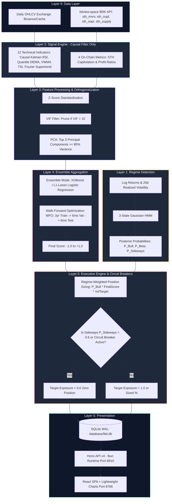

# Arsitektur & Fitur: Long-Term Trend Direction System (`quant-btc-lttd-system`)

> **Dokumen Arsitektur & Analisis Fitur Sistem Kuantitatif**  
> **Lokasi Proyek:** `/home/ubuntu/projects/quant-btc-lttd-system`  
> **Peran dalam Ekosistem:** *Orthogonal Regime-Switching Ensemble Engine* (Klasifikasi Arah Tren Makro Jangka Panjang)

---

## 1. Ringkasan Eksekutif & Tujuan Proyek

**Quant BTC LTTD System** adalah mesin kuantitatif berjangka panjang yang bertugas menjawab satu pertanyaan biner/terner fundamental pada setiap penutupan lilin harian (*daily bar close*):
> *"Apakah Bitcoin saat ini berada dalam rezim makro **BULL**, **BEAR**, atau **SIDEWAYS** dalam horizon waktu 120–350 hari ke depan?"*

Sistem ini didesain berdasarkan 4 pilar statistik yang ketat dan bebas dari bias pengintipan masa depan (*Zero Lookahead Bias*):

1. **Kalibrasi Horizon Ornstein-Uhlenbeck (OU):** Menentukan horizon waktu dinamis berdasarkan estimasi *half-life* mean-reversion harga BTC terhadap *Power Law trend*.
2. **Rezim Markov Tersembunyi (3-State Gaussian HMM):** Mengklasifikasikan kondisi pasar secara independen tanpa indikator harga, hanya menggunakan *log returns* harian dan volatilitas terealisasi (*realized volatility*).
3. **Ortogonalisasi PCA & Pruning VIF:** Menghilangkan multikolinearitas antar indikator teknikal dengan memilah komponen utama (*Principal Components*) dan memangkas indikator dengan *Variance Inflation Factor* (VIF) > 10.
4. **Ensemble Aggregation via L1-Lasso / XGBoost dengan Walk-Forward Optimization (WFO):** Menggabungkan sinyal teknikal dan *on-chain* secara adaptif terhadap perubahan siklus pasar.

---

## 2. Arsitektur 6-Layer & Alur Pemrosesan Sinyal

Sistem menerapkan arsitektur 6 lapisan (*6-Layer Architecture*) dari penerimaan data mentah hingga penyajian visual:



---

## 3. Rincian Lapisan Arsitektur (Layer 1 - Layer 5)

### 3.1 Layer 1: Regime Detection (Gaussian HMM)

Sebuah model **Hidden Markov Model (HMM) dengan 3 status Gaussian** dilatih hanya menggunakan input statistik murni: *Daily Log Returns* dan *20-Day Annualized Realized Volatility*.

- **Status 0 (BULL):** Imbal hasil harian rata-rata positif dengan volatilitas tinggi/menengah. Sinyal ensemble aktif penuh.
- **Status 1 (BEAR):** Imbal hasil negatif dengan volatilitas tinggi dan pergerakan ekstrem ke bawah. Sinyal ensemble aktif (bias *short/neutral*).
- **Status 2 (SIDEWAYS / CONSOLIDATION):** Imbal hasil mendekati nol, volatilitas rendah, korelasi acak. **Ensemble dimatikan (*Circuit Breaker*), target eksekusi dipaksa ke `0.0` exposure**.

### 3.2 Layer 2: Signal Engine (Causal Technical & On-Chain)

Sistem memiliki 12 indikator teknikal dalam desain dan 4 indikator aktif yang telah terporting penuh ke Python dengan **CausalFilter (nol lookahead bias)**.

#### 4 Indikator Teknikal Aktif (*Causal Indicator Engine*)

1. **Kalman Filtered RSI (`kalman_rsi.py`):** M menerapkan filter Kalman orde-N pada harga OHLC4 sebelum menghitung RSI(250) yang dinormalisasi ke rentang `[-0.5, +0.5]`.
2. **Adaptive Fourier Supertrend (`fourier_supertrend.py`):** Mendekomposisi frekuensi harmonik spektral menggunakan *Discrete Fourier Transform* (DFT) untuk membuat band trend/volatilitas adaptif.
3. **Quantile DEMA Supertrend / AdvancedStochastic (`quantile_dema.py`):** Menggabungkan Double Exponential Moving Average (DEMA) dengan persentil ATR bands untuk mendeteksi *directional flip*.
4. **VWMA Trend Strength Index / TSI (`trend_strength.py`):** Menghitung deviasi z-score intensitas tren berdasarkan `(Close - VWMA) / ATR`.

#### 4 Metrik On-Chain (via `bitview.space` BRK API - Free & No Auth)

| Seri API (`series`) | Nama Metrik | Sinyal Bullish / Capitulation Level | Perilaku terhadap Harga |
|---|---|---|---|
| `sth_mvrv` | Short-Term Holder MVRV | `< 1.0` (STH menanggung rugi kapitulasi awal) | *Leading indicator* (mendahului harga 3–14 hari saat puncak) |
| `sth_nupl` | Short-Term Holder NUPL | `< 0.0` (STH *underwater* / *oversold* ekstrem) | *Leading* di puncak, *lagging/coincide* di dasar |
| `sth_sopr_24h` | STH Spent Output Profit Ratio | *Bounce* dari `1.0` (konfirmasi kelanjutan tren) | *Lagging/Confirmation filter* |
| `sth_supply_in_profit` | STH Supply Held at Profit | Level absolut rendah dekat *cycle bottom* | *Macro Regime Filter* |

### 3.3 Layer 3: PCA Orthogonalization & VIF Pruning

Karena ke-16 fitur (teknikal + on-chain) mengukur momentum atau sentimen yang serupa, rata-rata sederhana menghasilkan keyakinan palsu akibat multikolinearitas.

1. **Pruning VIF:** Indikator dengan *Variance Inflation Factor* $\text{VIF} > 10$ dipangkas terlebih dahulu.
2. **PCA Transform:** Mengambil $k=3$ *Principal Components* pertama yang menjelaskan $\ge 85\%$ varians data historis.
3. **Pratt's Relative Importance:** Menilai kontribusi setiap indikator asli terhadap komponen utama $\text{PC}_1, \text{PC}_2, \text{PC}_3$ menggunakan rumus $d_j = \beta_j \cdot r_j / R^2$.

### 3.4 Layer 4: Ensemble Aggregation & Walk-Forward Optimization (WFO)

Model klasifikasi (*XGBoostEnsemble* untuk live mode, *L1LassoEnsemble* untuk backfill/pruning) dilatih untuk memprediksi probabilitas tren naik (*uptrend horizon*).

- **Walk-Forward Optimization (WFO):** Model tidak dilatih secara statis. Setiap lipatan (*fold*) menggunakan pelatihan bergerak (*rolling window*): **3 Tahun Train $\rightarrow$ 6 Bulan Validation (tuning parameter $\lambda$ L1-Lasso) $\rightarrow$ 6 Bulan Out-of-Sample Test**.

### 3.5 Layer 5: Execution Engine & Sizing

Bobot posisi dihitung secara dinamis:
$$\text{Position Size} = P(\text{Bull}) \times \text{Final Score} \times \text{Vol Target Scalar}$$

- **Hysteresis Circuit Breaker:** Eksekusi hanya memicu *entry/exit* jika terkonfirmasi pada penutupan lilin harian (*daily close*), mencegah *execution fee churn* di pasar yang bergetar.

---

## 4. Skema Database SQLite (`database/lttd.db`)

```sql
-- Core daily LTTD output table
CREATE TABLE daily_lttd (
  date                   TEXT PRIMARY KEY,
  final_score            REAL,          -- Nilai akhir ensemble [-1.0, +1.0]
  regime                 TEXT,          -- 'BULL' | 'BEAR' | 'SIDEWAYS'
  p_bull                 REAL,          -- Probabilitas posterior HMM status Bull
  p_bear                 REAL,          -- Probabilitas posterior HMM status Bear
  p_sideways             REAL,          -- Probabilitas posterior HMM status Sideways
  target_exposure        REAL,          -- 0.0 (Neutral/Cash) atau 1.0 (Full Exposure)
  circuit_breaker_active INTEGER        -- Flag 1 jika dipicu oleh Valuation System
);

-- Individual indicator scores per day
CREATE TABLE indicator_scores (
  date           TEXT,
  indicator_name TEXT,
  score          INTEGER,               -- Sinyal -1 atau +1
  PRIMARY KEY (date, indicator_name)
);

-- On-chain metrics history synced from BRK API
CREATE TABLE onchain_metrics (
  date                   TEXT PRIMARY KEY,
  sth_mvrv               REAL,
  sth_nupl               REAL,
  sth_sopr_24h           REAL,
  sth_supply_in_profit   REAL,
  stamp                  TEXT           -- Timestamp konfirmasi block dari BRK
);
```

---

## 5. API Backend (`backend/index.ts` - Port 8910)

| Endpoint | Metode | Deskripsi Respons & Kegunaan |
|---|---|---|
| `/api/regime` | `GET` | Status rezim saat ini (`BULL`, `BEAR`, `SIDEWAYS`) dan probabilitas `p_bull`, `p_bear`, `p_sideways`. |
| `/api/score/latest` | `GET` | Skor akhir saat ini (`final_score` $\in [-1.0, +1.0]$), arah (`direction`), dan status rezim. |
| `/api/score` | `GET` | Seluruh *time-series* historis skor akhir untuk pemetaan grafik *Lightweight Charts*. |
| `/api/indicators` | `GET` | Sinyal individual (`-1` atau `+1`) dari semua indikator aktif untuk pemetaan *Indicator Stack*. |
| `/api/onchain` | `GET` | Histori 4 metrik STH *on-chain* hasil sinkronisasi dari API `bitview.space`. |
| `/api/pca` & `/api/wfo` | `GET` | Analisis pembobotan komponen utama PCA dan metrik akurasi/Sharpe setiap *fold* WFO. |

---

## 6. Integrasi dengan Ekosistem Kuantitatif

LTTD bertindak sebagai **Pusat Sinkronisasi Data dan Filter Tren Makro**:

1. **Penyedia Data Cached OHLCV:** Tabel `ohlcv` di dalam `database/lttd.db` menjadi sumber kebenaran data harga harian Bitcoin untuk sistem jangka menengah (*MTTD System*). Saat `run_report_pipeline.py` dieksekusi, data dari tabel ini disalin secara otomatis ke `quant-btc-mttd-system/data/btc_daily.json`.
2. **Penerima Sinyal Valuasi:** LTTD memeriksa `CompositeValue` dari `quant-btc-valuation-system`. Jika terdeteksi anomali valuasi ekstrem, eksekusi LTTD mematikan posisi agresif.
