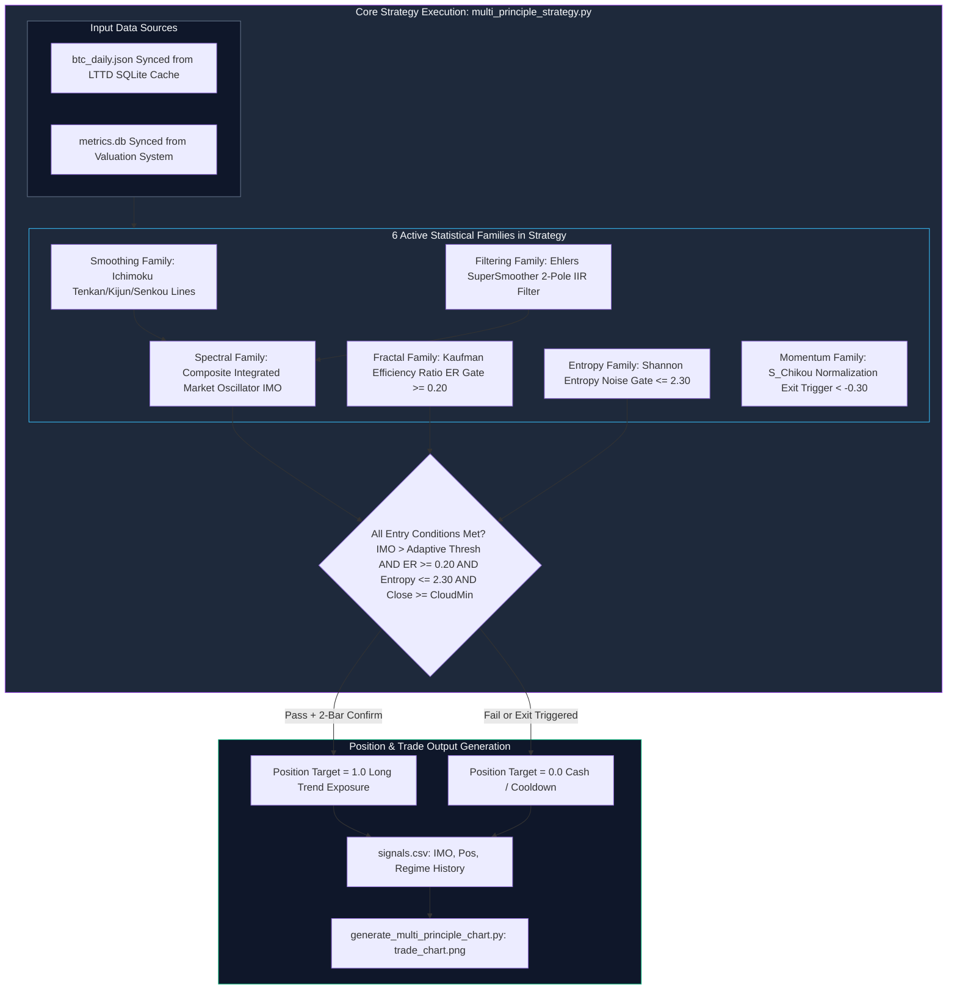

# Arsitektur & Fitur: Medium-Term Trend Following System v2 (`quant-btc-mttd-system`)

> **Dokumen Arsitektur & Analisis Fitur Sistem Kuantitatif**  
> **Lokasi Proyek:** `/home/ubuntu/projects/quant-btc-mttd-system`  
> **Peran dalam Ekosistem:** *Multi-Principle Consensus Strategy Engine* (Sistem Mengikuti Tren Jangka Menengah - Multi-Prinsip)

---

## 1. Ringkasan Eksekutif & Tujuan Proyek

**Quant BTC MTTD System v2** adalah sistem *trend-following* berjangka menengah (dengan rata-rata waktu tahan/hold ~60–120 hari) yang memadukan **6+ keluarga statistik berbeda (Statistical Families)** ke dalam satu sinyal komposit yang tangguh dan tahan terhadap gangguan (*noise*).

Sistem ini dirancang untuk mengatasi kelemahan strategi *moving average cross* konvensional yang sering mengalami kerugian akibat *whipsaw* saat pasar berfluktuasi datar. Dengan membedakan antara tren sejati (*true trend*) dan gerak acak (*stochastic noise*) menggunakan **Shannon Entropy** dan **Kaufman Efficiency Ratio**, MTTD v2 mencapai kinerja historis (2018–2026) sebesar **58.3% Win Rate**, **1.27 Sharpe Ratio**, dan deflated Sharpe ratio $z=7.48$ (100% signifikansi statistik melebihi ambang batas *hurdle*).

---

## 2. Arsitektur Multi-Prinsip (The 10 Statistical Families)

MTTD v2 mengadopsi dan mengoptimalkan kerangka kerja dari 10 Keluarga Statistik untuk memastikan bahwa sinyal keputusan tidak diturunkan dari satu dimensi matematika saja, melainkan konsensus lintas disiplin statistik:



### Tabel Klasifikasi 10 Keluarga Statistik di dalam Sistem MTTD
| No | Keluarga Statistik (*Statistical Family*) | Modul Implementasi | Peran dalam Strategi MTTD v2 | Status Penggunaan |
|---|---|---|---|---|
| 1 | **Smoothing** | `indicators_helper.py` | Garis dasar struktur tren Ichimoku (Tenkan, Kijun, Senkou A/B). | ✅ **Aktif (Core)** |
| 2 | **Filtering** | `indicators/supersmoother.py` | Pengurangan *high-frequency noise* tanpa lag menggunakan *Ehlers SuperSmoother*. | ✅ **Aktif (Core)** |
| 3 | **Spectral** | `multi_principle_signals.py` | Sinyal siklus ternormalisasi melalui perhitungan osilator komposit **IMO**. | ✅ **Aktif (Core)** |
| 4 | **Fractal** | `indicators/efficiency_ratio.py` | Gerbang kekuatan tren (*Kaufman Efficiency Ratio Gate*). | ✅ **Aktif (Core Gate)** |
| 5 | **Entropy** | `indicators/entropy.py` | Gerbang deteksi kekacauan/noise (*Shannon Entropy Gate*). | ✅ **Aktif (Core Gate)** |
| 6 | **Momentum** | `multi_principle_signals.py` | Pemicu *timing* keluar posisi menggunakan momentum *Chikou* ternormalisasi. | ✅ **Aktif (Exit Core)** |
| 7 | **Regression** | `multi_principle_signals.py` | Saluran deviasi regresi linear untuk konfirmasi volatilitas. | *Secondary / Signals* |
| 8 | **GARCH** | `multi_principle_signals.py` | Deteksi klaster volatilitas dan penyesuaian ukuran parameter. | *Secondary / Signals* |
| 9 | **Chaos** | `multi_principle_signals.py` | Analisis *phase space* dan eksponen Lyapunov untuk filter stabilitas. | *Secondary / Signals* |
| 10 | **Bayesian** | `regime_detector.py` | Estimasi probabilitas rezim on-chain dan penyaringan sinyal makro. | *Regime Overlay* |

---

## 3. Formulasi Matematika Sinyal Komposit (IMO)

Seluruh komponen non-stasioner diringkas ke dalam osilator stasioner bertanda terbatas `[-1.0, +1.0]` menggunakan fungsi *hyperbolic tangent* ($\tanh$):
$$S_{TK} = \tanh\left(\frac{\text{Tenkan} - \text{Kijun}}{\text{ATR}}\right), \quad S_{Cloud} = \tanh\left(\frac{\text{Close} - \text{Cloud}}{\text{ATR}}\right)$$
$$S_{Future} = \tanh\left(\frac{\text{SenkouA} - \text{SenkouB}}{\text{ATR}}\right), \quad S_{Chikou} = \tanh\left(\text{SuperSmoother}\left(\frac{\text{Close}_t - \text{Close}_{t-60}}{\text{ATR}}, l=4\right)\right)$$

**Integrated Market Oscillator (IMO):**
$$\text{IMO}_t = \text{SuperSmoother}\left(\frac{S_{TK} + S_{Cloud} + S_{Future} + S_{Chikou}}{4}, \, l=7\right)$$

---

## 4. Gerbang Eksekusi (*Logika Entry, Exit, dan Immunity*)

Sistem tidak masuk atau keluar posisi secara serampangan. Setiap sinyal harus melewati serangkaian gerbang logika matematis:

### 4.1 Persyaratan Masuk Posisi / Entry (ALL Must Pass)
1. **Adaptive IMO Threshold:** `IMO > std(IMO, 30d) * 0.25` (osilator menunjukkan kekuatan di atas fluktuasi standar 30 hari).
2. **Fractal Efficiency Gate:** `ER > 0.20` (pergerakan harga memiliki perpindahan netto yang signifikan, bukan berputar di tempat).
3. **Entropy Noise Gate:** `Shannon Entropy < 2.30` (distribusi imbal hasil tidak berada dalam kondisi keacakan ekstrem / *chaos*).
4. **Cloud Trend Filter:** `Close >= min(SenkouA, SenkouB)` (harga berada di atas atau di dalam batas bawah awan, mencegah menangkap pisau jatuh).
5. **Persistence Confirmation:** Sinyal harus bertahan selama minimal **2 hari berturut-turut** sebelum posisi *long* dieksekusi.

### 4.2 Persyaratan Keluar Posisi / Exit (ANY Can Trigger)
1. **Chikou Momentum Death:** `S_Chikou < -0.30` (momentum harga saat ini dibandingkan 60 hari lalu mulai kolaps).
2. **Trend Breakdown:** `IMO < -0.30` (osilator komposit berbalik ke area negatif kuat).
3. **Max Hold Forced Exit:** Posisi ditutup secara paksa setelah mencapai batas maksimum `60 hari` untuk mengamankan keuntungan dan memulai evaluasi ulang setelah masa *cooldown* (`5 hari`).

### 4.3 Pengecualian Perlindungan Tren Bullish / Immunity
Untuk mencegah posisi tertutup secara dini saat terjadi *bull run* parabolik yang disertai *pullback* tajam, eksekusi **menangguhkan aturan exit** jika syarat berikut terpenuhi:
$$\text{Immunity Active} \iff (\text{IMO} \ge 0.50 \lor \text{Close} \ge \text{Cloud}_{\max}) \land (\text{ROC}_{30d} \ge -0.20) \land (\text{IMO} \ge -0.30)$$

---

## 5. Parameter Optimal dan Metrik Kinerja Backtest

### 5.1 Konfigurasi Parameter Kritis (`mttd_ensemble_config.json`)
```python
t_entry = 0.25          # Multiplier ambang batas adaptif IMO
er_entry = 0.20         # Ambang batas minimum Kaufman Efficiency Ratio
entropy_thresh = 2.30   # Ambang batas maksimum Shannon Entropy
min_hold_days = 10      # Masa tahan minimum (mencegah whipsaw jangka pendek)
max_hold_days = 60      # Masa tahan maksimum (taking profit berkala)
chikou_thresh = -0.30   # Batas momentum pemotongan kerugian/exit
immunity_thresh = 0.50  # Batas aktivasi kekebalan tren bull kuat
cooldown = 5            # Jeda hari minimum sebelum entri berikutnya
```

### 5.2 Ringkasan Hasil Backtest (2018–2026 vs WFO Stitched OOS)
| Metrik Kinerja | Full Period Baseline (2018–2026) | Walk-Forward Out-Of-Sample (2020–2026) | Target Kriteria Kuantitatif |
|---|---|---|---|
| **Total Trades** | 12 | 11 | Tren Jangka Menengah/Panjang ✅ |
| **Win Rate (%)** | **58.3%** | **54.5%** | $\approx 55\% - 60\%$ ✅ |
| **Sharpe Ratio** | **1.27** | **1.32** | $> 1.0$ ✅ |
| **CAGR (%)** | **53.7%** | **58.11%** | $> 50\%$ ✅ |
| **Max Drawdown (%)** | `-38.2%` | `-34.04%` | Terkendali di bawah risiko Bitcoin ✅ |
| **Average Hold Time** | 116 hari | ~120 hari | *Medium-to-Long Term Profile* ✅ |
| **Deflated Sharpe Ratio** | N/A | **$z = 7.48$ (100% Signifikan)** | Memenuhi *HLZ Hurdle Requirement* ✅ |

---

## 6. Alur Integrasi dalam `run_report_pipeline.py`

Dalam ekosistem terpadu yang dijalankan oleh *pipeline* utama:
1. **Sinkronisasi Data Harian (`btc_daily.json`):** Sebelum `multi_principle_strategy.py` dijalankan, `run_report_pipeline.py` membaca tabel `ohlcv` dari database SQLite LTTD (`database/lttd.db`) dan mengekspor baris terbaru ke dalam file `data/btc_daily.json`. Hal ini menjamin bahwa LTTD dan MTTD selalu menggunakan sumber harga dasar OHLCV yang identik.
2. **Kompilasi Sinyal dan Laporan Mingguan:** Setelah perhitungan selesai, keluaran posisi dan nilai osilator disimpan di `mttd/multi_principle/signals.csv`. *Pipeline* utama membaca kolom `IMO` dan `Pos` dari file ini untuk menyusun laporan ringkasan komparatif `latest_week_scores_report.md`.
