# Arsitektur & Fitur: Ichimoku Quantitative Optimization System (`quant-lttd-ichimoku`)

> **Dokumen Arsitektur & Analisis Fitur Sistem Kuantitatif**  
> **Lokasi Proyek:** `/home/ubuntu/projects/quant-lttd-ichimoku`  
> **Peran dalam Ekosistem:** *Multi-Principle Denoised Framework for Crypto Trend-Following* (Kuantifikasi Ichimoku Kinko Hyo yang Dihilangkan Noisenya)

---

## 1. Ringkasan Eksekutif & Tujuan Proyek

**Ichimoku Quantitative Optimization System** adalah proyek riset dan implementasi produksi yang mengubah indikator visual tradisional *Ichimoku Kinko Hyo* menjadi sistem *trend-following* berjangka panjang dan menengah yang stasioner secara matematis, dapat diuji secara statistik, dan bebas dari interpretasi subyektif.

Tesis utama dari sistem ini adalah bahwa pengenalan pola visual pada grafik awan Ichimoku konvensional (yang bersifat non-stasioner karena nilainya melayang bersama harga absolut) dapat digantikan sepenuhnya oleh **osilator stasioner bertanda terbatas (`[-1.0, +1.0]`)** yang dihitung menggunakan transformasi *hyperbolic tangent* ($\tanh$) dan disaring menggunakan *Ehlers SuperSmoother 2-Pole IIR Filter*.

Dalam pengujian historis berjangka waktu 10 tahun (2016–2026), sistem ini menghasilkan total return **109,368.07%** dengan **Sharpe Ratio 1.47** dan **Max Drawdown -48.17%** (mengungguli *buy-and-hold* sebesar ~5.5× berdasarkan basis yang disesuaikan dengan risiko). Mengabaikan *bull run* ekstrem 2017 (periode 2018–2026), sistem tetap membukukan return **4,137.62%** dengan **Sharpe Ratio 1.29**.

---

## 2. Arsitektur 5-Layer Multi-Principle Gating Framework

Sinyal perdagangan dalam sistem ini diproses melalui 5 lapisan gerbang matematis berurutan, di mana setiap lapisan mewakili disiplin dan keluarga statistik yang unik:

```mermaid
graph TD
    subgraph DataIngestion [Raw OHLCV Data Input]
        A[yfinance / Local Cache / btc_cache.csv] --> B[Data Normalization & Calculation]
    end

    subgraph Layer1 [Layer 1: Spectral Filtering Family]
        B --> L1[Ehlers SuperSmoother 2-Pole IIR Filter]
        L1 -->|Zero Lag Noise Reduction| C[Stationary Tanh Decomposition: S_TK, S_Cloud, S_Future, S_Chikou]
        C --> D[Integrated Market Oscillator IMO]
    end

    subgraph Layer2 [Layer 2: Fractal Gating Family]
        D --> L2[Kaufman Efficiency Ratio ER Calculation]
        L2 -->|Check Trend vs Noise| E{ER >= 0.25 Gate}
    end

    subgraph Layer3 [Layer 3: Information Theory Family]
        E -->|Pass| L3[Shannon Entropy on Rolling 15d Histogram 6 Bins]
        L3 -->|Check Chaotic State| F{Entropy <= 2.271 Gate}
    end

    subgraph Layer4 [Layer 4: Trend Regression Boundary Gate]
        F -->|Pass| L4[Ichimoku Cloud Boundary Evaluation]
        L4 -->|Check Falling Knife Risk| G{Close >= min SenkouA, SenkouB Gate}
    end

    subgraph Layer5 [Layer 5: Signal Confirmation & Exit Logic]
        G -->|Pass| L5[Persistence Check: 2-Bar Confirmation]
        L5 -->|Trigger Entry| H[Active Long Position]
        H --> I{Exit Evaluation: S_Chikou < -0.30 OR IMO < -0.30 OR Crash ROC < -0.20}
        I -->|Exit Triggered| J[Close Position / Return to Cash]
    end

    style DataIngestion fill:#0f172a,stroke:#64748b,color:#f8fafc
    style Layer1 fill:#1e293b,stroke:#38bdf8,color:#f8fafc
    style Layer2 fill:#1e293b,stroke:#a78bfa,color:#f8fafc
    style Layer3 fill:#1e293b,stroke:#fb923c,color:#f8fafc
    style Layer4 fill:#1e293b,stroke:#4ade80,color:#f8fafc
    style Layer5 fill:#1e293b,stroke:#f472b6,color:#f8fafc
```

---

## 3. Rincian Lapisan & Formulasi Matematis

### 3.1 Layer 1: Dekomposisi Stasioner ($\tanh$) & Spectral Denoising
Empat komponen non-stasioner Ichimoku dinormalisasi ke rentang terbatas `[-1.0, +1.0]` menggunakan fluktuasi *Average True Range* (ATR):
1. **Tenkan-Kijun Cross Oscillator:** $S_{TK,t} = \tanh\left(\frac{TK_t - KJ_t}{ATR_t}\right)$
2. **Cloud Distance Oscillator:** $S_{Cloud,t} = \tanh\left(\frac{Close_t - Cloud_t}{ATR_t}\right)$
3. **Future Cloud Bias Oscillator:** $S_{Future,t} = \tanh\left(\frac{SenkouA_t - SenkouB_t}{ATR_t}\right)$
4. **Smoothed Chikou Momentum:** $S_{Chikou,t} = \tanh\left(\text{SuperSmoother}\left(\frac{Close_t - Close_{t-60}}{ATR_t}, l=4\right)\right)$

**Integrated Market Oscillator (IMO):**
$$\text{IMO}_t = \text{SuperSmoother}\left(\frac{S_{TK,t} + S_{Cloud,t} + S_{Future,t} + S_{Chikou,t}}{4}, \, l=7\right)$$
- **SuperSmoother IIR Transfer Function:** $y_t = c_1(x_t + x_{t-1})/2 + c_2 \cdot y_{t-1} + c_3 \cdot y_{t-2}$, di mana koefisien diturunkan dari frekuensi *cutoff* $l=7$ hari untuk menghilangkan getaran frekuensi tinggi tanpa menambah kelambatan (*lag*).

### 3.2 Layer 2: Gerbang Efisiensi Fraktal (*Kaufman Efficiency Ratio Gate*)
Mengukur rasio perpindahan harga neto (*net displacement*) terhadap total jarak pergerakan *tick-by-tick* (*total path length*):
$$\text{ER} = \frac{|Close_t - Close_{t-n}|}{\sum_{i=1}^{n} |Close_i - Close_{i-1}|}$$
- **Ambang Batas:** `ER >= 0.25`. Jika `ER < 0.25`, pasar dianggap berada dalam konsolidasi acak, dan seluruh sinyal *entry* diblokir.

### 3.3 Layer 3: Gerbang Teori Informasi (*Shannon Entropy Noise Gate*)
Mengukur tingkat ketidakpastian atau keacakan distribusi imbal hasil harian dalam jendela bergerak 15 hari menggunakan 6 *bins* histogram:
$$H = -\sum_{i=1}^{6} p_i \log_2(p_i)$$
- **Ambang Batas:** `Entropy <= 2.271`. Jika entropi melampaui level ini, struktur pasar dinilai terlalu kacau (*chaotic regime*), dan posisi baru tidak diizinkan.

### 3.4 Layer 4: Gerbang Batas Tren Awan (*Cloud Boundary Gate*)
Harga penutupan wajib berada di atas batas terendah awan Ichimoku: $Close_t \ge \min(SenkouA_t, SenkouB_t)$. Ini mencegah sistem mengeksekusi pembelian pada saat terjadi *dead-cat bounce* di dalam tren *bearish* mayor.

### 3.5 Layer 5: Logika Keluar dengan Kekebalan Dinamis (*Dynamic Immunity Exit*)
1. **Momentum Decay Exit:** Posisi ditutup jika momentum *Chikou* ternormalisasi turun di bawah ambang batas: `S_Chikou < -0.30`.
2. **Dynamic Immunity:** Selama harga berada di atas awan (*above cloud*) dan tidak terjadi kerusakan tren ekstrem, batas toleransi *exit* dilonggarkan ke `IMO > -0.30`.
3. **Crash Circuit Breaker:** Jika tingkat penurunan harga (*Rate of Change* 30 hari) jatuh di bawah `-0.20` (`-20%`), kekebalan dicabut dan posisi langsung ditutup paksa demi melindungi modal.
4. **Minimum Hold Time:** Jeda penahanan posisi minimal `10 hari` sejak *entry* untuk mencegah *overtrading*.

---

## 4. Validasi Statistik Formal (`research/statistical_tests.py`)

Sistem ini memiliki keunggulan ilmiah karena telah melewati 5 pengujian hipotesis statistik formal untuk membuktikan ketahanan dan keabsahan sinyalnya:

| Nama Pengujian Statistik | Hipotesis Nol ($H_0$) | Hasil Uji | Implikasi Klinis / Kuantitatif |
|---|---|---|---|
| **Augmented Dickey-Fuller (ADF)** | Osilator IMO bersifat non-stasioner (*unit root* / melayang acak). | **Tolak $H_0$ ($p \approx 0.0$)** | Osilator terbukti stasioner secara ketat. Parameter ambang batas statis sah digunakan sepanjang waktu. |
| **Kolmogorov-Smirnov (KS)** | Distribusi imbal hasil ke depan pada rezim Bullish dan Bearish adalah identik. | **Tolak $H_0$ ($p < 0.05$)** | Sinyal berhasil memisahkan dua rezim probabilitas pasar yang sama sekali berbeda secara signifikan. |
| **Welch's t-test** | Rata-rata imbal hasil 10 hari ke depan pada sinyal Bullish $\le 0$. | **Tolak $H_0$ ($p \approx 0.0$)** | Sinyal memberikan ekspektasi positif (*positive expectancy*) yang signifikan secara matematis. |
| **Bootstrap 95% Confidence Interval** | Rata-rata imbal hasil = $0$ (non-parametrik dengan resampling 10,000×). | **CI Selalu Positif** | Keunggulan (*edge*) sistem kebal terhadap anomali pencilan ekor tebal (*fat-tailed outliers*). |
| **Bonferroni Correction Check** | Sub-komponen ($S_{TK}, S_{Cloud}, S_{Future}, S_{Chikou}$) hanyalah kebetulan noise. | **Semua 4 Lolos ($\alpha = 0.0125$)** | Tidak terjadi *p-hacking*; keempat komponen menyumbang informasi independen yang valid. |

---

## 5. Arsitektur Perangkat Lunak & Integrasi Pipeline

### 5.1 Struktur Modular & Layanan (`src/ichimoku_quant/`)
Sistem dikembangkan dengan manajemen dependensi modern menggunakan **Poetry** (Python 3.10+) dan **Bun** (Frontend):
- `data.py`: Mengambil data historis BTC/USD harian dari *yfinance* dan menyimpannya secara lokal di *cache* CSV/SQLite.
- `features.py`: Bertanggung jawab penuh atas perhitungan normalisasi $\tanh$, *SuperSmoother*, *Efficiency Ratio*, dan *Shannon Entropy*.
- `strategy.py`: Menjalankan evaluasi 5 gerbang logika secara berurutan dan menghasilkan sinyal posisi harian (`Pos`).
- `server.py`: Layanan **FastAPI** *backend* yang menyediakan model validasi *Pydantic* untuk pengujian *backtest* interaktif via REST API.
- `web/`: Aplikasi *frontend* **React + Vite** bertema gelap (*dark mode*) dengan visualisasi **Lightweight Charts v5**.

### 5.2 Paritas TradingView Pine Script v6 (`ichimoku_quant_v6.pinescript`)
Untuk menjamin transparansi, seluruh logika matematika Python di dalam `features.py` dan `strategy.py` memiliki replika identik 100% dalam bahasa **TradingView Pine Script v6**, memungkinkan pengujian silang visualisasi *bar-by-bar* di platform TradingView.

### 5.3 Peran dalam `run_report_pipeline.py`
Ketika *pipeline* utama dieksekusi:
1. *Cache* sementara di `tmp/btc_cache.csv` dihapus terlebih dahulu (`os.remove`) untuk memastikan pembaruan data harga harian terbaru.
2. `python3 main.py` dijalankan di bawah direktori `quant-lttd-ichimoku` untuk menghitung ulang seluruh osilator dan sinyal posisi.
3. `run_report_pipeline.py` mengimpor modul `ichimoku_quant` secara langsung dan menghitung baris tabel `latest_week_scores_report.md` untuk menampilkan nilai `IMO`, `Regime`, dan `Pos` harian.
