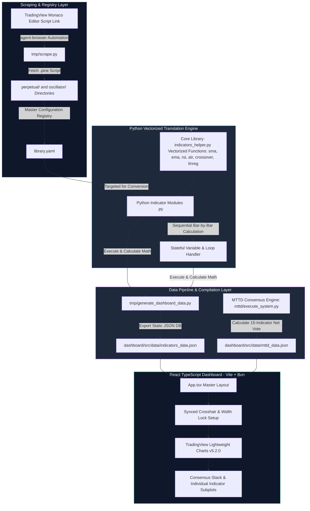

# Arsitektur & Fitur: Quant Technical Indicator Bank (`quant-technical-indicator-bank`)

> **Dokumen Arsitektur & Analisis Fitur Sistem Kuantitatif**  
> **Lokasi Proyek:** `/home/ubuntu/projects/quant-technical-indicator-bank`  
> **Peran dalam Ekosistem:** *Production-Grade Quant Library, Automated Scraper & Interactive Visualization Dashboard* (Bank Indikator Kuantitatif, Mesin Scraper Pine Script & Dashboard Visualisasi)

---

## 1. Ringkasan Eksekutif & Tujuan Proyek

**Quant Technical Indicator Bank** adalah repositori fondasi dan perpustakaan inti (*core library*) yang menyediakan infrastruktur indikator teknikal dan statistikal berkinerja tinggi bagi seluruh proyek kuantitatif Bitcoin di bawah `/home/ubuntu/projects`.

Proyek ini memiliki 3 pilar fungsionalitas utama:
1. **Automated Pine Script Scraping Engine (`tmp/scrape.py`):** Mesin otomatisasi peramban berbasis `agent-browser` yang mengambil dan mendokumentasikan kode indikator dari *Monaco Editor* di platform TradingView.
2. **Vectorized Python Translation Library (`indicators_helper.py`, `perpetual/*.py`, `oscillator/*.py`):** Pustaka terjemahan yang mengubah logika Pine Script (termasuk *stateful variables* `var` dan `varip`) menjadi operasi vektor *bar-by-bar* menggunakan **Pandas** dan **NumPy** dengan akurasi matematis 100% dan bebas lookahead bias.
3. **Interactive React TypeScript Dashboard (`dashboard/`):** Antarmuka visual interaktif berbasis **Vite** dan **TradingView Lightweight Charts v5** yang menampilkan hasil kalkulasi dari 15 indikator konsensus (*MTTD v1/Consensus Stack*) berserta grafik candlestick secara *real-time*.

---

## 2. Arsitektur Sistem & Alur Data Perpustakaan



---

## 3. Pustaka Inti Vectorized (`indicators_helper.py`)

Agar terjemahan Python memiliki perilaku yang identik mutlak dengan fungsi bawaan TradingView Pine Script v5/v6, modul `indicators_helper.py` menyediakan fungsi vektorisasi tingkat rendah yang dioptimalkan:

### A. Rata-Rata Bergerak & Filter Spektral (*Moving Averages & Smoothing*)
- **Simple & Exponential:** `sma(s, length)`, `ema(s, length)`, `wma(s, length)`, `vwma(s, volume, length)`
- **Hull & Double/Triple Exponential:** `hma(s, length)`, `dema(s, length)`, `tema(s, length)`, `t3(s, length, v)`
- **Adaptive & Zero-Lag:** `alma(s, length, offset, sigma)`, `frama(high, low, close, length)`
- **Ehlers Filters:** `supersmoother(s, length, poles=2)` (digunakan secara ekstensif oleh LTTD, MTTD v2, dan Ichimoku).

### B. Osilator Volatilitas & Momentum (*Range & Momentum*)
- **True Range & ATR:** `tr(high, low, close)`, `atr(high, low, close, length)`
- **Momentum & Strength:** `rsi(close, length)`, `cmo(close, length)`, `mom(close, length)`, `mfi(high, low, close, volume, length)`
- **Parabolic & Channels:** `sar(high, low, step, max_step)`, `cci(high, low, close, length)`

### C. Logika & Operasi Sinyal Bar-by-Bar (*Pine Script Logic Equivalents*)
- **Zero & Null Handling:** `nz(s, default=0)` (mengubah `NaN` menjadi nilai default sesuai standar Pine).
- **Crossover & Crossunder:** `crossover(s1, s2)`, `crossunder(s1, s2)` (mendeteksi titik persilangan tepat pada bar ke-$t$).
- **Lookback & Extremum:** `highest(s, length)`, `lowest(s, length)`, `pivothigh(s, left, right)`, `pivotlow(s, left, right)`
- **Regression & Reference:** `linreg(s, length, offset)`, `valuewhen(condition, source, occurrence)`, `barssince(condition)`

---

## 4. Skema Registri Master (`library.yaml`)

Semua metrik dan status terjemahan dilacak secara terpusat dalam file konfigurasi YAML master:
```yaml
- indicator: DEMA RSI Overlay
  author: BackQuant
  link: https://www.tradingview.com/script/YJ1WIIFb-DEMA-RSI-Overlay-BackQuant/
  status: fetched              # Status pengambilan dari web: fetched | unfetched | script not available
  conversion_status: converted # Status terjemahan Python: converted | unconverted | not applicable
```
Skrip otomatis `tmp/sync_conversion_status.py` memvalidasi keberadaan fisik file `.py` di folder `perpetual/` dan `oscillator/` dan memperbarui `library.yaml` secara otomatis.

---

## 5. Implementasi 10 Keluarga Statistik (*10 Statistical Families Foundation*)

Pustaka ini menjadi rumah bagi riset dasar klasifikasi **10 Keluarga Statistik** yang diterapkan pada proyek-proyek strategi utama:
1. **Smoothing Family:** Rata-rata bergerak dan filter linear untuk meredam noise harga.
2. **Filtering Family:** Filter frekuensi digital IIR (*Ehlers SuperSmoother, Roofing Filter*) untuk menghilangkan kelambatan (*zero-lag*).
3. **Regression Family:** Saluran regresi kuadratik dan linear (*Linear Regression Channels*) untuk menentukan batas penyimpangan tren.
4. **Spectral Family:** Analisis transformasi Fourier (*Discrete Fourier Transform / FFT*) untuk mendeteksi siklus dominan dan harmonik.
5. **Fractal Family:** Rasio efisiensi Kaufman (*Efficiency Ratio*) dan eksponen Hurst untuk memisahkan tren fraktal dari gerak acak (*Brownian motion*).
6. **Entropy Family:** Teori informasi Shannon (*Shannon Entropy*) untuk mendeteksi rezim pasar yang kacau (*chaos gate*).
7. **Momentum Family:** Osilator momentum termodifikasi (*Chikou, MACD, TSI*) untuk memetakan percepatan harga.
8. **GARCH Family:** Pemodelan volatilitas autoregresif bersyarat untuk memprediksi klaster volatilitas dan penyesuaian ukuran posisi.
9. **Chaos Family:** Rekonstruksi *phase space* dan eksponen Lyapunov untuk mengukur stabilitas tren sistem dinamis.
10. **Bayesian / ML Hybrid Family:** Pemodelan probabilitas posterior (*Hidden Markov Models / HMM*) untuk klasifikasi rezim pasar makro.

---

## 6. Dashboard Visualisasi & Konsensus MTTD v1 (`dashboard/`)

Aplikasi *frontend* yang dibangun dengan **React 19 + TypeScript + Vite** berfungsi sebagai *testbed* visualisasi berkinerja tinggi:
1. **Vertical Cursor Synchronization:** Ketika pengguna menggerakkan *crosshair* mouse di salah satu grafik, garis vertikal penunjuk waktu secara otomatis tersinkronisasi di seluruh grafik indikator lainnya.
2. **Y-Axis Width Lock (`85px`):** Lebar sumbu harga di sisi kanan dikunci pada ukuran minimum `85px`, memastikan seluruh grid, batas lilin, dan label harga tegak lurus sempurna secara vertikal.
3. **Consensus Stack Panel (`mttd/execute_system.py`):**
   - Menampilkan agregasi **15 indikator non-repainting** berjangka menengah.
   - Menghitung **Net Vote** harian (rentang `-15` hingga `+15`). Jika skor komposit positif, area diwarnai **Emerald Green** (*Bullish Consensus*); jika negatif, diwarnai **Rose Red** (*Bearish Consensus*).
   - Menampilkan 15 *subplot custom baseline chart* yang memperlihatkan pergeseran status rezim individual secara serentak.
