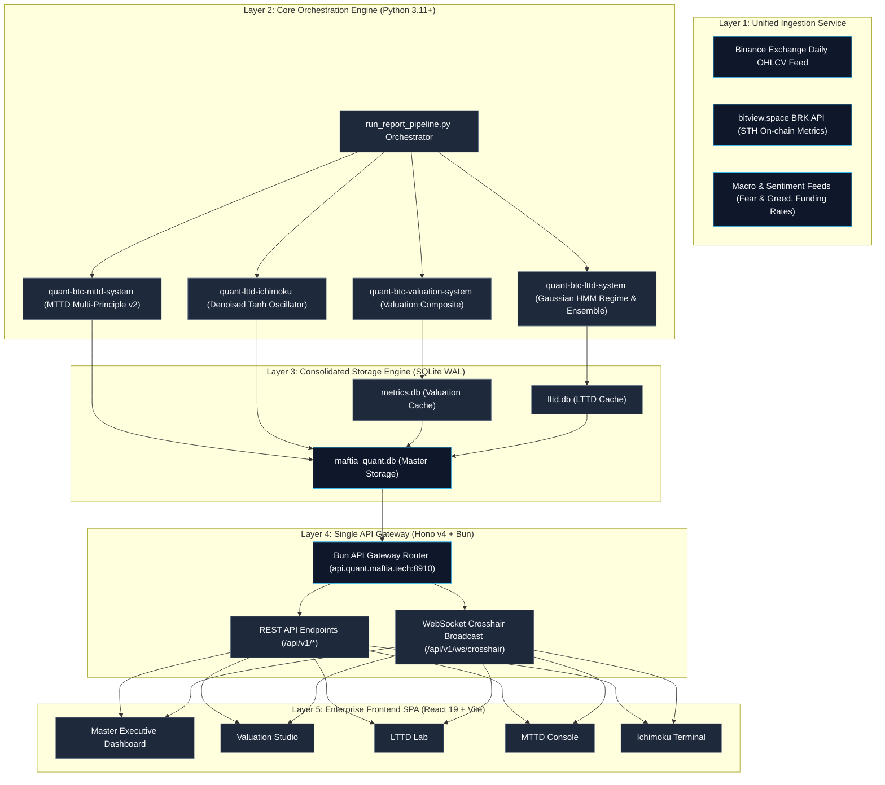
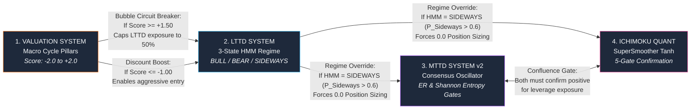

# Maftia Quant Platform: End-to-End Master Architecture

> **Navigation:**
> - [E2E Overview](file:///home/ubuntu/projects/quant.maftia.tech/docs/architecture/00_end_to_end.md)
> - [01. Valuation Studio](file:///home/ubuntu/projects/quant.maftia.tech/docs/architecture/01_valuation_system.md)
> - [02. LTTD Lab](file:///home/ubuntu/projects/quant.maftia.tech/docs/architecture/02_lttd_system.md)
> - [03. MTTD Console](file:///home/ubuntu/projects/quant.maftia.tech/docs/architecture/03_mttd_system.md)
> - [04. Ichimoku Terminal](file:///home/ubuntu/projects/quant.maftia.tech/docs/architecture/04_ichimoku_system.md)

---

## 1. System Overview

The **Maftia Quant Bitcoin Intelligence Platform** is an enterprise-grade quantitative trading and analytics ecosystem. It integrates **4 unified quantitative models** into a single event-driven execution pipeline and real-time visualization interface.

The platform is structured into **5 distinct architectural layers**:



---

## 2. Ingestion & Data Sources

`MasterOHLCV` acts as the canonical data source. Freshness is enforced by a **Causal Freshness Guard** ensuring that all indicators use historical ($t-1$) data with no lookahead bias.

*   **OHLCV Master Feed:** Daily price action fetched from Binance Exchange APIs and project cache.
*   **bitview.space BRK API:** Fetches 4 short-term holder (STH) indicators via a single bulk HTTP request:
    *   `sth_mvrv` (Short-Term Holder Market Value to Realized Value)
    *   `sth_nupl` (Short-Term Holder Net Unrealized Profit/Loss)
    *   `sth_sopr_24h` (Short-Term Holder Spent Output Profit Ratio)
    *   `sth_supply_in_profit` (Short-Term Holder Supply in Profit)
*   **Macro & Sentiment Feeds:** Crypto Fear & Greed index, Google Trends, and BTC funding rates.

---

## 3. Core Orchestration Engine

The pipeline runs sequentially via `run_report_pipeline.py`. It coordinates the calculations across all 4 systems, ensuring SQLite connections use **Write-Ahead Logging (WAL)** for lock-free concurrency.

### Daily Sync Sequence Diagram

```mermaid
sequenceDiagram
    autonumber
    participant Exec as run_report_pipeline.py
    participant DB as maftia_quant.db (WAL)
    participant VAL as quant-btc-valuation-system
    participant LTTD as quant-btc-lttd-system
    participant MTTD as quant-btc-mttd-system
    participant ICH as quant-lttd-ichimoku

    Exec->>DB: Open SQLite WAL connection
    Exec->>VAL: Trigger Valuation Engine calculation
    VAL->>VAL: Calculate 17 indicators (t-1)
    VAL->>Exec: Return valuation_composite score [-2.0, +2.0]
    
    Exec->>LTTD: Run HMM Regime & Ensemble Engine
    LTTD->>LTTD: Calculate HMM Regime (BULL/BEAR/SIDEWAYS)
    LTTD->>Exec: Return LTTD final_score & regime
    
    Note over Exec,MTTD: Sync synced_daily.json and lttd target_exposure
    Exec->>MTTD: Trigger Mid-Term Trend Engine
    MTTD->>MTTD: Apply ER & Entropy gates; compute position
    MTTD->>Exec: Return mttd_imo & target position
    
    Exec->>ICH: Trigger Ichimoku Quant Engine
    ICH->>ICH: Compute Denoised Tanh components & SuperSmoother
    ICH->>Exec: Return ichimoku_imo & target position
    
    Exec->>DB: Persist UnifiedDailyAnalytics & UnifiedComponentSignals
    Exec->>DB: Close WAL connection cleanly
```

---

## 4. Consolidated Storage Engine

The unified database `maftia_quant.db` stores historical and current analytical metrics.

*   `master_ohlcv`: Canonical table for daily Bitcoin prices (`open`, `high`, `low`, `close`, `volume`).
*   `unified_daily_analytics`: Daily outputs from all 4 quantitative systems.
*   `unified_component_signals`: Daily individual indicator components (17 valuation, 12 LTTD, 10 MTTD, 4 Ichimoku).

---

## 5. Single API Gateway & WebSocket Server

All client queries route through a **Hono v4 Gateway on port `:8910`**, bound to `0.0.0.0` for container and external visibility.

*   `GET /api/v1/executive-summary`: Fetches the latest day's status across all 4 systems.
*   `GET /api/v1/timeseries/master`: Returns full historical time series.
*   `WebSocket /api/v1/ws/crosshair`: Broadcasts multi-window mouse coordinate updates (`x`, `y` coordinates) to synchronize charts across different displays.

---

## 6. Enterprise Frontend SPA

Built with **React 19, TypeScript, Vite, and Lightweight Charts v5.2**.
*   **85px Y-Axis Lock:** Strictly enforces a fixed width of `85px` on the right price/oscillator axis across all subplots to prevent horizontal time-tick misalignment.
*   **DOM Chart Persistence:** Fullscreen maximize toggling preserves chart instances in the DOM by using CSS visibility filters (`.chart-subplot-hidden { height: 0; overflow: hidden }`) instead of unmounting.

---

## 7. Cross-System Interlocking Safeguards

The platform employs a multi-tiered defense architecture, where systems act as gates and overrides for one another.



### Inter-System Interaction Matrix

| System Source | Target System | Logic & Condition | Action Taken |
|---|---|---|---|
| **Valuation** | LTTD | `valuation_composite >= +1.50` (Extreme Bubble) | Set macro safety valve, cap maximum LTTD target exposure to `0.50`. |
| **Valuation** | LTTD | `valuation_composite <= -1.00` (Deep Discount) | Enable aggressive scale-in; override short signals. |
| **LTTD** | MTTD & Ichimoku | `lttd_regime == 'SIDEWAYS'` ($P_{\text{Sideways}} > 0.60$) | Force medium-term target positions (`mttd_position`, `ichimoku_position`) to `0.0` (Return to Cash). |
| **MTTD** | Ichimoku | `mttd_imo > 0.25` AND `ichimoku_imo > 0.40` | Symmetrical confluence: Unlock maximum target leverage/sizing. |

---

> **Navigation:**
> - [E2E Overview](file:///home/ubuntu/projects/quant.maftia.tech/docs/architecture/00_end_to_end.md)
> - [01. Valuation Studio](file:///home/ubuntu/projects/quant.maftia.tech/docs/architecture/01_valuation_system.md)
> - [02. LTTD Lab](file:///home/ubuntu/projects/quant.maftia.tech/docs/architecture/02_lttd_system.md)
> - [03. MTTD Console](file:///home/ubuntu/projects/quant.maftia.tech/docs/architecture/03_mttd_system.md)
> - [04. Ichimoku Terminal](file:///home/ubuntu/projects/quant.maftia.tech/docs/architecture/04_ichimoku_system.md)

← Prev (Index) | ↑ [E2E Overview](file:///home/ubuntu/projects/quant.maftia.tech/docs/architecture/00_end_to_end.md) | [01. Valuation Studio](file:///home/ubuntu/projects/quant.maftia.tech/docs/architecture/01_valuation_system.md) →
