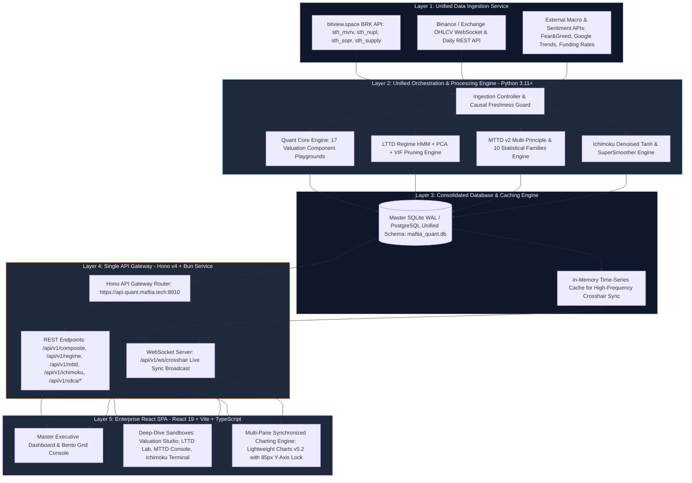
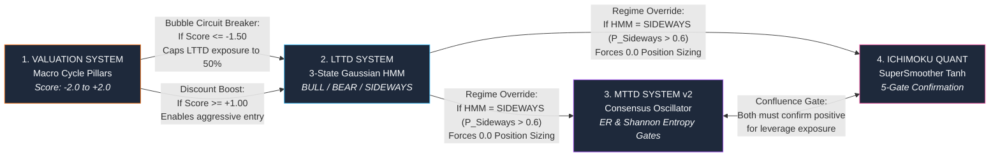

# 00. Master Unified System Architecture: Maftia Quant Platform

> **Navigation:**
> - [00. Unified Architecture](00_unified_architecture.md)
> - [01. Valuation Studio](01_valuation_system.md)
> - [02. LTTD Lab](02_lttd_system.md)
> - [03. MTTD Console](03_mttd_system.md)
> - [04. Ichimoku Terminal](04_ichimoku_system.md)

---

## 1. System Overview & Unified Vision

The **Maftia Quant Bitcoin Intelligence Platform** (`quant.maftia.tech`) is an enterprise-grade quantitative trading and analytics ecosystem. It unifies **4 quantitative systems** into a single event-driven execution pipeline and real-time visualization interface:

1. **Valuation System (`engines/valuation`):** Measures macroeconomic cycle valuation based on 17 indicators (Fundamental, Technical, Sentiment) normalized via piecewise linear interpolation into `[-2.0, +2.0]`, powering the Bayesian Optuna-optimized SDCA Strategy Engine with a 4-state rotation FSM and continuous transaction ledger.
2. **LTTD System (`engines/lttd`):** Orthogonal long-term trend classification via 3-State Gaussian HMM (`BULL`, `BEAR`, `SIDEWAYS`), PCA variance filtering, VIF pruning, and v3.3 HL-driven sizing (SuperSmoother 35/20, MHP 60d, RCO 30d, MA 250d, Macro Breakdown Emergency Exit Gate `smoothed_score_exit <= -0.10` AND `regime == "BEAR"`, dynamic quantile 65/35, and dual-mode `LTTD_MODE`).
3. **MTTD System v2 (`engines/mttd`):** Mid-term trend consensus across 10 Statistical Families with strict mathematical gating (`Efficiency Ratio >= 0.20`, `Shannon Entropy <= 2.30`, and `Chikou Momentum Exit < -0.30`).
4. **Ichimoku Quant (`engines/ichimoku`):** Denoised stationary $\tanh$ oscillator framework (`[-1.0, +1.0]`) with Ehlers 2-pole SuperSmoother filtering and 5-gate confirmation logic.

---

## 2. Unified 5-Layer Enterprise Architecture



---

## 3. Ingestion & Data Sources (Layer 1)

`MasterOHLCV` acts as the canonical data source. Freshness is enforced by a **Causal Freshness Guard** ensuring that all indicators use historical ($t-1$) data with no lookahead bias.

* **OHLCV Master Feed:** Daily price action fetched from Binance Exchange APIs and cached locally.
* **bitview.space BRK API:** Fetches 4 short-term holder (STH) on-chain metrics via a single bulk HTTP request:
  * `sth_mvrv` (Short-Term Holder Market Value to Realized Value)
  * `sth_nupl` (Short-Term Holder Net Unrealized Profit/Loss)
  * `sth_sopr_24h` (Short-Term Holder Spent Output Profit Ratio)
  * `sth_supply_in_profit` (Short-Term Holder Supply in Profit)
* **Macro & Sentiment Feeds:** Crypto Fear & Greed index, Google Trends, and BTC funding rates.
* **Causal Freshness Guard:** Verifies on-chain data timestamp $\ge t-1$ before executing quantitative calculation passes.

---

## 4. Core Orchestration Engine (Layer 2)

The orchestration pipeline runs sequentially via `run_report_pipeline.py`. It coordinates the calculations across all 4 systems, ensuring SQLite connections use **Write-Ahead Logging (WAL)** for lock-free concurrency.

### Daily Sync Sequence Diagram

```mermaid
sequenceDiagram
    autonumber
    participant Exec as run_report_pipeline.py
    participant DB as maftia_quant.db (WAL)
    participant VAL as engines/valuation
    participant LTTD as engines/lttd
    participant MTTD as engines/mttd
    participant ICH as engines/ichimoku

    Exec->>DB: Open SQLite WAL connection
    Exec->>VAL: Trigger Valuation Engine calculation
    VAL->>VAL: Calculate 17 indicators (t-1)
    VAL->>Exec: Return valuation_composite score [-2.0, +2.0]
    
    Exec->>LTTD: Run HMM Regime & Ensemble Engine
    LTTD->>LTTD: Calculate HMM Regime (BULL/BEAR/SIDEWAYS) & v3.3 Sizing
    LTTD->>Exec: Return LTTD final_score & target_exposure
    
    Note over Exec,MTTD: Sync synced_daily.json and lttd target_exposure
    Exec->>MTTD: Trigger Mid-Term Trend Engine
    MTTD->>MTTD: Apply ER & Entropy gates; compute position
    MTTD->>Exec: Return mttd_imo & target position
    
    Exec->>ICH: Trigger Ichimoku Quant Engine
    ICH->>ICH: Compute Denoised Tanh components & SuperSmoother
    ICH->>Exec: Return ichimoku_imo & target position
    
    Exec->>DB: Persist UnifiedDailyAnalytics & UnifiedComponentSignals
    Exec->>DB: Close WAL connection cleanly
```

---

## 5. Consolidated Database Schema (Layer 3)

The unified database `maftia_quant.db` stores all historical and current analytical metrics. It acts as the single source of truth for the API Gateway and frontend dashboard:

```sql
-- 1. Master OHLCV Price Table (Single Source of Truth)
CREATE TABLE master_ohlcv (
  date                   TEXT PRIMARY KEY,
  open                   REAL NOT NULL,
  high                   REAL NOT NULL,
  low                    REAL NOT NULL,
  close                  REAL NOT NULL,
  volume                 REAL NOT NULL,
  source                 TEXT DEFAULT 'binance',
  fetched_at             TIMESTAMP DEFAULT CURRENT_TIMESTAMP
);

-- 2. Master Composite Metrics & Regimes (Unified Output Table)
CREATE TABLE unified_daily_analytics (
  date                   TEXT PRIMARY KEY,
  -- A. Valuation System Output
  valuation_composite    REAL,          -- Score in [-2.0, +2.0]
  valuation_btc_price    REAL,
  
  -- B. LTTD System Output
  lttd_final_score       REAL,          -- Score in [-1.0, +1.0]
  lttd_regime            TEXT,          -- 'BULL' | 'BEAR' | 'SIDEWAYS'
  lttd_p_bull            REAL,
  lttd_p_bear            REAL,
  lttd_p_sideways        REAL,
  lttd_target_exposure   REAL,          -- 0.0 or 1.0 (or sized %)
  lttd_circuit_breaker   INTEGER,       -- 1 if triggered by valuation score
  
  -- C. MTTD System v2 Output
  mttd_imo               REAL,          -- Integrated Market Oscillator [-1.0, +1.0]
  mttd_efficiency_ratio  REAL,          -- Kaufman ER gate
  mttd_entropy           REAL,          -- Shannon Entropy gate
  mttd_position          REAL,          -- Position exposure [0.0, 1.0]
  mttd_immunity_active   INTEGER,       -- 1 if hold immunity is active
  
  -- D. Ichimoku Quant System Output
  ichimoku_imo           REAL,          -- Denoised Tanh Oscillator [-1.0, +1.0]
  ichimoku_regime        TEXT,          -- 'BULLISH' | 'BEARISH' | 'NEUTRAL'
  ichimoku_position      REAL,          -- Position exposure [0.0, 1.0]
  
  FOREIGN KEY (date) REFERENCES master_ohlcv(date)
);

-- 3. Detailed Component Scores (17 Valuation Metrics + LTTD Indicators + MTTD Signals)
CREATE TABLE unified_component_signals (
  date                   TEXT,
  system_source          TEXT,          -- 'VALUATION' | 'LTTD' | 'MTTD' | 'ICHIMOKU'
  component_name         TEXT,
  raw_value              REAL,
  normalized_score       REAL,          -- Score normalized to system bounds
  signal_direction       INTEGER,       -- -1 (Bearish) | 0 (Neutral) | +1 (Bullish)
  PRIMARY KEY (date, system_source, component_name)
);
```

---

## 6. Single API Gateway & WebSocket Server (Layer 4)

All client queries route through a **Hono v4 Gateway on port `:8910`**, explicitly bound to `0.0.0.0` (`https://api.quant.maftia.tech:8910`).

### Operational Boundary Safeguard
The API Gateway functions strictly as a read-only viewer querying the local `maftia_quant.db` using parameterized SQL and SQLite WAL concurrency. The API Gateway does not query subsystem databases directly, nor does it spawn external Python scripts or subprocesses (e.g. for metrics renormalization or pipeline execution). All computations and backfills are executed strictly via the ETL CLI.

### Primary Endpoints
* `GET /api/v1/executive-summary`: Fetches the latest day's status across all 4 systems.
* `GET /api/v1/timeseries/master`: Returns full historical time series aligned across all systems.
* `GET /api/v1/system/:system_name/details`: Fetches specific metadata and indicator breakdowns for `valuation`, `lttd`, `mttd`, or `ichimoku`.
* `POST /api/v1/sdca/backtest`: Runs point-in-time SDCA simulations with custom or Bayesian Optuna presets.
* `POST /api/v1/sdca/signal`: Returns point-in-time causal SDCA signal and multiplier.
* `WebSocket /api/v1/ws/crosshair`: Broadcasts multi-window mouse coordinate updates (`x`, `y` coordinates) to synchronize charts across displays in real time.

---

## 7. Enterprise Frontend SPA (Layer 5)

Built with **React 19, TypeScript, Vite, and TradingView Lightweight Charts v5.2**.

### 7.1 Design Tokens (Obsidian Dark-Tech HSL)
```css
:root {
  /* Surface & Background Tokens */
  --bg-obsidian-master: hsl(220, 24%, 7%);       /* #0B0E14 - Deep Obsidian Root */
  --bg-surface-card: hsl(218, 22%, 11%);        /* #121721 - Sub-surface card container */
  --bg-surface-elevated: hsl(217, 20%, 16%);    /* #202634 - Hovered / active card state */
  --border-glass: rgba(255, 255, 255, 0.08);    /* Subtly illuminated glassmorphism border */
  
  /* Quantitative Signal Color Tokens */
  --signal-bull-emerald: hsl(142, 71%, 45%);    /* #22C55E - Bullish / Undervalued / Active Long */
  --signal-neutral-amber: hsl(45, 93%, 47%);    /* #EAB308 - Sideways / Fair Value / Cash Mode */
  --signal-bear-crimson: hsl(0, 84%, 60%);      /* #EF4444 - Bearish / Overvalued / Exit Trigger */
  --signal-quant-cyan: hsl(192, 91%, 50%);      /* #06B6D4 - Data highlights / Spectral lines */
  --signal-pca-purple: hsl(262, 83%, 68%);      /* #A855F7 - Statistical / PCA / HMM overlays */
  
  /* Typography Tokens */
  --text-primary: hsl(210, 40%, 98%);           /* Pure crisp white for primary headers */
  --text-secondary: hsl(215, 20%, 65%);         /* Muted slate for axis labels and descriptions */
  --text-mono-accent: hsl(180, 70%, 75%);       /* Cyan mono for formula variables and numbers */
}
```

### 7.2 Critical Charting Innovations
1. **85px Y-Axis Lock:** Strictly enforces a fixed width of `85px` on the right price/oscillator axis across all subplots to prevent horizontal time-tick misalignment between large price values (`$65,000.00`) and short oscillator values (`-0.45`).
2. **Vertical Crosshair Synchronization:** Mouse cursor movements on any subplot broadcast exact time coordinates to all stacked subplots.
3. **DOM Chart Persistence:** Subplots preserve chart instances in the DOM during layout maximization by using CSS visibility filters (`.chart-subplot-hidden { height: 0; overflow: hidden }`) rather than unmounting.

### 7.3 Frontend Wireframe Layout
```
┌──────────────────────────────────────────────────────────────────────────────────────────────────────┐
│  Maftia Quant Intelligence Platform   [ Master Overview ]  [ Valuation ]  [ LTTD ]  [ MTTD ]  [ Ichimoku ]│
├─────────┬────────────────────────────────────────────────────────────────────────────────────────────┤
│ SIDEBAR │  EXECUTIVE SUMMARY HEADER (Bento Grid Layout)                                              │
│         │  ┌────────────────────────┐ ┌────────────────────────┐ ┌─────────────────────────────────┐ │
│ • Home  │  │ VALUATION COMPOSITE    │ │ LTTD REGIME (HMM)      │ │ CROSS-SYSTEM CONSENSUS          │ │
│ • Val   │  │  1.5402                │ │  BEARISH (P: 0.89)     │ │  STRONG BEAR / NEUTRAL          │ │
│ • LTTD  │  │  Status: Overvalued    │ │  Exposure: 0.0% Cash   │ │  Target Allocation: 0.0%        │ │
│ • MTTD  │  └────────────────────────┘ └────────────────────────┘ └─────────────────────────────────┘ │
│ • Ich   ├────────────────────────────────────────────────────────────────────────────────────────────┤
│ • SDCA  │  SYNCHRONIZED MULTI-PANE CHARTING ENGINE (Lightweight Charts v5.2.0 - 85px Y-Axis Lock)   │
│ • Alert │  ┌──────────────────────────────────────────────────────────────────────────────┬────────┐ │
│ • Export│  │ [Subplot 1: Log-Scale BTC/USD OHLC Price + Ichimoku Cloud + Buy/Sell Markers] │ $62.6K │ │
│ • Config│  ├──────────────────────────────────────────────────────────────────────────────┼────────┤ │
│         │  │ [Subplot 2: Master Valuation Composite Oscillator (-2.0 to +2.0 Scale)]      │ +1.54  │ │
│         │  ├──────────────────────────────────────────────────────────────────────────────┼────────┤ │
│         │  │ [Subplot 3: LTTD Final Score + HMM Probability Background Fills]             │ -0.44  │ │
│         │  ├──────────────────────────────────────────────────────────────────────────────┼────────┤ │
│         │  │ [Subplot 4: MTTD v2 IMO & Kaufman Efficiency Ratio (ER Gate >= 0.20 Overlay)]│ -0.99  │ │
│         │  └──────────────────────────────────────────────────────────────────────────────┴────────┘ │
└─────────┴────────────────────────────────────────────────────────────────────────────────────────────┘
```

---

## 8. Cross-System Interlocking Safeguards

The platform employs a multi-tiered defense architecture, where systems act as mutual gates and overrides:



### Inter-System Interaction Matrix

| System Source | Target System | Logic & Condition | Action Taken |
|---|---|---|---|
| **Valuation** | LTTD | `valuation_composite <= -1.50` (Extreme Bubble) | Set macro safety valve, cap maximum LTTD target exposure to `0.50` (or lockout). |
| **Valuation** | LTTD | `valuation_composite >= +1.00` (Deep Discount) | Enable aggressive scale-in; override short/neutral signals. |
| **LTTD** | MTTD & Ichimoku | `lttd_regime == 'SIDEWAYS'` ($P_{\text{Sideways}} > 0.60$) | Force medium-term target positions (`mttd_position`, `ichimoku_position`) to `0.0` (Return to Cash). |
| **MTTD** | Ichimoku | `mttd_imo > 0.25` AND `ichimoku_imo > 0.40` | Symmetrical confluence: Unlock maximum target leverage/sizing. |

---

## 9. Phased Roadmap & Implementation

| Phase | Milestone Name | Core Objectives & Deliverables |
|---|---|---|
| **Phase 1** | **Unified Storage & Data Orchestration** | Master SQLite WAL database (`maftia_quant.db`), unified ingestion controller for OHLCV and BRK API, causal freshness verification. |
| **Phase 2** | **Single Backend API Gateway (`Hono + Bun`)** | Single API Gateway on port `:8910` (`api.quant.maftia.tech`), `/api/v1/executive-summary`, `/api/v1/timeseries/master`, WebSocket crosshair broadcaster. |
| **Phase 3** | **Frontend Core & Master Executive Dashboard** | React 19 SPA, Obsidian dark-tech tokens, 85px Y-axis lock, vertical crosshair sync, executive bento grid. |
| **Phase 4** | **Deep-Dive Sandboxes & Backtester** | 4 Deep-Dive Sandboxes (`Valuation Studio`, `LTTD Lab`, `MTTD Console`, `Ichimoku Terminal`), Bayesian Optuna SDCA engine, continuous ledger reporting. |

---

> **Navigation:**
> - [00. Unified Architecture](00_unified_architecture.md)
> - [01. Valuation Studio](01_valuation_system.md)
> - [02. LTTD Lab](02_lttd_system.md)
> - [03. MTTD Console](03_mttd_system.md)
> - [04. Ichimoku Terminal](04_ichimoku_system.md)

← Prev (Index) | ↑ [00. Unified Architecture](00_unified_architecture.md) | [01. Valuation Studio](01_valuation_system.md) →
