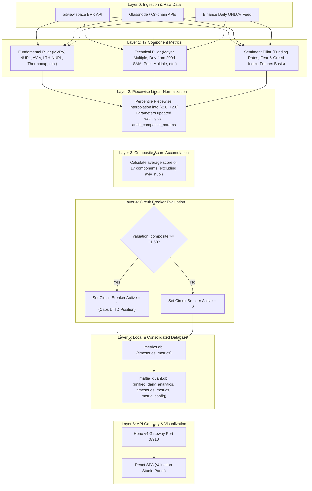

# 01. Valuation System Architecture

> **Navigation:**
> - [E2E Overview](file:///home/ubuntu/projects/quant.maftia.tech/docs/architecture/00_end_to_end.md)
> - [01. Valuation Studio](file:///home/ubuntu/projects/quant.maftia.tech/docs/architecture/01_valuation_system.md)
> - [02. LTTD Lab](file:///home/ubuntu/projects/quant.maftia.tech/docs/architecture/02_lttd_system.md)
> - [03. MTTD Console](file:///home/ubuntu/projects/quant.maftia.tech/docs/architecture/03_mttd_system.md)
> - [04. Ichimoku Terminal](file:///home/ubuntu/projects/quant.maftia.tech/docs/architecture/04_ichimoku_system.md)

---

## 1. System Role

The **Valuation System** (located under [engines/valuation](file:///home/ubuntu/projects/quant.maftia.tech/engines/valuation)) measures Bitcoin's macro-economic cycle positioning. It ingests 17 indicators spanning fundamental, technical, and sentiment metrics, scaling them into a unified piecewise linear range of `[-2.0, +2.0]` to form the `ValuationComposite`.

Its primary architectural role is serving as the **Macro Circuit Breaker** for the LTTD execution engine when valuations enter extreme bubbles (`score >= +1.50`) or deep discounts (`score <= -1.00`).

---

## 2. Signal Processing & Flow

The signal flow moves from raw data sources down to the database and presentation layers:



---

## 3. The 17 Indicator Pillars

The `ValuationComposite` is calculated from 17 indicators grouped into three pillars:

| Pillar | Indicator Key | Description | Score Range | Signal Direction |
|---|---|---|---|---|
| **Fundamental** | `mvrv_z_score` | Market Cap deviation from Realized Cap (Z-Score) | `[-2.0, +2.0]` | +1: Oversold, -1: Overbought |
| **Fundamental** | `nupl` | Net Unrealized Profit/Loss | `[-2.0, +2.0]` | +1: Oversold, -1: Overbought |
| **Fundamental** | `lth_nupl` | Long-Term Holder Net Unrealized Profit/Loss | `[-2.0, +2.0]` | +1: Oversold, -1: Overbought |
| **Fundamental** | `sth_nupl` | Short-Term Holder Net Unrealized Profit/Loss | `[-2.0, +2.0]` | +1: Oversold, -1: Overbought |
| **Fundamental** | `thermocap` | Market Cap relative to cumulative miner revenue | `[-2.0, +2.0]` | +1: Oversold, -1: Overbought |
| **Fundamental** | `sth_mvrv` | Short-Term Holder Market Cap to Realized Cap | `[-2.0, +2.0]` | +1: Oversold, -1: Overbought |
| **Fundamental** | `sth_sopr_24h` | Short-Term Holder Spent Output Profit Ratio | `[-2.0, +2.0]` | +1: Oversold, -1: Overbought |
| **Fundamental** | `sth_supply_in_profit` | Short-Term Holder supply portion in profit | `[-2.0, +2.0]` | +1: Oversold, -1: Overbought |
| **Technical** | `mayer_multiple` | Ratio of close price to 200-day Simple Moving Average | `[-2.0, +2.0]` | +1: Oversold, -1: Overbought |
| **Technical** | `dev_from_200d` | Percentage deviation from 200-day moving average | `[-2.0, +2.0]` | +1: Oversold, -1: Overbought |
| **Technical** | `puell_multiple` | Daily issuance value divided by 365-day moving average | `[-2.0, +2.0]` | +1: Oversold, -1: Overbought |
| **Technical** | `rsi_14` | 14-day Relative Strength Index | `[-2.0, +2.0]` | +1: Oversold, -1: Overbought |
| **Technical** | `macd_histogram` | MACD trend indicator histogram value | `[-2.0, +2.0]` | +1: Oversold, -1: Overbought |
| **Sentiment** | `funding_rates` | Bitcoin annualized funding rate | `[-2.0, +2.0]` | +1: Oversold, -1: Overbought |
| **Sentiment** | `fear_greed` | Crypto Fear and Greed index value | `[-2.0, +2.0]` | +1: Oversold, -1: Overbought |
| **Sentiment** | `futures_basis` | Percent difference between futures and spot prices | `[-2.0, +2.0]` | +1: Oversold, -1: Overbought |
| **Sentiment** | `social_volume` | Volume of mentions across indexed social media channels | `[-2.0, +2.0]` | +1: Oversold, -1: Overbought |

---

## 4. Macro Circuit Breaker Safeguards

*   **Bubble Safeguard (`valuation_composite >= +1.50`):**
    If the composite score exceeds `+1.50`, the system triggers an active circuit breaker flag (`circuit_breaker_active = 1`). This is written to the database and restricts the maximum target exposure of System 2 (LTTD) to `0.50` (or locks it out) regardless of bullish momentum signals, protecting capital from tail risk.
*   **Discount Safeguard (`valuation_composite <= -1.00`):**
    If the score drops below `-1.00`, the market is in a deep discount/capitulation zone. This boosts buying parameters, overriding temporary short/neutral LTTD signals to capture accumulation opportunities.

---

## 5. Storage Schema Excerpt (`database/metrics.db`)

```sql
-- Raw and normalized daily metrics
CREATE TABLE timeseries_metrics (
    date TEXT,
    metric_name TEXT,
    raw_value REAL,
    normalized_value REAL,
    btc_price REAL,
    PRIMARY KEY (metric_name, date)
);

-- Historical indicator distribution parameters
CREATE TABLE audit_composite_params (
    run_date TEXT NOT NULL PRIMARY KEY,
    raw_min REAL,
    raw_max REAL,
    raw_p2_5 REAL,
    raw_p50 REAL,
    raw_p97_5 REAL,
    rescale_method TEXT DEFAULT 'percentile_piecewise'
);

-- Bitcoin price cache
CREATE TABLE btc_ohlc (
    date TEXT PRIMARY KEY,
    open REAL,
    high REAL,
    low REAL,
    close REAL
);
```

---

## 6. API Route Mapping

| HTTP Verb | Route | Description | Response Payload |
|---|---|---|---|
| **GET** | `/api/v1/system/valuation/details` | Fetches details and metadata of the 17 indicators. | List of components with daily stats |
| **GET** | `/api/v1/timeseries/master` | Returns timeseries history including `valuation_composite`. | Object array with keys `date`, `valuation_composite`, etc. |

> [!NOTE]
> **Operational Boundary Safeguard:** The API Gateway functions strictly as a read-only viewer querying the consolidated local `maftia_quant.db` (utilizing parameters and WAL concurrency). The legacy `POST /api/v1/analytics/metric/:metric_name/renormalize` endpoint and related Python subprocess triggers have been removed. Indicator renormalization is decoupled from the API and executed solely within the ETL pipeline.

---

## 7. Frontend Integration (`ValuationStudio.tsx`)

The **Valuation Studio** panel imports React and displays indicators via Lightweight Charts:

1.  **Data Ingestion Hook:** Uses `useQuery` fetching `/api/v1/timeseries/master` for daily historical series.
2.  **Layout Components:**
    *   `ValuationComposite` subplot: Bounded line chart showing score range `[-2.0, +2.0]`. Includes horizontal lines at `+1.5` and `-1.0`.
    *   `BTC Price Overlay` subplot: Candlestick chart overlaid with valuation zones.
    *   `Pillar Breakdowns` grid: Small sparkline charts displaying raw values for individual components.

---

> **Navigation:**
> - [E2E Overview](file:///home/ubuntu/projects/quant.maftia.tech/docs/architecture/00_end_to_end.md)
> - [01. Valuation Studio](file:///home/ubuntu/projects/quant.maftia.tech/docs/architecture/01_valuation_system.md)
> - [02. LTTD Lab](file:///home/ubuntu/projects/quant.maftia.tech/docs/architecture/02_lttd_system.md)
> - [03. MTTD Console](file:///home/ubuntu/projects/quant.maftia.tech/docs/architecture/03_mttd_system.md)
> - [04. Ichimoku Terminal](file:///home/ubuntu/projects/quant.maftia.tech/docs/architecture/04_ichimoku_system.md)

← [00. E2E Overview](file:///home/ubuntu/projects/quant.maftia.tech/docs/architecture/00_end_to_end.md) | ↑ [Valuation Studio](file:///home/ubuntu/projects/quant.maftia.tech/docs/architecture/01_valuation_system.md) | [02. LTTD Lab](file:///home/ubuntu/projects/quant.maftia.tech/docs/architecture/02_lttd_system.md) →
