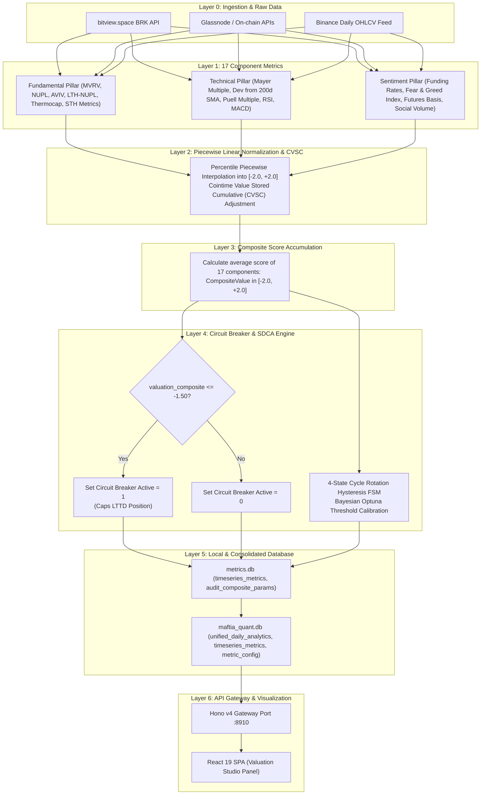

# 01. Valuation System Architecture

> **Navigation:**
> - [00. Unified Architecture](00_unified_architecture.md)
> - [01. Valuation Studio](01_valuation_system.md)
> - [02. LTTD Lab](02_lttd_system.md)
> - [03. MTTD Console](03_mttd_system.md)
> - [04. Ichimoku Terminal](04_ichimoku_system.md)

---

## 1. System Role & Executive Summary

The **Valuation System** (located under `engines/valuation`) measures Bitcoin's macro-economic cycle positioning. It ingests 17 indicators spanning fundamental, technical, and sentiment metrics, scaling them via piecewise linear interpolation into a unified range of `[-2.0, +2.0]` to form the `ValuationComposite`.

Its primary architectural roles are:
1. Serving as the **Macro Circuit Breaker** for the LTTD execution engine when valuations enter extreme bubbles (`score <= -1.50`) or deep discounts (`score >= +1.00`).
2. Powering the **Strategic Dollar Cost Averaging (SDCA)** engine with Bayesian Optuna-optimized thresholds, a 4-state rotation FSM, and a continuous transaction ledger.

---

## 2. Signal Processing & Data Flow

The signal flow moves from raw data sources down to the database and presentation layers:


```mermaid
graph TD
    subgraph Layer0 [Layer 0: Ingestion & Raw Data]
        D_Bitview["bitview.space BRK API"]
        D_Glassnode["Glassnode / On-chain APIs"]
        D_OHLCV["Binance Daily OHLCV Feed"]
    end

    subgraph Layer1 [Layer 1: 17 Component Metrics]
        P1["Fundamental Pillar (MVRV, NUPL, AVIV, LTH-NUPL, Thermocap, STH Metrics)"]
        P2["Technical Pillar (Mayer Multiple, Dev from 200d SMA, Puell Multiple, RSI, MACD)"]
        P3["Sentiment Pillar (Funding Rates, Fear & Greed Index, Futures Basis, Social Volume)"]
        D_Bitview & D_Glassnode & D_OHLCV --> P1 & P2 & P3
    end

    subgraph Layer2 [Layer 2: Piecewise Linear Normalization & CVSC]
        Norm["Percentile Piecewise Interpolation into [-2.0, +2.0]<br/>Cointime Value Stored Cumulative (CVSC) Adjustment"]
        P1 & P2 & P3 --> Norm
    end

    subgraph Layer3 [Layer 3: Composite Score Accumulation]
        Composite["Calculate average score of 17 components: CompositeValue in [-2.0, +2.0]"]
        Norm --> Composite
    end

    subgraph Layer4 [Layer 4: Circuit Breaker & SDCA Engine]
        CB{"valuation_composite <= -1.50?"}
        SDCA["4-State Cycle Rotation Hysteresis FSM<br/>Bayesian Optuna Threshold Calibration"]
        Composite --> CB
        Composite --> SDCA
        CB -->|Yes| CB_Active["Set Circuit Breaker Active = 1<br/>(Caps LTTD Position)"]
        CB -->|No| CB_Inactive["Set Circuit Breaker Active = 0"]
    end

    subgraph Layer5 [Layer 5: Local & Consolidated Database]
        DB_Val["metrics.db (timeseries_metrics, audit_composite_params)"]
        DB_Master["maftia_quant.db (unified_daily_analytics, timeseries_metrics, metric_config)"]
        CB_Active & CB_Inactive & SDCA --> DB_Val
        DB_Val --> DB_Master
    end

    subgraph Layer6 [Layer 6: API Gateway & Visualization]
        API["Hono v4 Gateway Port :8910"]
        UI["React 19 SPA (Valuation Studio Panel)"]
        DB_Master --> API --> UI
    end
```

---

## 3. The 17 Indicator Pillars & Cointime-Adjustment (CVSC)

### 3.1 Cointime-Adjusted Valuation (DR-Immune Indicators)
To overcome diminishing returns (DR) across 4-year halving cycles, intrinsic valuation metrics are stationarized by dividing raw metrics with the normalized Cointime Value Stored Cumulative:
$$\text{CVSC}_{\text{norm}} = \log_{10}(\text{CVSC})$$

| Indicator Key | Module Path | Pillar | Description | Score Range | Signal Direction |
|---|---|---|---|---|---|
| `aviv_ratio` | `aviv_ratio.py` | Fundamental | Cointime-adjusted MVRV ratio (naturally DR-immune) | `[-2.0, +2.0]` | +1: Oversold, -1: Overbought |
| `mvrv_z_cvsc` | `mvrv_z_cvsc.py` | Fundamental | Classic MVRV Z-Score divided by $\text{CVSC}_{\text{norm}}$ | `[-2.0, +2.0]` | +1: Oversold, -1: Overbought |
| `pi_cycle_top_cvsc` | `pi_cycle_top_cvsc.py` | Fundamental | Pi Cycle Top ratio (111d SMA / 2x350d SMA) divided by $\text{CVSC}_{\text{norm}}$ | `[-2.0, +2.0]` | +1: Oversold, -1: Overbought |
| `risk_metrics_cvsc` | `risk_metrics_cvsc.py` | Fundamental | Realized Cap price deviation divided by $\text{CVSC}_{\text{norm}}$ | `[-2.0, +2.0]` | +1: Oversold, -1: Overbought |
| `two_year_ma_rcap` | `two_year_ma_rcap.py` | Fundamental | 2-Year Moving Average multiplier divided by $\text{CVSC}_{\text{norm}}$ | `[-2.0, +2.0]` | +1: Oversold, -1: Overbought |
| `ahr999_cvsc` | `ahr999_cvsc.py` | Fundamental | AHR999 Accumulation Index divided by $\text{CVSC}_{\text{norm}}$ | `[-2.0, +2.0]` | +1: Oversold, -1: Overbought |
| `vpli_cvsc` | `vpli_cvsc.py` | Fundamental | Price deviation from 255d SMA divided by $\text{CVSC}_{\text{norm}}$ | `[-2.0, +2.0]` | +1: Oversold, -1: Overbought |
| `nupl` | `nupl.py` | Fundamental | Net Unrealized Profit/Loss | `[-2.0, +2.0]` | +1: Oversold, -1: Overbought |
| `lth_nupl` | `lth_nupl.py` | Fundamental | Long-Term Holder Net Unrealized Profit/Loss | `[-2.0, +2.0]` | +1: Oversold, -1: Overbought |
| `sth_nupl` | `sth_nupl.py` | Fundamental | Short-Term Holder Net Unrealized Profit/Loss | `[-2.0, +2.0]` | +1: Oversold, -1: Overbought |
| `thermocap` | `thermocap.py` | Fundamental | Market Cap relative to cumulative miner revenue | `[-2.0, +2.0]` | +1: Oversold, -1: Overbought |
| `sth_mvrv` | `sth_mvrv.py` | Fundamental | Short-Term Holder Market Cap to Realized Cap | `[-2.0, +2.0]` | +1: Oversold, -1: Overbought |
| `sth_sopr_24h` | `sth_sopr_24h.py` | Fundamental | Short-Term Holder Spent Output Profit Ratio | `[-2.0, +2.0]` | +1: Oversold, -1: Overbought |
| `sth_supply_in_profit` | `sth_supply_in_profit.py` | Fundamental | Short-Term Holder supply portion in profit | `[-2.0, +2.0]` | +1: Oversold, -1: Overbought |
| `mayer_multiple` | `mayer_multiple.py` | Technical | Ratio of close price to 200-day Simple Moving Average | `[-2.0, +2.0]` | +1: Oversold, -1: Overbought |
| `dev_from_200d` | `dev_from_200d.py` | Technical | Percentage deviation from 200-day moving average | `[-2.0, +2.0]` | +1: Oversold, -1: Overbought |
| `puell_multiple` | `puell_multiple.py` | Technical | Daily issuance value divided by 365-day moving average | `[-2.0, +2.0]` | +1: Oversold, -1: Overbought |
| `rsi_14` | `rsi_14.py` | Technical | 14-day Relative Strength Index | `[-2.0, +2.0]` | +1: Oversold, -1: Overbought |
| `macd_histogram` | `macd_histogram.py` | Technical | MACD trend indicator histogram value | `[-2.0, +2.0]` | +1: Oversold, -1: Overbought |
| `funding_rates` | `funding_rates.py` | Sentiment | Bitcoin annualized funding rate | `[-2.0, +2.0]` | +1: Oversold, -1: Overbought |
| `fear_greed` | `fear_greed.py` | Sentiment | Crypto Fear and Greed index value | `[-2.0, +2.0]` | +1: Oversold, -1: Overbought |
| `futures_basis` | `futures_basis.py` | Sentiment | Percent difference between futures and spot prices | `[-2.0, +2.0]` | +1: Oversold, -1: Overbought |
| `social_volume` | `social_volume.py` | Sentiment | Volume of mentions across indexed social media channels | `[-2.0, +2.0]` | +1: Oversold, -1: Overbought |

---

## 4. Master Composite Valuation Oscillator & Visual Styling

### 4.1 Master Composite Formula
$$\text{CompositeValue}_t = \frac{1}{N} \sum_{i=1}^{N} \text{NormalizedScore}_{i,t} \quad \text{where } \text{NormalizedScore} \in [-2.0, +2.0]$$

* **Critical Action Thresholds:**
  * `Composite <= -1.50`: **Extreme Overvalued** (*Red Zone / Macro Bubble Warning*).
  * `Composite >= +1.00`: **Deep Undervalued** (*Green Zone / Generational Accumulation Opportunity*).

### 4.2 HSL Dynamic Color System
* `-2.0` (Extreme Overvalued / Bubble): **Bright Red / Crimson (`hsl(0, 84%, 60%)`)**
* `-1.0` (Overvalued): **Amber / Orange (`hsl(32, 95%, 53%)`)**
* `0.0` (Fair Value): **Neutral Gray/White (`hsl(0, 0%, 80%)`)**
* `+1.0` (Undervalued): **Cyan / Teal (`hsl(175, 70%, 41%)`)**
* `+2.0` (Extreme Undervalued / Bottom): **Bright Green / Lime (`hsl(142, 71%, 45%)`)**

### 4.3 Three-Pane Synchronized View
* **Subplot 1:** Log-scale Candlestick OHLC Bitcoin Price + SDCA Buy/Sell Execution Markers.
* **Subplot 2:** Raw Metric Value with user-configurable historical threshold lines.
* **Subplot 3:** Bounded Normalized Score `[-2.0, +2.0]` with gradient fills and 85px locked Y-axis.

---

## 5. SDCA (Strategic Dollar Cost Averaging) Strategy Engine

The Valuation System powers the **Strategic Dollar Cost Averaging (SDCA)** engine, translating macroeconomic cycle composite scores into dynamically adjusted capital allocations.

### 5.1 Piecewise Multiplier Allocation Matrix

| Valuation Composite Range | Allocation Multiplier | Market Cycle Phase | Portfolio Action |
|---|---|---|---|
| $\ge +1.5$ | $-0.5\times$ | Euphoria | DCA Out (Sell $19\%$ of active BTC position weekly) |
| $\ge +1.0$ | $0.0\times$ | Expensive | Pause DCA (Preserve cash reserves) |
| $\ge +0.5$ | $0.5\times$ | Rich | Reduce DCA (Defensive accumulation) |
| $>-0.5 \text{ to } <+0.5$ | $1.0\times$ | Fair Value | Baseline Weekly DCA |
| $\le -0.5$ | $1.5\times$ | Fair-Low | Moderate Buy DCA |
| $\le -1.0$ | $2.0\times$ | Value Zone | Aggressive Buy DCA |
| $\le -1.5$ | $3.0\times$ | Deep Discount | Maximum Accumulation |

### 5.2 4-State Cycle Rotation Hysteresis FSM (Bayesian Optuna Calibrated)

Execution is governed by a Bayesian Optuna-optimized state machine:
1. **`OUT_ALL` $\to$ `DCA_IN`:** Initiates value accumulation when `valuation_composite >= +1.70` (deep discount zone).
2. **`DCA_IN` $\to$ `ALL_IN`:** Triggers 100% cash allocation (`BUY_ALL`, multiplier `999.0`) into BTC when `valuation_composite <= +1.25` or multi-system breakout consensus confirms.
3. **`ALL_IN` $\to$ `DCA_OUT`:** Triggers gradual distribution (`SELL_DCA`, trimming 19% of active BTC holdings weekly) when `valuation_composite <= -1.70` (euphoric macro cycle top).
4. **`DCA_OUT` $\to$ `OUT_ALL`:** Completely liquidates 100% of remaining BTC into cash (`OUT_ALL`, multiplier `-1.0`) when valuation resets to `valuation_composite >= +0.40`, safeguarding profits in cash across the entire bear market.

### 5.3 Continuous Transaction Ledger Architecture

The SDCA engine records portfolio operations into a **Continuous Transaction Ledger** (`action: BUY_DCA | BUY_ALL | SELL_DCA | SELL_ALL | OUT_ALL`, `price`, `amount_usd`, `btc_amount`, `fee_usd`, `cash_balance`, `btc_balance`) rather than paired trade constructs (`entryPrice`/`exitPrice`), ensuring continuous balance tracking without React UI crashes.

---

## 6. Storage Schema Excerpt (`database/metrics.db` & `maftia_quant.db`)

```sql
-- Raw and normalized daily metrics
CREATE TABLE timeseries_metrics (
    date TEXT,
    metric_name TEXT,
    raw_value REAL,
    normalized_value REAL,
    btc_price REAL,
    PRIMARY KEY (metric_name, date)
);

-- Historical indicator distribution parameters
CREATE TABLE audit_composite_params (
    run_date TEXT NOT NULL PRIMARY KEY,
    raw_min REAL,
    raw_max REAL,
    raw_p2_5 REAL,
    raw_p50 REAL,
    raw_p97_5 REAL,
    rescale_method TEXT DEFAULT 'percentile_piecewise'
);

-- Bitcoin price cache
CREATE TABLE btc_ohlc (
    date TEXT PRIMARY KEY,
    open REAL,
    high REAL,
    low REAL,
    close REAL
);
```

---

## 7. API Route Mapping

| HTTP Verb | Route | Description | Response Payload |
|---|---|---|---|
| **GET** | `/api/v1/system/valuation/details` | Fetches details and metadata of the 17 indicators. | List of components with daily stats |
| **GET** | `/api/v1/timeseries/master` | Returns timeseries history including `valuation_composite`. | Object array with keys `date`, `valuation_composite`, etc. |
| **POST** | `/api/v1/sdca/backtest` | Executes full SDCA strategy backtest with custom parameters/presets. | Backtest metrics, equity curve, trade log |
| **POST** | `/api/v1/sdca/signal` | Evaluates point-in-time causal SDCA signal and multiplier. | Multiplier, phase, action, confidence |

> [!NOTE]
> **Operational Boundary Safeguard:** The API Gateway functions strictly as a read-only viewer querying the consolidated local `maftia_quant.db` (utilizing parameters and WAL concurrency). Renormalization and calculations are strictly executed inside the ETL pipeline.

---

## 8. Frontend Integration (`ValuationStudio.tsx`)

The **Valuation Studio** panel renders:
1. **Data Ingestion Hook:** Uses `useQuery` fetching `/api/v1/timeseries/master` for daily historical series.
2. **Layout Components:**
   * `ValuationComposite` subplot: Bounded line chart showing score range `[-2.0, +2.0]`. Includes horizontal lines at `+1.5` and `-1.0`.
   * `BTC Price Overlay` subplot: Candlestick chart overlaid with valuation zones.
   * `Pillar Breakdowns` grid: Small sparkline charts displaying raw values for individual components.
   * `SDCA Backtest Panel`: Interactive simulator with Bayesian Optuna preset toggles and continuous ledger transaction inspection.

---

> **Navigation:**
> - [00. Unified Architecture](00_unified_architecture.md)
> - [01. Valuation Studio](01_valuation_system.md)
> - [02. LTTD Lab](02_lttd_system.md)
> - [03. MTTD Console](03_mttd_system.md)
> - [04. Ichimoku Terminal](04_ichimoku_system.md)

← [00. Unified Architecture](00_unified_architecture.md) | ↑ [01. Valuation Studio](01_valuation_system.md) | [02. LTTD Lab](02_lttd_system.md) →
