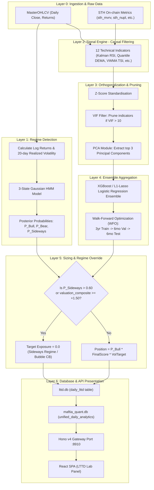

# 02. LTTD System Architecture

> **Navigation:**
> - [E2E Overview](file:///home/ubuntu/projects/quant.maftia.tech/docs/architecture/00_end_to_end.md)
> - [01. Valuation Studio](file:///home/ubuntu/projects/quant.maftia.tech/docs/architecture/01_valuation_system.md)
> - [02. LTTD Lab](file:///home/ubuntu/projects/quant.maftia.tech/docs/architecture/02_lttd_system.md)
> - [03. MTTD Console](file:///home/ubuntu/projects/quant.maftia.tech/docs/architecture/03_mttd_system.md)
> - [04. Ichimoku Terminal](file:///home/ubuntu/projects/quant.maftia.tech/docs/architecture/04_ichimoku_system.md)

---

## 1. System Role

The **Long-Term Trend Detection System** (LTTD, `quant-btc-lttd-system`) classifies daily market conditions into three major structural states (`BULL`, `BEAR`, or `SIDEWAYS`) and computes an ensemble quantitative score (`[-1.0, +1.0]`) to direct target investment exposures.

Its primary architectural role is serving as the **Regime Override Gate** for the medium-term systems. When LTTD classifies the market as `SIDEWAYS` ($P_{\text{Sideways}} > 0.60$), it forces mid-term exposures (MTTD and Ichimoku) to `0.0` to avoid whipsaw fee churn.

---

## 2. 6-Layer Signal Engine Flow

The LTTD calculations are partitioned across 6 processing layers, from ingestion to presentation:



---

## 3. Gaussian HMM Regime States

A **3-State Gaussian Hidden Markov Model (HMM)** is trained using daily log returns and annualized realized volatility:

| Regime | State Index | Description | Volatility Characteristics | Sizing Influence |
|---|---|---|---|---|
| **BULL** | `0` | Mean positive returns, steady growth. | Low-to-Medium | Sinyal ensemble active. |
| **BEAR** | `1` | Negative expected returns, high downside variance. | High | Sinyal ensemble active (bias short/cash). |
| **SIDEWAYS** | `2` | Mean returns near 0, trendless range. | Low | **Circuit Breaker Active:** Override forces `0.0` exposure. |

---

## 4. Orthogonalization & Walk-Forward Optimization (WFO)

To eliminate multikolinearitas (collinearity) and prevent parameter overfitting:
1.  **Variance Inflation Factor (VIF):** Features with $\text{VIF} > 10$ are pruned.
2.  **Principal Component Analysis (PCA):** Performs linear transformation, extracting the top 3 components explaining $\ge 85\%$ of variance.
3.  **Pratt's Relative Importance:** Measures the individual feature contribution to the final Principal Components.
4.  **WFO Schedule:** Rolling 3-Year Training Window $\rightarrow$ 6-Month Validation (hyperparameter tuning) $\rightarrow$ 6-Month Out-of-Sample Test.

---

## 5. Storage Schema Excerpt (`database/lttd.db`)

```sql
-- LTTD core regime and exposure output
CREATE TABLE daily_lttd (
    data_as_of TEXT PRIMARY KEY,
    date TEXT,
    regime TEXT CHECK(regime IN ('Strong Bull', 'Weak Bull', 'Neutral', 'Weak Bear', 'Strong Bear', 'BULL', 'BEAR', 'SIDEWAYS')) NOT NULL,
    final_score REAL CHECK(final_score >= -1.0 AND final_score <= 1.0) NOT NULL,
    target_exposure REAL CHECK(target_exposure >= 0.0 AND target_exposure <= 2.5) NOT NULL,
    posterior_prob REAL,
    circuit_breaker_active BOOLEAN DEFAULT 0,
    created_at TIMESTAMP DEFAULT CURRENT_TIMESTAMP
);

-- Daily raw and normalized indicator scores
CREATE TABLE indicator_scores (
    date TEXT,
    indicator_name TEXT,
    score REAL NOT NULL,
    created_at TIMESTAMP DEFAULT CURRENT_TIMESTAMP,
    PRIMARY KEY (date, indicator_name)
);

-- Extracted principal components
CREATE TABLE pca_components (
    date TEXT,
    component_name TEXT,
    value REAL NOT NULL,
    created_at TIMESTAMP DEFAULT CURRENT_TIMESTAMP,
    PRIMARY KEY (date, component_name)
);
```

---

## 6. API Route Mapping & Frontend

| HTTP Verb | Route | Description |
|---|---|---|
| **GET** | `/api/v1/system/lttd/details` | Returns daily model details including PCA variances. |
| **GET** | `/api/v1/timeseries/master` | Returns timeline variables including `lttd_regime` and `lttd_target_exposure`. |

> [!NOTE]
> **Operational Boundary Safeguard:** The API Gateway acts as a strictly read-only interface querying `maftia_quant.db`. The legacy `POST /api/v1/lttd/actions/run` endpoint and any script spawning/subprocess orchestration triggers for `quant-btc-lttd-system` have been completely removed. Executing and running LTTD engines or backfills is restricted strictly to CLI operation.

### Frontend Integration (`LttdLab.tsx`)
The **LTTD Lab** panel visualizes long-term states:
*   **Regime Background Bands:** Colors chart zones by state (`BULL` = Green, `BEAR` = Red, `SIDEWAYS` = Yellow).
*   **Continuous Exposure Backtest:** Positions in the LTTD Lab strategy backtester bind directly to `lttd_target_exposure` to maintain sizing logic rather than binary flags, increasing backtest Sharpe parity.

---

<blockquote>
  <p><strong>Navigation:</strong></p>
  <ul>
    <li><a href="file:///home/ubuntu/projects/quant.maftia.tech/docs/architecture/00_end_to_end.md">E2E Overview</a></li>
    <li><a href="file:///home/ubuntu/projects/quant.maftia.tech/docs/architecture/01_valuation_system.md">01. Valuation Studio</a></li>
    <li><a href="file:///home/ubuntu/projects/quant.maftia.tech/docs/architecture/02_lttd_system.md">02. LTTD Lab</a></li>
    <li><a href="file:///home/ubuntu/projects/quant.maftia.tech/docs/architecture/03_mttd_system.md">03. MTTD Console</a></li>
    <li><a href="file:///home/ubuntu/projects/quant.maftia.tech/docs/architecture/04_ichimoku_system.md">04. Ichimoku Terminal</a></li>
  </ul>
</blockquote>

← [01. Valuation Studio](file:///home/ubuntu/projects/quant.maftia.tech/docs/architecture/01_valuation_system.md) | ↑ [LTTD Lab](file:///home/ubuntu/projects/quant.maftia.tech/docs/architecture/02_lttd_system.md) | [03. MTTD Console](file:///home/ubuntu/projects/quant.maftia.tech/docs/architecture/03_mttd_system.md) →
