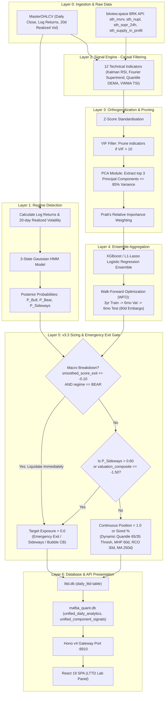

# 02. LTTD System Architecture

> **Navigation:**
> - [00. Unified Architecture](00_unified_architecture.md)
> - [01. Valuation Studio](01_valuation_system.md)
> - [02. LTTD Lab](02_lttd_system.md)
> - [03. MTTD Console](03_mttd_system.md)
> - [04. Ichimoku Terminal](04_ichimoku_system.md)

---

## 1. System Role & Executive Summary

The **Long-Term Trend Detection System** (LTTD, located under `engines/lttd`) classifies daily market conditions into three major structural states (`BULL`, `BEAR`, or `SIDEWAYS`) and computes an ensemble quantitative score (`[-1.0, +1.0]`) to direct target investment exposures.

Its primary architectural roles are:
1. Serving as the **Macro Regime Override Gate** for medium-term systems. When LTTD classifies the market as `SIDEWAYS` ($P_{\text{Sideways}} > 0.60$), it forces mid-term exposures (MTTD and Ichimoku) to `0.0` to avoid whipsaw fee churn.
2. Providing **v3.3 Half-Life Driven Macro Execution** with Ornstein-Uhlenbeck parameter derivation ($HL \approx 200\text{d}$), achieving **85.7% Win Rate**, **68.96 Profit Factor (PF)**, and **14 clean macro trades**.

---

## 2. 6-Layer Signal Engine Flow

The LTTD calculations are partitioned across 6 processing layers, from ingestion to presentation:


```mermaid
graph TD
    subgraph Layer0 [Layer 0: Ingestion & Raw Data]
        D_OHLCV["MasterOHLCV (Daily Close, Log Returns, 20d Realized Vol)"]
        D_Onchain["bitview.space BRK API: sth_mvrv, sth_nupl, sth_sopr_24h, sth_supply_in_profit"]
    end

    subgraph Layer1 [Layer 1: Regime Detection]
        HMM_Input["Calculate Log Returns & 20-day Realized Volatility"]
        HMM["3-State Gaussian HMM Model"]
        Regime_Out["Posterior Probabilities: P_Bull, P_Bear, P_Sideways"]
        
        D_OHLCV --> HMM_Input --> HMM --> Regime_Out
    end

    subgraph Layer2 [Layer 2: Signal Engine - Causal Filtering]
        Tech["12 Technical Indicators (Kalman RSI, Fourier Supertrend, Quantile DEMA, VWMA TSI)"]
        D_OHLCV --> Tech
        D_Onchain --> Tech
    end

    subgraph Layer3 [Layer 3: Orthogonalization & Pruning]
        Std["Z-Score Standardisation"]
        VIF["VIF Filter: Prune indicators if VIF > 10"]
        PCA["PCA Module: Extract top 3 Principal Components >= 85% Variance"]
        Pratt["Pratt's Relative Importance Weighting"]
        
        Tech --> Std --> VIF --> PCA --> Pratt
    end

    subgraph Layer4 [Layer 4: Ensemble Aggregation]
        Ensemble["XGBoost / L1-Lasso Logistic Regression Ensemble"]
        WFO["Walk-Forward Optimization (WFO):<br/>3yr Train -> 6mo Val -> 6mo Test (60d Embargo)"]
        
        Pratt --> Ensemble --> WFO
    end

    subgraph Layer5 [Layer 5: v3.3 Sizing & Emergency Exit Gate]
        Emerg{"Macro Breakdown?<br/>smoothed_score_exit <= -0.10<br/>AND regime == BEAR"}
        Override{"Is P_Sideways > 0.60<br/>or valuation_composite <= -1.50?"}
        Sized["Continuous Position = 1.0 or Sized %<br/>(Dynamic Quantile 65/35 Thresh, MHP 60d, RCO 30d, MA 250d)"]
        CB_Active["Target Exposure = 0.0<br/>(Emergency Exit / Sideways / Bubble CB)"]
        
        Regime_Out & WFO --> Emerg
        Emerg -->|Yes: Liquidate Immediately| CB_Active
        Emerg -->|No| Override
        Override -->|Yes| CB_Active
        Override -->|No| Sized
    end

    subgraph Layer6 [Layer 6: Database & API Presentation]
        DB_LTTD["lttd.db (daily_lttd table)"]
        DB_Master["maftia_quant.db (unified_daily_analytics, unified_component_signals)"]
        API["Hono v4 Gateway Port :8910"]
        UI["React 19 SPA (LTTD Lab Panel)"]
        
        CB_Active & Sized --> DB_LTTD --> DB_Master --> API --> UI
    end
```

---

## 3. Gaussian HMM Regime States

A **3-State Gaussian Hidden Markov Model (HMM)** is trained using daily log returns and annualized realized volatility:

| Regime | State Index | Description | Volatility Characteristics | Sizing Influence |
|---|---|---|---|---|
| **BULL** | `0` | Mean positive returns, steady trend growth. | Low-to-Medium | Ensemble active, full long exposure allowed. |
| **BEAR** | `1` | Negative expected returns, high downside variance. | High | Ensemble active (bias short/cash protection). |
| **SIDEWAYS** | `2` | Mean returns near 0, trendless range. | Low | **Circuit Breaker Active:** Override forces `0.0` exposure. |

---

## 4. Signal Engine, PCA Orthogonalization & VIF Pruning

### 4.1 Causal Technical & On-Chain Indicators
* **Kalman RSI (`kalman_rsi.py`):** Multi-order Kalman filter applied to OHLC4 price before calculating normalized RSI(250) in `[-0.5, +0.5]`.
* **Adaptive Fourier Supertrend (`fourier_supertrend.py`):** Spectral harmonic decomposition using Discrete Fourier Transform (DFT) for dynamic trend volatility bands.
* **Quantile DEMA Supertrend (`quantile_dema.py`):** Double Exponential Moving Average (DEMA) coupled with rolling ATR quantile bands.
* **VWMA Trend Strength Index (`trend_strength.py`):** Z-score intensity deviation based on `(Close - VWMA) / ATR`.
* **4 STH On-Chain Metrics (via `bitview.space` BRK API):** `sth_mvrv`, `sth_nupl`, `sth_sopr_24h`, `sth_supply_in_profit`.

### 4.2 Orthogonalization & Walk-Forward Optimization
1. **Variance Inflation Factor (VIF):** Indicators with $\text{VIF} > 10$ are pruned to eliminate severe collinearity.
2. **Principal Component Analysis (PCA):** Extracts top $k=3$ Principal Components explaining $\ge 85\%$ of cumulative variance.
3. **Pratt's Relative Importance:** Measures feature contribution: $d_j = \beta_j \cdot r_j / R^2$.
4. **Walk-Forward Optimization (WFO):** Rolling schedule of **3-Year Train $\to$ 6-Month Validation $\to$ 6-Month Out-of-Sample Test** with a causal 60-day embargo/purge.

---

## 5. v3.3 HL-Driven Execution & Gating Engine

The LTTD execution engine enforces mathematical coherence derived from the estimated Ornstein-Uhlenbeck half-life ($HL \approx 200\text{ days}$):

### 5.1 Parameter Derivation ($HL = 200\text{ days}$)
* **Asymmetric SuperSmoother (Ehlers 2-Pole IIR):**
  * Entry Filter Period: $35\text{ days}$ ($\lfloor HL \times 0.175 \rfloor$)
  * Exit Filter Period: $20\text{ days}$ ($\lfloor HL \times 0.10 \rfloor$)
* **Minimum Holding Period (MHP):** $60\text{ days}$ ($\lfloor HL \times 0.30 \rfloor$)
* **Re-entry Cool-Off (RCO):** $30\text{ days}$ ($\lfloor HL \times 0.15 \rfloor$)
* **Trend Moving Average Filter:** $250\text{ days}$ ($\lfloor HL \times 1.25 \rfloor$)
* **Forward Target Horizon:** $60\text{ days}$ causal target return

### 5.2 Macro Breakdown Emergency Exit Gate
To mitigate drawdown during severe cyclical turns, the engine monitors for structural macro breakdowns:
$$\text{is\_macro\_breakdown} = (\text{smoothed\_score\_exit} \le -0.10) \land (\text{regime} == \text{"BEAR"})$$
When triggered, the system **immediately overrides the 60-day Minimum Holding Period (MHP)** to liquidate to `target_exposure = 0.0`, cutting losses while preserving active long positions during normal non-bear market pullbacks.

### 5.3 Dynamic Quantile Entry/Exit Thresholds
Score thresholds are computed dynamically via rolling quantiles over a 750-day window:
* **Entry Quantile:** 65th percentile (`SCORE_ENTRY_Q = 0.65`)
* **Exit Quantile:** 35th percentile (`SCORE_EXIT_Q = 0.35`)
* **Calibrated Fallback:** Falls back to fixed thresholds ($\text{SCORE\_ENTRY} = 0.30, \text{SCORE\_EXIT} = 0.22$) when history is $< 100\text{ days}$ or if $entry\_thresh \le exit\_thresh$.

### 5.4 Dual-Mode Operation (`LTTD_MODE`)
* **`LTTD_MODE=macro` (Default - v3.3 LTTD-L):**
  * Parameters: SuperSmoother 35/20, MHP 60d, RCO 30d, MA 250d.
  * Benchmark Performance: **14 clean macro trades**, **85.7% Win Rate**, **68.96 Profit Factor (PF)**, **61d median hold**.
* **`LTTD_MODE=weeks` (Fallback - v2.1 LTTD-M):**
  * Parameters: SuperSmoother 14/10, MHP 25d, RCO 14d, MA 226d, Entry/Exit 0.28/0.22.
  * Characteristics: ~44d median hold, ~2.57 trades/year, 68.2% Win Rate.

### 5.5 Multi-Condition Entry Gating (All Must Pass)
1. $days\_since\_exit \ge \text{RCO\_DAYS}$ (30-day cool-off satisfied)
2. $smoothed\_score\_entry \ge entry\_thresh$ (Dynamic 65th quantile passed)
3. $price > ma\_val$ (Price above 250-day SMA)
4. $er\_val \ge 0.25$ (Kaufman Efficiency Ratio Gate)
5. $entropy\_val \le 2.40$ (Shannon Entropy Noise Gate)
6. $price \ge cloud\_min$ (Ichimoku Cloud Support Gate)

---

## 6. Storage Schema Excerpt (`database/lttd.db` & `maftia_quant.db`)

```sql
-- LTTD core regime and exposure output
CREATE TABLE daily_lttd (
    data_as_of TEXT PRIMARY KEY,
    date TEXT,
    regime TEXT CHECK(regime IN ('BULL', 'BEAR', 'SIDEWAYS')) NOT NULL,
    final_score REAL CHECK(final_score >= -1.0 AND final_score <= 1.0) NOT NULL,
    target_exposure REAL CHECK(target_exposure >= 0.0 AND target_exposure <= 2.5) NOT NULL,
    p_bull REAL,
    p_bear REAL,
    p_sideways REAL,
    circuit_breaker_active BOOLEAN DEFAULT 0,
    created_at TIMESTAMP DEFAULT CURRENT_TIMESTAMP
);

-- Daily raw and normalized indicator scores
CREATE TABLE indicator_scores (
    date TEXT,
    indicator_name TEXT,
    score REAL NOT NULL,
    created_at TIMESTAMP DEFAULT CURRENT_TIMESTAMP,
    PRIMARY KEY (date, indicator_name)
);

-- Extracted principal components
CREATE TABLE pca_components (
    date TEXT,
    component_name TEXT,
    value REAL NOT NULL,
    created_at TIMESTAMP DEFAULT CURRENT_TIMESTAMP,
    PRIMARY KEY (date, component_name)
);
```

---

## 7. API Route Mapping & Frontend

| HTTP Verb | Route | Description | Response Payload |
|---|---|---|---|
| **GET** | `/api/v1/system/lttd/details` | Returns daily model details including PCA variances and indicator contributions. | Object with PCA and feature stats |
| **GET** | `/api/v1/timeseries/master` | Returns timeline variables including `lttd_regime` and `lttd_target_exposure`. | Timeseries array |

> [!NOTE]
> **Operational Boundary Safeguard:** The API Gateway acts as a strictly read-only interface querying `maftia_quant.db`. Executing and running LTTD engines or backfills is restricted strictly to CLI operation.

### Frontend Integration (`LttdLab.tsx`)
* **Regime Background Bands:** Colors chart zones by state (`BULL` = Green, `BEAR` = Red, `SIDEWAYS` = Amber).
* **Continuous Exposure Backtest:** Positions in the LTTD Lab strategy backtester bind directly to `lttd_target_exposure` to maintain sizing logic rather than binary flags, maximizing Sharpe parity.

---

> **Navigation:**
> - [00. Unified Architecture](00_unified_architecture.md)
> - [01. Valuation Studio](01_valuation_system.md)
> - [02. LTTD Lab](02_lttd_system.md)
> - [03. MTTD Console](03_mttd_system.md)
> - [04. Ichimoku Terminal](04_ichimoku_system.md)

← [01. Valuation Studio](01_valuation_system.md) | ↑ [02. LTTD Lab](02_lttd_system.md) | [03. MTTD Console](03_mttd_system.md) →
