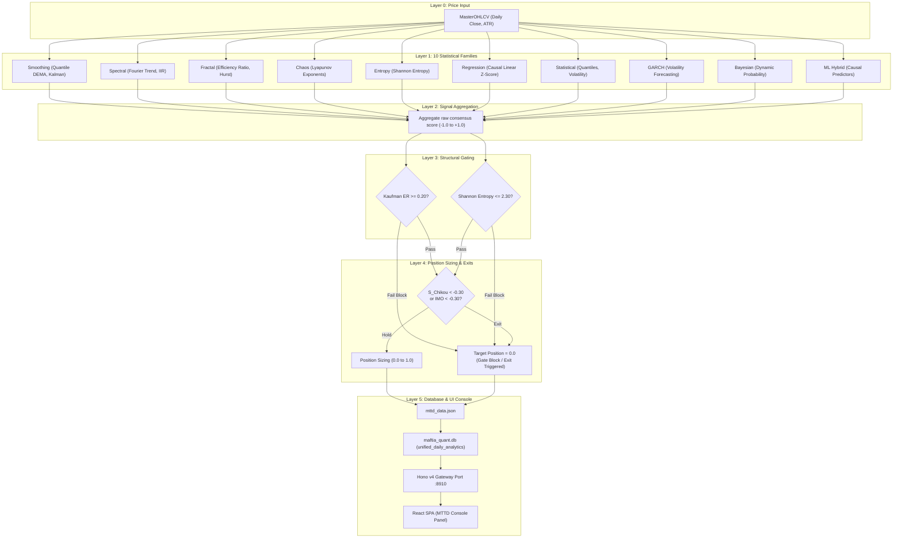

# 03. MTTD System Architecture

> **Navigation:**
> - [E2E Overview](file:///home/ubuntu/projects/quant.maftia.tech/docs/architecture/00_end_to_end.md)
> - [01. Valuation Studio](file:///home/ubuntu/projects/quant.maftia.tech/docs/architecture/01_valuation_system.md)
> - [02. LTTD Lab](file:///home/ubuntu/projects/quant.maftia.tech/docs/architecture/02_lttd_system.md)
> - [03. MTTD Console](file:///home/ubuntu/projects/quant.maftia.tech/docs/architecture/03_mttd_system.md)
> - [04. Ichimoku Terminal](file:///home/ubuntu/projects/quant.maftia.tech/docs/architecture/04_ichimoku_system.md)

---

## 1. System Role

The **Medium-Term Trend Detection System** (MTTD v2, located under [engines/mttd](file:///home/ubuntu/projects/quant.maftia.tech/engines/mttd)) is a quantitative consensus engine. It combines indicators from **10 statistical families** into a single stationary oscillator, the `MTTDIntegratedOscillator` (scaled between `[-1.0, +1.0]`).

Its calculations are governed by three strict gating mechanisms: the **Efficiency Ratio Gate** (`ER >= 0.20`), the **Shannon Entropy Gate** (`Entropy <= 2.30`), and the **Chikou Momentum Exit** (`< -0.30`). These gates check for trend structural strength, information entropy, and momentum breakdowns to optimize trade execution.

---

## 2. Multi-Principle Signal Pipeline

The diagram below maps the process from price inputs through statistical filtering, the structural gates, and target output positioning:



---

## 3. The 10 Statistical Families

The consensus engine evaluates market dynamics across ten distinct statistical domains:

| Family | Sub-indicator / Method | Metric Characterization | Output Style |
|---|---|---|---|
| **Smoothing** | Double Exponential MA (DEMA) | Attenuates high-frequency noise without lagging | Normalized Line |
| **Spectral** | Discrete Fourier Transform (DFT) | Resolves cycle harmonics and frequency spectra | Bounded Sinyal |
| **Fractal** | Kaufman Efficiency Ratio (ER) | Quantifies movement efficiency vs search noise | Ratio `[0.0, 1.0]` |
| **Chaos** | Local Lyapunov Exponents | Identifies phase space departures and instability | Real Number |
| **Entropy** | Shannon Information Entropy | Measures probability state dispersion over 15d | Bits `[0.0, ~2.5]` |
| **Regression** | Causal Linear Regression Z-Score | Computes standardized rate of change z-scores | Z-Score |
| **Statistical** | Rolling Volatility Quantiles | Standardizes volatility across cycles | Percentile |
| **GARCH** | GARCH(1,1) Variance Forecast | Projects forward-looking realized volatility | Percentage |
| **Bayesian** | Recursive Probability Updater | Dynamically adjusts regime probabilities | Probability |
| **ML Hybrid** | Walk-Forward Ridge Regressor | Learns parameters on rolling historical windows | Score `[-1.0, +1.0]` |

---

## 4. The 3 Core Gating Safeguards

*   **Efficiency Ratio Gate (`ER >= 0.20`):**
    Evaluates price direction relative to total path noise:
    $$\text{ER} = \frac{|Close_t - Close_{t-n}|}{\sum_{i=1}^{n} |Close_i - Close_{i-1}|}$$
    If $\text{ER} < 0.20$, the market is consolidating in a random walk. MTTD blocks new entries.
*   **Shannon Entropy Gate (`Entropy <= 2.30`):**
    Calculates statistical uncertainty of returns using a rolling 15-day window segmented into 6 histogram bins:
    $$H = -\sum_{i=1}^{6} p_i \log_2(p_i)$$
    If $H > 2.30$, the market is in a chaotic regime, blocking entry executions.
*   **Chikou Momentum Exit (`S_Chikou < -0.30`):**
    Monitors normalized 60-day lagging momentum. A drop below `-0.30` closes active positions, returning the portfolio to cash.

---

## 5. Storage Schema & Serialization

The MTTD engine writes execution outputs to `mttd_data.json` before they are synced into the centralized database `maftia_quant.db`:

```sql
-- SQLite table schema in maftia_quant.db
CREATE TABLE unified_daily_analytics (
  date                   TEXT PRIMARY KEY,
  -- MTTD System v2 columns
  mttd_imo               REAL,          -- Integrated Market Oscillator [-1.0, +1.0]
  mttd_efficiency_ratio  REAL,          -- Kaufman ER value
  mttd_entropy           REAL,          -- Shannon Entropy value
  mttd_position          REAL,          -- Target position [0.0, 1.0]
  mttd_immunity_active   INTEGER        -- Hold immunity flag
);
```

---

## 6. API Route Mapping & Frontend

| HTTP Verb | Route | Description |
|---|---|---|
| **GET** | `/api/v1/timeseries/master` | Returns timeseries history including `mttd_imo` and `mttd_position`. |

### Frontend Integration (`MttdConsole.tsx`)
The **MTTD Console** displays medium-term trend execution indicators:
*   **Oscillator Panels:** Displays `mttd_imo` relative to buying/selling thresholds (`+0.25` and `-0.25`).
*   **Gate Panel Widgets:** Shows live lights for the Efficiency Ratio Gate and Shannon Entropy Gate (Green = Open, Red = Blocked).

---

<blockquote>
  <p><strong>Navigation:</strong></p>
  <ul>
    <li><a href="file:///home/ubuntu/projects/quant.maftia.tech/docs/architecture/00_end_to_end.md">E2E Overview</a></li>
    <li><a href="file:///home/ubuntu/projects/quant.maftia.tech/docs/architecture/01_valuation_system.md">01. Valuation Studio</a></li>
    <li><a href="file:///home/ubuntu/projects/quant.maftia.tech/docs/architecture/02_lttd_system.md">02. LTTD Lab</a></li>
    <li><a href="file:///home/ubuntu/projects/quant.maftia.tech/docs/architecture/03_mttd_system.md">03. MTTD Console</a></li>
    <li><a href="file:///home/ubuntu/projects/quant.maftia.tech/docs/architecture/04_ichimoku_system.md">04. Ichimoku Terminal</a></li>
  </ul>
</blockquote>

← [02. LTTD Lab](file:///home/ubuntu/projects/quant.maftia.tech/docs/architecture/02_lttd_system.md) | ↑ [MTTD Console](file:///home/ubuntu/projects/quant.maftia.tech/docs/architecture/03_mttd_system.md) | [04. Ichimoku Terminal](file:///home/ubuntu/projects/quant.maftia.tech/docs/architecture/04_ichimoku_system.md) →
