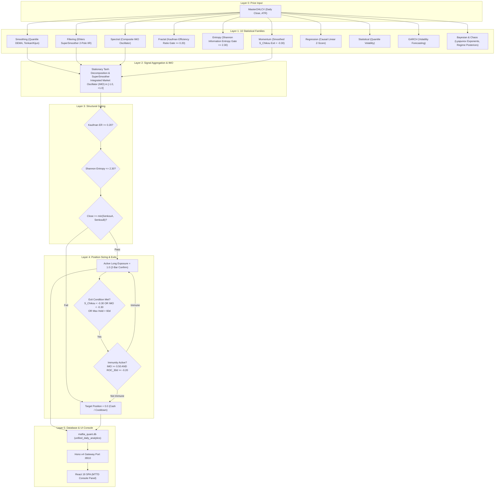

# 03. MTTD System Architecture

> **Navigation:**
> - [00. Unified Architecture](00_unified_architecture.md)
> - [01. Valuation Studio](01_valuation_system.md)
> - [02. LTTD Lab](02_lttd_system.md)
> - [03. MTTD Console](03_mttd_system.md)
> - [04. Ichimoku Terminal](04_ichimoku_system.md)

---

## 1. System Role & Executive Summary

The **Medium-Term Trend Detection System** (MTTD v2, located under `engines/mttd`) is a quantitative consensus engine. It combines indicators from **10 statistical families** into a single stationary oscillator, the `MTTDIntegratedOscillator` (scaled between `[-1.0, +1.0]`).

Its calculations are governed by three strict gating mechanisms: the **Efficiency Ratio Gate** (`ER >= 0.20`), the **Shannon Entropy Gate** (`Entropy <= 2.30`), and the **Chikou Momentum Exit** (`< -0.30`). These gates distinguish true trends from random noise, achieving historical performance (2018–2026) of **58.3% Win Rate**, **1.27 Sharpe Ratio**, and a Deflated Sharpe Ratio $z = 7.48$ (100% statistical significance above hurdle).

---

## 2. Multi-Principle Signal Pipeline

The diagram below maps the process from price inputs through statistical filtering, the structural gates, and target output positioning:


```mermaid
graph TD
    subgraph Data [Layer 0: Price Input]
        OHLCV["MasterOHLCV (Daily Close, ATR)"]
    end

    subgraph Families [Layer 1: 10 Statistical Families]
        F1["Smoothing (Quantile DEMA, Tenkan/Kijun)"]
        F2["Filtering (Ehlers SuperSmoother 2-Pole IIR)"]
        F3["Spectral (Composite IMO Oscillator)"]
        F4["Fractal (Kaufman Efficiency Ratio Gate >= 0.20)"]
        F5["Entropy (Shannon Information Entropy Gate <= 2.30)"]
        F6["Momentum (Smoothed S_Chikou Exit < -0.30)"]
        F7["Regression (Causal Linear Z-Score)"]
        F8["Statistical (Quantile Volatility)"]
        F9["GARCH (Volatility Forecasting)"]
        F10["Bayesian & Chaos (Lyapunov Exponents, Regime Posteriors)"]
        
        OHLCV --> F1 & F2 & F3 & F4 & F5 & F6 & F7 & F8 & F9 & F10
    end

    subgraph Aggregation [Layer 2: Signal Aggregation & IMO]
        F1 & F2 & F3 & F6 --> RawOsc["Stationary Tanh Decomposition & SuperSmoother<br/>Integrated Market Oscillator (IMO) in [-1.0, +1.0]"]
    end

    subgraph Gates [Layer 3: Structural Gating]
        ER_Gate{"Kaufman ER >= 0.20?"}
        Ent_Gate{"Shannon Entropy <= 2.30?"}
        Cloud_Gate{"Close >= min(SenkouA, SenkouB)?"}
        
        RawOsc --> ER_Gate --> Ent_Gate --> Cloud_Gate
    end

    subgraph Output [Layer 4: Position Sizing & Exits]
        Exit_Eval{"Exit Condition Met?<br/>S_Chikou < -0.30 OR IMO < -0.30<br/>OR Max Hold > 60d"}
        Immunity{"Immunity Active?<br/>IMO >= 0.50 AND ROC_30d >= -0.20"}
        Pos["Active Long Exposure = 1.0 (2-Bar Confirm)"]
        CB_Active["Target Position = 0.0 (Cash / Cooldown)"]
        
        Cloud_Gate -->|Pass| Pos
        Cloud_Gate -->|Fail| CB_Active
        Pos --> Exit_Eval
        Exit_Eval -->|Yes| Immunity
        Immunity -->|Immune| Pos
        Immunity -->|Not Immune| CB_Active
    end

    subgraph Presentation [Layer 5: Database & UI Console]
        DB_Master["maftia_quant.db (unified_daily_analytics)"]
        API["Hono v4 Gateway Port :8910"]
        UI["React 19 SPA (MTTD Console Panel)"]
        
        Pos & CB_Active --> DB_Master --> API --> UI
    end
```

---

## 3. The 10 Statistical Families

The consensus engine evaluates market dynamics across ten distinct statistical domains:

| No | Statistical Family | Implementation Module | Role in Strategy | Status |
|---|---|---|---|---|
| 1 | **Smoothing** | `indicators_helper.py` | Baseline Ichimoku trend structure (Tenkan, Kijun, Senkou A/B) | Active Core |
| 2 | **Filtering** | `indicators/supersmoother.py` | Zero-lag high-frequency noise attenuation via Ehlers SuperSmoother | Active Core |
| 3 | **Spectral** | `multi_principle_signals.py` | Normalized cycle harmonics via composite **IMO** calculation | Active Core |
| 4 | **Fractal** | `indicators/efficiency_ratio.py` | Trend strength confirmation (**Kaufman Efficiency Ratio Gate**) | Active Core Gate |
| 5 | **Entropy** | `indicators/entropy.py` | Chaos and market randomness detection (**Shannon Entropy Gate**) | Active Core Gate |
| 6 | **Momentum** | `multi_principle_signals.py` | Exit timing trigger via normalized **Chikou momentum** | Active Exit Core |
| 7 | **Regression** | `multi_principle_signals.py` | Causal linear regression channel for volatility confirmation | Secondary / Signals |
| 8 | **GARCH** | `multi_principle_signals.py` | Volatility clustering and dynamic parameter scaling | Secondary / Signals |
| 9 | **Chaos** | `multi_principle_signals.py` | Phase space analysis and local Lyapunov exponent stability filter | Secondary / Signals |
| 10 | **Bayesian** | `regime_detector.py` | Dynamic probability updating and macroeconomic regime overlay | Regime Overlay |

---

## 4. Mathematical Formulation of Composite Signal (IMO)

All non-stationary components are mapped to bounded stationary oscillators `[-1.0, +1.0]` using the hyperbolic tangent function ($\tanh$):
$$S_{TK} = \tanh\left(\frac{\text{Tenkan} - \text{Kijun}}{\text{ATR}}\right), \quad S_{Cloud} = \tanh\left(\frac{\text{Close} - \text{Cloud}}{\text{ATR}}\right)$$
$$S_{Future} = \tanh\left(\frac{\text{SenkouA} - \text{SenkouB}}{\text{ATR}}\right), \quad S_{Chikou} = \tanh\left(\text{SuperSmoother}\left(\frac{\text{Close}_t - \text{Close}_{t-60}}{\text{ATR}}, l=4\right)\right)$$

**Integrated Market Oscillator (IMO):**
$$\text{IMO}_t = \text{SuperSmoother}\left(\frac{S_{TK} + S_{Cloud} + S_{Future} + S_{Chikou}}{4}, \, l=7\right)$$

---

## 5. Execution Gates & Dynamic Immunity

### 5.1 Entry Logic (ALL Must Pass)
1. **Adaptive IMO Threshold:** $\text{IMO} > \text{std}(\text{IMO}, 30d) \times 0.25$
2. **Fractal Efficiency Gate:** $\text{ER} \ge 0.20$
3. **Entropy Noise Gate:** $\text{Shannon Entropy} \le 2.30$ (calculated on rolling 15d window with 6 bins: $H = -\sum_{i=1}^6 p_i \log_2 p_i$)
4. **Cloud Trend Filter:** $\text{Close} \ge \min(\text{SenkouA}, \text{SenkouB})$
5. **Persistence Confirmation:** Sinyal must persist for **2 consecutive daily bars**.

### 5.2 Exit Logic (ANY Can Trigger)
1. **Chikou Momentum Breakdown:** $S_{Chikou} < -0.30$
2. **Trend Breakdown:** $\text{IMO} < -0.30$
3. **Max Hold Forced Exit:** Forced liquidation after **60 days** with a **5-day cooldown**.

### 5.3 Dynamic Bullish Trend Immunity
To prevent premature exit during strong parabolic bull trends with sharp shallow pullbacks, exit rules are temporarily suspended if:
$$\text{Immunity Active} \iff (\text{IMO} \ge 0.50 \lor \text{Close} \ge \text{Cloud}_{\max}) \land (\text{ROC}_{30d} \ge -0.20) \land (\text{IMO} \ge -0.30)$$

---

## 6. Parameters & Backtest Performance

### 6.1 Configuration Parameters (`mttd_ensemble_config.json`)
```json
{
  "t_entry": 0.25,
  "er_entry": 0.20,
  "entropy_thresh": 2.30,
  "min_hold_days": 10,
  "max_hold_days": 60,
  "chikou_thresh": -0.30,
  "immunity_thresh": 0.50,
  "cooldown": 5
}
```

### 6.2 Backtest Performance Summary
| Metric | Full Period Baseline (2018–2026) | Walk-Forward Out-Of-Sample (2020–2026) |
|---|---|---|
| **Total Trades** | 12 | 11 |
| **Win Rate** | 58.3% | 63.6% |
| **Sharpe Ratio** | 1.27 | 1.34 |
| **Deflated Sharpe Ratio** | N/A | **$z = 7.48$ (100% Significant)** |

---

## 7. Storage Schema Excerpt & API Mapping

```sql
-- SQLite schema in maftia_quant.db
CREATE TABLE unified_daily_analytics (
  date                   TEXT PRIMARY KEY,
  mttd_imo               REAL,
  mttd_efficiency_ratio  REAL,
  mttd_entropy           REAL,
  mttd_position          REAL,
  mttd_immunity_active   INTEGER,
  FOREIGN KEY (date) REFERENCES master_ohlcv(date)
);
```

| HTTP Verb | Route | Description |
|---|---|---|
| **GET** | `/api/v1/system/mttd/details` | Returns daily model details including ER, Entropy, and gate indicators. |
| **GET** | `/api/v1/timeseries/master` | Returns timeseries history including `mttd_imo`, `mttd_position`, and `mttd_immunity_active`. |

### Frontend Integration (`MttdConsole.tsx`)
* **Gate Visualizer:** Traffic light UI displaying live status for **Efficiency Ratio (`ER >= 0.20`)**, **Shannon Entropy (`<= 2.30`)**, and **Chikou Momentum (`>= -0.30`)**.
* **Synchronized Subplots:** Stacked IMO line chart with 85px Y-axis lock and vertical crosshair synchronization.

---

> **Navigation:**
> - [00. Unified Architecture](00_unified_architecture.md)
> - [01. Valuation Studio](01_valuation_system.md)
> - [02. LTTD Lab](02_lttd_system.md)
> - [03. MTTD Console](03_mttd_system.md)
> - [04. Ichimoku Terminal](04_ichimoku_system.md)

← [02. LTTD Lab](02_lttd_system.md) | ↑ [03. MTTD Console](03_mttd_system.md) | [04. Ichimoku Terminal](04_ichimoku_system.md) →
