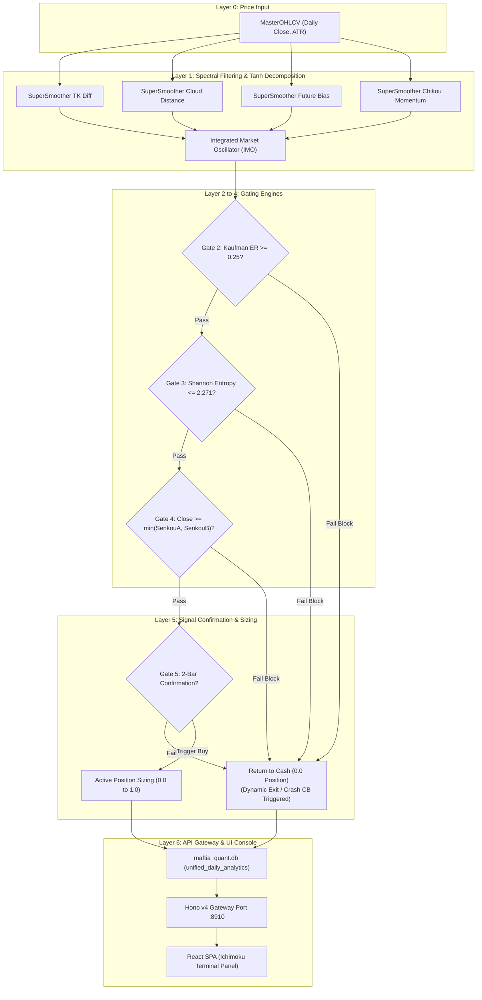

# 04. Ichimoku Quant System Architecture

> **Navigation:**
> - [E2E Overview](file:///home/ubuntu/projects/quant.maftia.tech/docs/architecture/00_end_to_end.md)
> - [01. Valuation Studio](file:///home/ubuntu/projects/quant.maftia.tech/docs/architecture/01_valuation_system.md)
> - [02. LTTD Lab](file:///home/ubuntu/projects/quant.maftia.tech/docs/architecture/02_lttd_system.md)
> - [03. MTTD Console](file:///home/ubuntu/projects/quant.maftia.tech/docs/architecture/03_mttd_system.md)
> - [04. Ichimoku Terminal](file:///home/ubuntu/projects/quant.maftia.tech/docs/architecture/04_ichimoku_system.md)

---

## 1. System Role

The **Ichimoku Quant System** (located under [engines/ichimoku](file:///home/ubuntu/projects/quant.maftia.tech/engines/ichimoku)) decomposes standard non-stationary Ichimoku cloud indicator values into stationary, bounded $\tanh$ oscillators (`[-1.0, +1.0]`) denoised with an Ehlers 2-pole `SuperSmoother` filter.

It operates as a medium-term trend execution platform. Sinyal output (`ichimoku_position`) is subject to **5 sequential confirmation gates** checking fractal efficiency, information theory entropy boundaries, cloud support thresholds, and multi-day persistence.

---

## 2. Five-Gate Processing Architecture

The signal pipeline processes incoming prices through spectral denoising, fractal/information filters, cloud positioning checks, and confirmation gates:

---

## 3. Tanh Decomposition & SuperSmoother Math

Ichimoku's raw values are non-stationary and fluctuate with price. The system stabilizes them using Average True Range (ATR) normalization inside a $\tanh$ function:

1.  **Tenkan-Kijun Cross:** $S_{TK,t} = \tanh\left(\frac{TK_t - KJ_t}{ATR_t}\right)$
2.  **Cloud Distance:** $S_{Cloud,t} = \tanh\left(\frac{Close_t - Cloud_t}{ATR_t}\right)$
3.  **Future Cloud Bias:** $S_{Future,t} = \tanh\left(\frac{SenkouA_t - SenkouB_t}{ATR_t}\right)$
4.  **Smoothed Chikou Momentum:** $S_{Chikou,t} = \tanh\left(\text{SuperSmoother}\left(\frac{Close_t - Close_{t-60}}{ATR_t}, l=4\right)\right)$

### Integrated Market Oscillator (IMO)
$$\text{IMO}_t = \text{SuperSmoother}\left(\frac{S_{TK,t} + S_{Cloud,t} + S_{Future,t} + S_{Chikou,t}}{4}, \, l=7\right)$$

*   **SuperSmoother IIR Filter:**
    The Ehlers 2-pole IIR filter removes high-frequency volatility noise without introducing lag:
    $$y_t = c_1 \frac{x_t + x_{t-1}}{2} + c_2 y_{t-1} + c_3 y_{t-2}$$
    *Where coefficients $c_1, c_2, c_3$ are derived dynamically from the chosen cut-off period ($l=7$ or $l=4$ days).*

---

## 4. The 5 Logical Gates

| Gate | Function Name | Threshold Value / Condition | Action on Failure |
|---|---|---|---|
| **Gate 1** | Spectral Normalizer | `IMO` calculation | Initial signal formation; no exit. |
| **Gate 2** | Kaufman Efficiency | `ER >= 0.25` | Blocks execution entry. |
| **Gate 3** | Shannon Entropy | `Entropy <= 2.271` | Blocks execution entry (chaotic market override). |
| **Gate 4** | Cloud Boundary | `Close >= min(SenkouA, SenkouB)` | Blocks buying during downtrends. |
| **Gate 5** | Sinyal Confirmation | 2 consecutive bars of alignment | Prevents premature execution entries. |

---

## 5. Statistical Rigor & Validation

The Ichimoku Quant oscillator underwent five mathematical tests to prove its market edge:

| Statistical Test | Null Hypothesis ($H_0$) | Test Result | Implication |
|---|---|---|---|
| **Augmented Dickey-Fuller (ADF)** | IMO oscillator is non-stationary. | **Rejected $H_0$ ($p \approx 0.0$)** | Bounded stationary distribution; thresholds remain valid across cycles. |
| **Kolmogorov-Smirnov (KS)** | Forward return distributions in Bullish and Bearish regimes are identical. | **Rejected $H_0$ ($p < 0.05$)** | Sinyal successfully isolates distinct performance regimes. |
| **Welch's t-test** | Average 10-day forward return on bullish signals is $\le 0$. | **Rejected $H_0$ ($p \approx 0.0$)** | Bullish signals hold statistically significant positive expectancy. |
| **Bootstrap 95% Confidence Interval** | Mean signal return = 0 (10,000x resampling). | **CI is strictly positive** | Edge is robust against fat-tail volatility events. |
| **Bonferroni Correction** | Sinyal sub-components are independent random noise. | **All 4 pass ($\alpha = 0.0125$)** | Subcomponents add distinct, non-overlapping information. |

---

## 6. API Route Mapping & Frontend Terminal

*   `GET /api/v1/timeseries/master`: Returns timeseries history including `ichimoku_imo`, `ichimoku_regime`, and `ichimoku_position`.

### Frontend Integration (`IchimokuTerminal.tsx`)
The **Ichimoku Terminal** panel renders:
*   **Oscillator Track Subplot:** Renders the bounded `ichimoku_imo` line chart.
*   **Gate Panel Widgets:** Shows live lights for the five logical gates.
*   **Performance Metrics:** Displays Sharpe, Sortino, and drawdown metrics calculated directly from continuous `ichimoku_position` data.

---

<blockquote>
  
<strong>Navigation:</strong>

  <ul>
    <li><a href="file:///home/ubuntu/projects/quant.maftia.tech/docs/architecture/00_end_to_end.md">E2E Overview</a></li>
    <li><a href="file:///home/ubuntu/projects/quant.maftia.tech/docs/architecture/01_valuation_system.md">01. Valuation Studio</a></li>
    <li><a href="file:///home/ubuntu/projects/quant.maftia.tech/docs/architecture/02_lttd_system.md">02. LTTD Lab</a></li>
    <li><a href="file:///home/ubuntu/projects/quant.maftia.tech/docs/architecture/03_mttd_system.md">03. MTTD Console</a></li>
    <li><a href="file:///home/ubuntu/projects/quant.maftia.tech/docs/architecture/04_ichimoku_system.md">04. Ichimoku Terminal</a></li>
  </ul>
</blockquote>

← [03. MTTD Console](file:///home/ubuntu/projects/quant.maftia.tech/docs/architecture/03_mttd_system.md) | ↑ [Ichimoku Terminal](file:///home/ubuntu/projects/quant.maftia.tech/docs/architecture/04_ichimoku_system.md) | Prev (Index) →
