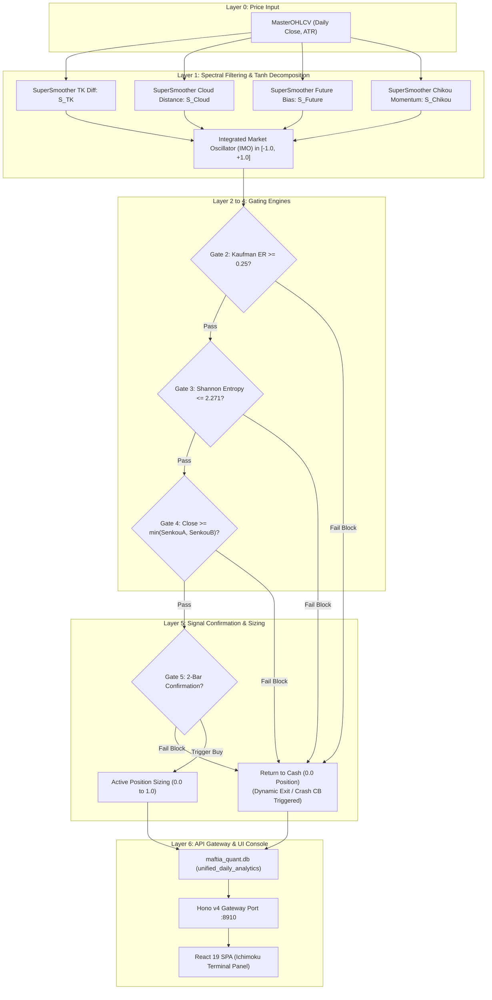

# 04. Ichimoku Quant System Architecture

> **Navigation:**
> - [00. Unified Architecture](00_unified_architecture.md)
> - [01. Valuation Studio](01_valuation_system.md)
> - [02. LTTD Lab](02_lttd_system.md)
> - [03. MTTD Console](03_mttd_system.md)
> - [04. Ichimoku Terminal](04_ichimoku_system.md)

---

## 1. System Role & Executive Summary

The **Ichimoku Quant System** (located under `engines/ichimoku`) decomposes standard non-stationary Ichimoku cloud indicator values into stationary, bounded $\tanh$ oscillators (`[-1.0, +1.0]`) denoised with an Ehlers 2-pole `SuperSmoother` filter.

It operates as a medium-term trend execution platform. Sinyal output (`ichimoku_position`) is subject to **5 sequential confirmation gates** checking fractal efficiency, information theory entropy boundaries, cloud support thresholds, and multi-day persistence. Across historical testing (2016–2026), the system achieved a total return of **109,368.07%** with a **Sharpe Ratio of 1.47** and **Max Drawdown of -48.17%** (outperforming buy-and-hold by ~5.5x on a risk-adjusted basis).

---

## 2. Five-Gate Processing Architecture

The signal pipeline processes incoming prices through spectral denoising, fractal/information filters, cloud positioning checks, and confirmation gates:


```mermaid
graph TD
    subgraph Data [Layer 0: Price Input]
        OHLCV["MasterOHLCV (Daily Close, ATR)"]
    end

    subgraph Denoise [Layer 1: Spectral Filtering & Tanh Decomposition]
        SS_TK["SuperSmoother TK Diff: S_TK"]
        SS_Cloud["SuperSmoother Cloud Distance: S_Cloud"]
        SS_Fut["SuperSmoother Future Bias: S_Future"]
        SS_Chk["SuperSmoother Chikou Momentum: S_Chikou"]
        
        OHLCV --> SS_TK & SS_Cloud & SS_Fut & SS_Chk
        SS_TK & SS_Cloud & SS_Fut & SS_Chk --> IMO["Integrated Market Oscillator (IMO) in [-1.0, +1.0]"]
    end

    subgraph Gates [Layer 2 to 4: Gating Engines]
        G2{"Gate 2: Kaufman ER >= 0.25?"}
        G3{"Gate 3: Shannon Entropy <= 2.271?"}
        G4{"Gate 4: Close >= min(SenkouA, SenkouB)?"}
        
        IMO --> G2
        G2 -->|Pass| G3
        G3 -->|Pass| G4
    end

    subgraph Exec [Layer 5: Signal Confirmation & Sizing]
        G5{"Gate 5: 2-Bar Confirmation?"}
        Active["Active Position Sizing (0.0 to 1.0)"]
        Cash["Return to Cash (0.0 Position)<br/>(Dynamic Exit / Crash CB Triggered)"]
        
        G4 -->|Pass| G5
        G2 & G3 & G4 & G5 -->|Fail Block| Cash
        G5 -->|Trigger Buy| Active
    end

    subgraph Presentation [Layer 6: API Gateway & UI Console]
        DB_Master["maftia_quant.db (unified_daily_analytics)"]
        API["Hono v4 Gateway Port :8910"]
        UI["React 19 SPA (Ichimoku Terminal Panel)"]
        
        Active & Cash --> DB_Master --> API --> UI
    end
```

---

## 3. Tanh Decomposition & SuperSmoother Math

Ichimoku's raw visual lines are non-stationary and drift with absolute price. The system stabilizes them using Average True Range (ATR) normalization inside a $\tanh$ function:

1. **Tenkan-Kijun Cross:** $S_{TK,t} = \tanh\left(\frac{TK_t - KJ_t}{ATR_t}\right)$
2. **Cloud Distance:** $S_{Cloud,t} = \tanh\left(\frac{Close_t - Cloud_t}{ATR_t}\right)$
3. **Future Cloud Bias:** $S_{Future,t} = \tanh\left(\frac{SenkouA_t - SenkouB_t}{ATR_t}\right)$
4. **Smoothed Chikou Momentum:** $S_{Chikou,t} = \tanh\left(\text{SuperSmoother}\left(\frac{Close_t - Close_{t-60}}{ATR_t}, l=4\right)\right)$

### Integrated Market Oscillator (IMO)
$$\text{IMO}_t = \text{SuperSmoother}\left(\frac{S_{TK,t} + S_{Cloud,t} + S_{Future,t} + S_{Chikou,t}}{4}, \, l=7\right)$$

* **SuperSmoother 2-Pole IIR Filter:**
  $$y_t = c_1 \frac{x_t + x_{t-1}}{2} + c_2 y_{t-1} + c_3 y_{t-2}$$
  *Where coefficients $c_1, c_2, c_3$ are derived dynamically from the cut-off period ($l=7$ or $l=4$ days) to attenuate high-frequency noise without introducing phase delay.*

---

## 4. The 5 Logical Gates

| Gate | Function Name | Threshold Value / Condition | Action on Failure |
|---|---|---|---|
| **Gate 1** | Spectral Normalizer | `IMO` calculation via SuperSmoother $\tanh$ | Initial signal formation; no exit. |
| **Gate 2** | Kaufman Efficiency | `ER >= 0.25` ($\text{ER} = \frac{\|Close_t - Close_{t-n}\|}{\sum \|Close_i - Close_{i-1}\|}$) | Blocks execution entry (random walk filter). |
| **Gate 3** | Shannon Entropy | `Entropy <= 2.271` ($H = -\sum_{i=1}^6 p_i \log_2 p_i$ on 15d window) | Blocks execution entry (chaotic state filter). |
| **Gate 4** | Cloud Boundary | $Close_t \ge \min(SenkouA_t, SenkouB_t)$ | Blocks buying during major downtrends / falling knives. |
| **Gate 5** | Signal Confirmation | 2 consecutive daily bars of alignment | Prevents premature execution entries. |

### Dynamic Immunity & Exit Rules
1. **Momentum Decay Exit:** Position liquidated if $S_{Chikou} < -0.30$.
2. **Dynamic Immunity:** While price is above the cloud, exit tolerance is softened to $\text{IMO} > -0.30$.
3. **Crash Circuit Breaker:** If 30-day Rate of Change drops below `-0.20` (`-20%`), immunity is instantly revoked, forcing immediate exit to cash.
4. **Minimum Hold Period:** 10-day minimum holding time to suppress overtrading.

---

## 5. Statistical Rigor & Formal Validation

The Ichimoku Quant oscillator underwent five rigorous mathematical hypothesis tests:

| Statistical Test | Null Hypothesis ($H_0$) | Test Result | Implication |
|---|---|---|---|
| **Augmented Dickey-Fuller (ADF)** | IMO oscillator is non-stationary. | **Rejected $H_0$ ($p \approx 0.0$)** | Bounded stationary distribution; fixed thresholds remain valid across cycles. |
| **Kolmogorov-Smirnov (KS)** | Forward return distributions in Bullish and Bearish regimes are identical. | **Rejected $H_0$ ($p < 0.05$)** | Signal successfully isolates distinct performance regimes. |
| **Welch's t-test** | Average 10-day forward return on bullish signals is $\le 0$. | **Rejected $H_0$ ($p \approx 0.0$)** | Bullish signals hold statistically significant positive expectancy. |
| **Bootstrap 95% Confidence Interval** | Mean signal return = 0 (10,000x resampling). | **CI is strictly positive** | Edge is robust against fat-tail volatility events. |
| **Bonferroni Correction** | Signal sub-components are independent random noise. | **All 4 pass ($\alpha = 0.0125$)** | Subcomponents add distinct, non-overlapping information without p-hacking. |

---

## 6. Storage Schema & API Route Mapping

```sql
-- SQLite table schema in maftia_quant.db
CREATE TABLE unified_daily_analytics (
  date                   TEXT PRIMARY KEY,
  ichimoku_imo           REAL,
  ichimoku_regime        TEXT,
  ichimoku_position      REAL,
  FOREIGN KEY (date) REFERENCES master_ohlcv(date)
);
```

| HTTP Verb | Route | Description |
|---|---|---|
| **GET** | `/api/v1/system/ichimoku/details` | Returns daily model details including component $\tanh$ values and gate statuses. |
| **GET** | `/api/v1/timeseries/master` | Returns timeseries history including `ichimoku_imo`, `ichimoku_regime`, and `ichimoku_position`. |

### Frontend Integration (`IchimokuTerminal.tsx`)
* **Oscillator Track Subplot:** Renders the bounded `ichimoku_imo` line chart with an 85px locked Y-axis.
* **Gate Panel Widgets:** Shows live lights for the 5 logical gates.
* **Raw vs Denoised Comparison:** Toggles between standard candlestick cloud view and stationary bounded oscillators.

---

> **Navigation:**
> - [00. Unified Architecture](00_unified_architecture.md)
> - [01. Valuation Studio](01_valuation_system.md)
> - [02. LTTD Lab](02_lttd_system.md)
> - [03. MTTD Console](03_mttd_system.md)
> - [04. Ichimoku Terminal](04_ichimoku_system.md)

← [03. MTTD Console](03_mttd_system.md) | ↑ [04. Ichimoku Terminal](04_ichimoku_system.md) | [00. Unified Architecture](00_unified_architecture.md) →
