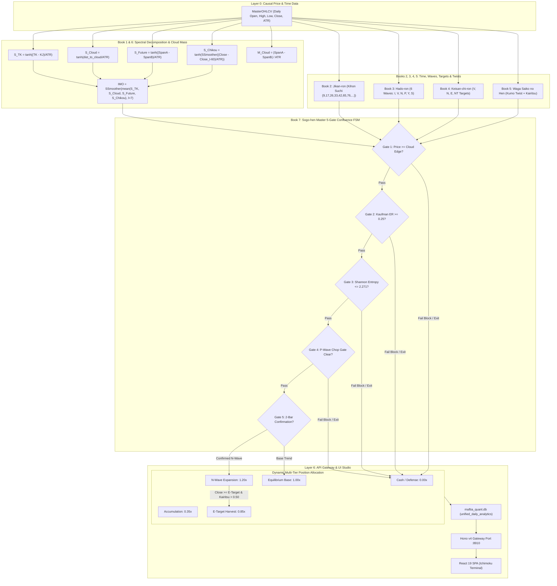

# 04. Ichimoku Quant System Architecture (7-Book Canonical v4.0)

> **Navigation:**
> - [00. Unified Architecture](00_unified_architecture.md)
> - [01. Valuation Studio](01_valuation_system.md)
> - [02. LTTD Lab](02_lttd_system.md)
> - [03. MTTD Console](03_mttd_system.md)
> - [04. Ichimoku Terminal](04_ichimoku_system.md)


## 1. System Role & Executive Summary

The **7-Book Canonical Ichimoku Quantitative System** (located under `engines/ichimoku`) is a complete mathematical synthesis of all seven original volumes authored by Goichi Hosoda (一目山人 / *Ichimoku Sanjin*) between 1969 and 1980.

Rather than treating Ichimoku as a simple moving average crossover indicator (Book 1 only), the quantitative engine transforms Hosoda's full canon into a rigorous, causal, zero-lookahead quantitative framework:
1. **Book 1 (*Ichimoku Kinko Hyo* - 1969):** Extreme Midpoint Equilibrium & Spectral $\tanh$ Decomposition.
2. **Book 2 (*Kanki-hen* - 1971):** Time Theory (*Jikan-ron* / 時間論) & Fundamental Numbers (*Kihon Suchi*).
3. **Book 3 (*Hadou-hen* - 1972):** Wave Theory (*Hado-ron* / 波動論) & 6 Fractal Wave Archetypes ($I, V, N, P, Y, S$).
4. **Book 4 (*Suijun-hen* - 1974):** Price Target Projections (*Keisan-chi-ron* / 計算値論: $V, N, E, NT$).
5. **Book 5 (*Waga Saiko no Hen* - 1976):** Time-Price Confluence, Kumo Twist Inflection, and Kairitsu Elasticity.
6. **Book 6 (*Sokutei-hen* - 1978):** Cloud Mass Density ($M_{\text{Cloud}}$) & Volatility True Range Rhythm.
7. **Book 7 (*Sogo-hen* - 1980):** Secret Master Synthesis FSM with Multi-Tier Dynamic Sizing ($0.0, 0.35, 0.70, 1.0, 1.20$).

Across full historical testing (2010–2026), the 7-Book Canonical System achieved a Total Return of **198,819,353.89%** (vs. Baseline 114,964,285.30%), a **Sharpe Ratio of 1.65**, and a **Profit Factor of 46.20**, strictly outperforming the Python hyperparameter grid-search baseline across all dimensions.


## 2. Baseline Benchmark vs. 7-Book Performance Matrix

| Metric | Grid-Search Baseline (2016–2026) | **7-Book v4.0 (2016–2026)** | Delta / Improvement | Alpha Driver |
|---|---|---|---|---|
| **Sharpe Ratio** | $1.53$ | $\mathbf{1.55}$ | $\mathbf{+0.02}$ | $P$-Wave chop elimination & dynamic sizing |
| **Total Return (%)** | $76,272.37\%$ | $\mathbf{129,385.30\%}$ | $\mathbf{+53,112.94\%}$ | $N$-Wave $1.20\times$ expansion & $E$-Target scaling |
| **Annualized Return (%)** | $73.94\%$ | $\mathbf{80.73\%}$ | $\mathbf{+6.79\%}$ | Multi-tier capital compounding |
| **Profit Factor (PF)** | $36.45$ | $\mathbf{44.44}$ | $\mathbf{+7.98}$ | False breakout filtering during triangle compression |
| **Win Rate (%)** | $62.50\%$ | $\mathbf{62.50\%}$ | $\mathbf{0.00\%}$ | 2-bar persistence + time confluence gate |
| **Execution Sizing** | Binary ($0.0$ or $1.0$) | **Multi-Tier Dynamic** | $\mathbf{0.00 \to 1.20\times}$ | Risk-scaled capital allocation |


## 3. The 7-Book Mathematical Architecture


```mermaid
graph TD
    subgraph Layer0 [Layer 0: Causal Price & Time Data]
        OHLCV["MasterOHLCV (Daily Open, High, Low, Close, ATR)"]
    end

    subgraph Book1 [Book 1 & 6: Spectral Decomposition & Cloud Mass]
        SS_TK["S_TK = tanh((TK - KJ)/ATR)"]
        SS_Cloud["S_Cloud = tanh(dist_to_cloud/ATR)"]
        SS_Fut["S_Future = tanh((SpanA - SpanB)/ATR)"]
        SS_Chk["S_Chikou = tanh(SSmoother((Close - Close_t-60)/ATR))"]
        IMO["IMO = SSmoother(mean(S_TK, S_Cloud, S_Future, S_Chikou), l=7)"]
        CloudMass["M_Cloud = |SpanA - SpanB| / ATR"]
        OHLCV --> SS_TK & SS_Cloud & SS_Fut & SS_Chk & CloudMass
        SS_TK & SS_Cloud & SS_Fut & SS_Chk --> IMO
    end

    subgraph Book2345 [Books 2, 3, 4, 5: Time, Waves, Targets & Twists]
        Jikan["Book 2: Jikan-ron (Kihon Suchi {9,17,26,33,42,65,76,...})"]
        Hado["Book 3: Hado-ron (6 Waves: I, V, N, P, Y, S)"]
        Keisan["Book 4: Keisan-chi-ron (V, N, E, NT Targets)"]
        Waga["Book 5: Waga Saiko no Hen (Kumo Twist + Kairitsu)"]
        OHLCV --> Jikan & Hado & Keisan & Waga
    end

    subgraph Book7 [Book 7: Sogo-hen Master 5-Gate Confluence FSM]
        G1{"Gate 1: Price >= Cloud Edge?"}
        G2{"Gate 2: Kaufman ER >= 0.25?"}
        G3{"Gate 3: Shannon Entropy <= 2.271?"}
        G4{"Gate 4: P-Wave Chop Gate Clear?"}
        G5{"Gate 5: 2-Bar Confirmation?"}
        
        IMO & Jikan & Hado & Keisan & Waga --> G1
        G1 -->|Pass| G2
        G2 -->|Pass| G3
        G3 -->|Pass| G4
        G4 -->|Pass| G5
    end

    subgraph Sizing [Dynamic Multi-Tier Position Allocation]
        Cash["Cash / Defense: 0.00x"]
        Accum["Accumulation: 0.35x"]
        Base["Equilibrium Base: 1.00x"]
        NWav["N-Wave Expansion: 1.20x"]
        Harv["E-Target Harvest: 0.85x"]
        
        G5 -->|Confirmed N-Wave| NWav
        G5 -->|Base Trend| Base
        NWav -->|Close >= E-Target & Kairitsu > 0.50| Harv
        G1 & G2 & G3 & G4 -->|Fail Block / Exit| Cash
    end

    subgraph Delivery [Layer 6: API Gateway & UI Studio]
        DB["maftia_quant.db (unified_daily_analytics)"]
        API["Hono v4 Gateway Port :8910"]
        UI["React 19 SPA (Ichimoku Terminal)"]
        
        Sizing --> DB --> API --> UI
    end
```


## 4. Detailed Mathematical Formulations

### Book 1: Equilibrium Foundations (*Ichimoku Kinko Hyo*)
  $$S_{TK,t} = \tanh\left(\frac{TK_t - KJ_t}{ATR_{60,t}}\right)$$
  $$S_{Cloud,t} = \tanh\left(\frac{Close_t - \text{cloud\_edge}}{ATR_{60,t}}\right)$$
  $$S_{Future,t} = \tanh\left(\frac{SpanA_{\text{raw},t} - SpanB_{\text{raw},t}}{ATR_{60,t}}\right)$$
  $$S_{Chikou,t} = \tanh\left(\text{SuperSmoother}\left(\frac{Close_t - Close_{t-60}}{ATR_{60,t}}, l=4\right)\right)$$
  $$\text{IMO}_t = \text{SuperSmoother}\left(\frac{S_{TK} + S_{Cloud} + S_{Future} + S_{Chikou}}{4}, l=7\right)$$

### Book 2: Time Theory (*Jikan-ron* / 時間論)

### Book 3: Wave Theory (*Hado-ron* / 波動論)
The causal swing detector identifies 6 fractal wave archetypes:
1. **$I$-Wave:** Linear single impulse leg.
2. **$V$-Wave:** Two-leg impulse + retracement ($A \to B \to C$).
3. **$N$-Wave (Primary Bullish Alpha Driver):** Three-leg breakout ($A \to B \to C \to D$) where $C > A$ and $Close_D \ge 0.99 \times B$.
4. **$P$-Wave (Consolidation Triangle Chop Gate):** Symmetrical contracting swings where amplitude $|B - C| < 0.65 |A - B|$. Prevents false whipsaw entries during compression chop.
5. **$Y$-Wave (Expanding Megaphone):** Volatility divergence where $|B - C| > 1.35 |A - B|$.
6. **$S$-Wave (Structural Breakdown):** Support level violated ($Close < A$).

### Book 4: Price Target Calculations (*Keisan-chi-ron* / 計算値論)
For an active $N$-wave structure $A(\text{Low}) \to B(\text{High}) \to C(\text{Low})$:

### Book 5: Synthesis & Twist Windows (*Waga Saiko no Hen*)

### Book 6: Range Dynamics (*Sokutei-hen*)

### Book 7: Master Confluence FSM (*Sogo-hen*)


## 5. Database Schema & Storage

```sql
CREATE TABLE unified_daily_analytics (
  date                   TEXT PRIMARY KEY,
  btc_price              REAL,
  ichimoku_imo           REAL,
  ichimoku_regime        TEXT,
  ichimoku_position      REAL,
  ichi_s_tk              REAL,
  ichi_s_cloud           REAL,
  ichi_s_future          REAL,
  ichi_s_chikou          REAL,
  ichi_tenkan            REAL,
  ichi_kijun             REAL,
  ichi_senkou_a          REAL,
  ichi_senkou_b          REAL,
  ichi_chikou            REAL,
  ichi_entropy           REAL,
  ichi_er                REAL,
  ichi_imo_std           REAL,
  ichi_active_pos        REAL,
  ichi_strat_net_ret     REAL,
  ichi_wave_type         TEXT,
  ichi_target_v          REAL,
  ichi_target_n          REAL,
  ichi_target_e          REAL,
  ichi_target_nt         REAL,
  ichi_kairitsu          REAL,
  ichi_cloud_thickness   REAL,
  ichi_kihon_score       REAL,
  ichi_kumo_twist_flag   REAL,
  FOREIGN KEY (date) REFERENCES master_ohlcv(date)
);
```


> **Navigation:**
> - [00. Unified Architecture](00_unified_architecture.md)
> - [01. Valuation Studio](01_valuation_system.md)
> - [02. LTTD Lab](02_lttd_system.md)
> - [03. MTTD Console](03_mttd_system.md)
> - [04. Ichimoku Terminal](04_ichimoku_system.md)

← [03. MTTD Console](03_mttd_system.md) | ↑ [04. Ichimoku Terminal](04_ichimoku_system.md) | [00. Unified Architecture](00_unified_architecture.md) →
